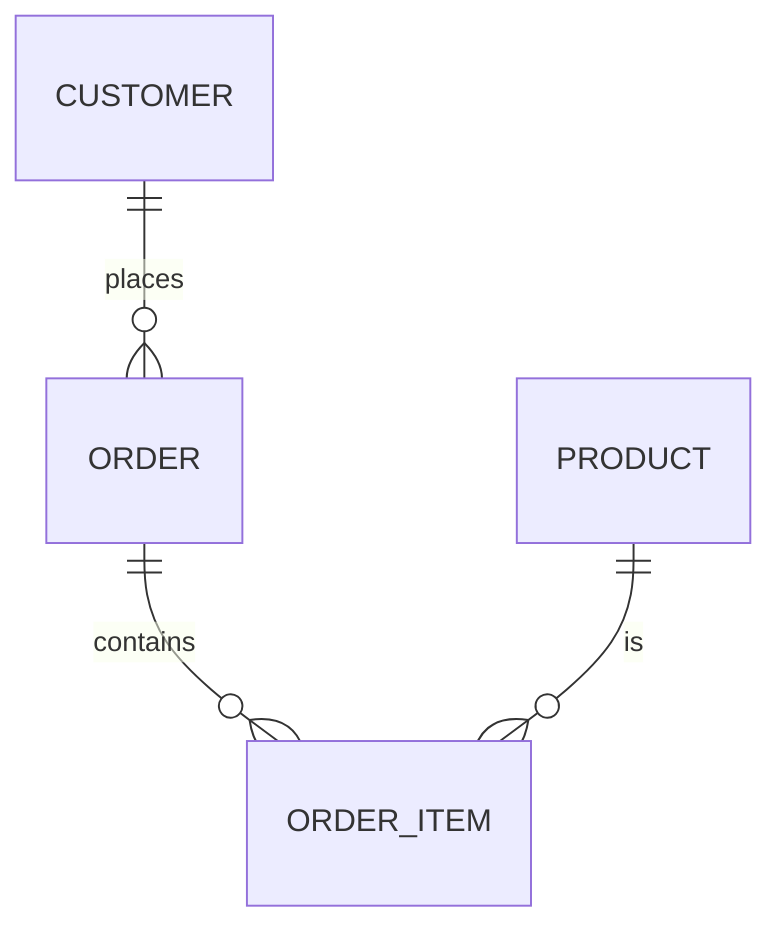

# Normalization

> **Learning Path:** Data Architecture
> **Section:** 4.2.2 — Data architecture

# Normalization — Data-ஐ ஒரே இடத்தில் வைக்கும் காரணம்

## 1. Problem

ஒரு e-commerce system ஆரம்பத்தில் simple ஆக இருக்கும். Orders table-ல `order_id, customer_name, customer_phone, customer_address, product_name, price, qty` எல்லாம் ஒரே row-ல வைத்து விடுவீர்கள்.

பிரச்சனை வரும் போது:

* Customer address மாறினால், அந்த customer-க்கு இருக்கும் 200 orders-லயும் update பண்ண வேண்டும். ஒன்று miss ஆனால் data inconsistent.
* ஒரு புதிய customer create பண்ணும் முன் order வேண்டும் என்றால், customer details இல்லாமல் order போட முடியாது. Insert anomaly.
* ஒரு product விற்பனை நின்று விட்டால், அந்த product-ஐ reference செய்யும் எல்லா order rows-ம் delete ஆகி product history-யே போய்விடும். Delete anomaly.

இது painful ஆகும்போது தான் normalization தேவைப்படுகிறது. **Same fact-ஐ எத்தனை இடத்தில் repeat பண்ணுவது என்பதுதான் core problem.**

## 2. Mental Model

Normalization = ஒரு fact-ஐ database-ல ஒரே ஒரு authoritative இடத்தில் வைத்து, மற்ற tables அதை reference செய்யும்.

அப்போது:
* Update ஒரே இடத்தில் நடக்கும்
* Data redundancy குறையும்
* Anomalies குறையும்

இது bookkeeping க்கு பணம் ஒரே ledger-ல எழுதுவது போல. Duplicate entry வைத்தால் reconciliation சிக்கல்.

## 3. How It Works

Relational model-ல normalization படிப்படியாக செய்யப்படுகிறது.

* **1NF:** Column-ல atomic value மட்டும். `phone_numbers` ஒரு list அல்ல, separate rows அல்லது separate table.
* **2NF:** Non-key attribute primary key-ன் முழு பகுதியை depend செய்ய வேண்டும். Partial dependency remove.
* **3NF:** Non-key attribute மற்ற non-key attribute-ஐ depend செய்யக்கூடாது. Transitive dependency remove.

உதாரணமாக:
`CUSTOMER(customer_id PK, name, email, address)`
`ORDER(order_id PK, customer_id FK, order_date)`
`ORDER_ITEM(order_id FK, product_id FK, qty, price)`

Customer details customer table-ல ஒரே முறை. Order அதை reference செய்கிறது.

## 4. Architectural Reasoning

Normalization எப்போது useful?

* **OLTP systems** — write heavy, transactional consistency முக்கியம். Banking, order management, inventory. Data correctness > read speed.
* Team size பெரியது, multiple services same data-ஐ touch பண்ணும். Single source of truth தேவை.

Alternative = denormalization.
* **OLAP / read heavy** — dashboard, analytics, recommendation. Join cost தாங்க முடியாது.
* Event sourcing / data warehouse-ல read models pre-joined / materialized view ஆக வைப்பது சாதாரணம்.

Architect-ஆக நீங்கள் கேட்க வேண்டியது: Write consistency எவ்வளவு முக்கியம்? Read latency எவ்வளவு கட்டுப்படுத்த வேண்டும்? Team எத்தனை இடத்தில் data-ஐ maintain பண்ணும்?

## 5. Trade
