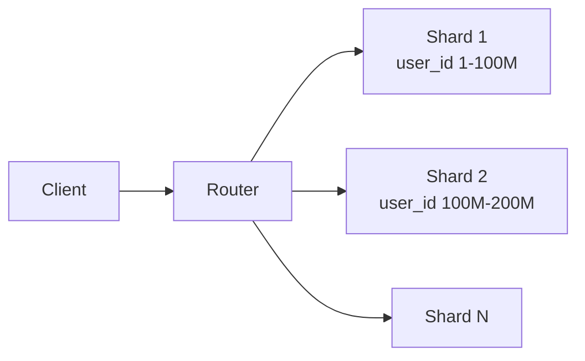

# Partitioning

> **Learning Path:** Data Architecture
> **Section:** 4.2.4 — Data architecture

## 1. Problem

உங்க company-ல ஒரு user table இருக்கு. 10 million users இருந்தப்போ MySQL ஒரே instance-ல smooth-ஆ run ஆச்சு. இப்போ 500 million users, ஒரு நாளைக்கு 2 billion writes.

என்ன ஆகும்?

* Single disk-ல I/O saturate ஆகும். Read latency spike ஆகும்.
* One CPU, one memory. Scale up பண்ணினாலும் price exponential-ஆ போகும்.
* Backup எடுக்க 8 மணி நேரம் ஆகும். Fail ஆனால் downtime மணிக்கணக்கு.
* One big table-ல index size கூட மிக பெரிசாகும். Query slow ஆகும்.

Scale up பண்ண முடியாது. இப்போ என்ன பண்ணுவீங்க? அதே data-ஐ split பண்ணி, பல machines-ல வைக்க வேண்டியது வரும். அதுதான் partitioning.

## 2. Mental Model

Partitioning என்பது **data-ஐ logical-ஆ break பண்ணி, physical-ஆ different nodes-ல வைக்கிறது**.

ஒரு பெரிய library-யை ஒரே room-ல வைக்க முடியாது. A to M ஒரு room, N to Z இன்னொரு room. புத்தகம் வேண்டும் என்றால் எந்த room-க்கு போக வேண்டுமோ அங்கே மட்டும் தேடினால் போதும்.

Database-ல அதே concept. ஒரு table-ஐ multiple partitions / shards-ஆ பிரிப்பது. ஒவ்வொரு partition-மும் ஒரு node-ல இருக்கும். Query வரும்போது எந்த partition-ல data இருக்கும் என்று தெரிந்தால் மற்ற partitions-ஐ touch பண்ண தேவையில்லை.

## 3. How It Works

Partition key என்பது எந்த column-ஆல் data-ஐ split பண்ணுவது என்பதை decide பண்ணும்.

**Hash partitioning:** `user_id % 64` பண்ணி 64 shards-க்கு spread பண்ணுவீங்க. Even distribution கிடைக்கும். ஆனால் range-ல query பண்ணினால் எல்லா shards-மும் hit ஆகும்.

**Range partitioning:** `created_at` அல்லது `user_id` range-ல split பண்ணுவீங்க. Ex: 1-10M shard1, 10M-20M shard2. Recent data access pattern-க்கு நல்லது. Hotspot வர வாய்ப்பு.

**Directory / lookup:** Partition எங்கே இருக்கு என்று ஒரு routing layer / metadata service வைத்து track பண்ணுவோம். Client-க்கு direct shard address தெரியாது. Router decide பண்ணும்.

Write வரும்போது router hash பார்த்து சரியான shard-க்கு forward பண்ணும். Read-க்கும் அதே.

## 4. Architectural Reasoning

Partitioning solve பண்ணுவது என்ன?

* **Write throughput & I/O**: Multiple disks, multiple CPUs parallel-ஆ work பண்ணும்.
* **Read latency**: Less data per node, cache hit ratio improve ஆகும்.
* **Availability**: ஒரு node down ஆனாலும் மற்ற partitions வேலை செய்யும்.
* **Operational**: Backup, restore, maintenance-ஐ partition wise பண்ணலாம்.

Alternatives என்ன?
* Vertical scaling: Bigger machine. Simple ஆனால் limit உண்டு, cost high.
* Read replicas: Read scale ஆகும், write scale ஆகாது.
* Caching: Hot data மட்டும் solve ஆகும்.

நீங்கள் choose பண்ண வேண்டியது: data size மற்றும் traffic pattern எப்படி இருக்கு என்பதை பார்த்து. Write heavy, data continuously grow ஆகிறது என்றால் partitioning தவிர வேறு வழி இல்லை.

## 5. Trade-offs

**1. Complexity vs scale**
Partition key choose பண்ணுவது முக்கியம். தவறான key-ஆல் hot shard உருவாகும். எல்லா writes-மும் ஒரே shard-க்கு போய் அது bottleneck ஆகும். Re-sharding painful.

**2. Cross-partition queries**
`JOIN` across shards, `COUNT(*)`, `ORDER BY` முழு data-ல பண்ண வேண்டும் என்றால் scatter-gather வேண்டும். Latency அதிகம். Application level-ல aggregation பண்ண வேண்டி வரும்.

**3. Data movement & rebalancing**
New shard add பண்ணினால் data மறுபங்கீடு வேண்டும். Hash partitioning-ல rebalancing அதிகம். Range-ல split பண்ணினால் கூட data migration தேவை.

**4. Failure mode**
Router அல்லது metadata service single point of failure ஆகும். அதை highly available-ஆ வைக்க வேண்டும். Network partition-ல split-brain தவிர்க்க வேண்டும்.

## 6. Practical Example

ஒரு payments company. `transactions` table-ல ஒரு நாளைக்கு 100M rows வருகிறது. Query pattern: user_id வைத்து தான் தேடுவார்கள். Admin report-ல date range report தேவை.

Decision: Primary partitioning by `user_id` hash 128 shards. ஏனென்றால் user lookup 99% queries. Write distribute ஆகும்.

Date range report-க்கு? Secondary partitioning inside shard by `created_at` monthly. அல்லது separate OLAP store-க்கு ETL பண்ணி அங்கே run பண்ணுவது.

இப்போ ஒரு node fail ஆனாலும் 127 shards work பண்ணும். New shard add பண்ணினால் router config update பண்ணி traffic shift பண்ணலாம்.

## 7. Reasoning Challenge

உங்க system-ல 20 consumers இருக்கு. ஒரே event stream தேவை. Producer block பண்ணக் கூடாது. Replay வேண்டும்.

அதே மாதிரி உங்க user data 1 billion rows. Write throughput தேவை. ஆனால் முக்கிய query pattern `WHERE created_at BETWEEN ...` மட்டும் தான். `user_id` ஆல் தேடுவது அரிது.

இந்த scenario-ல partition key-ஆ
