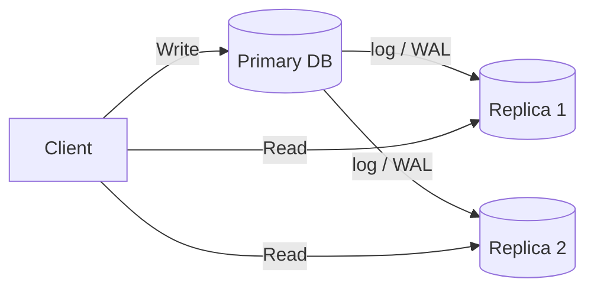

# Replication

> **Learning Path:** Data Architecture
> **Section:** 4.2.6 — Data architecture

## Problem

ஒரு monolith app-க்கு ஒரே PostgreSQL இருக்கு. Peak hour-ல reads அதிகமாகுது. ஒரு query 200ms ஆகுது, connection pool நிரம்புது, CPU 90% போகுது. இதை vertical scale பண்ணினாலும் limit வரும்.

இன்னொரு பிரச்சனை availability. அந்த ஒரே DB down ஆனால் எல்லா service-மும் down. Maintenance window-க்கு கூட முழு app-ஐயும் நிறுத்தணும்.

இன்னொன்று latency. User Chennai-ல இருக்கார், DB Mumbai-ல இருக்கு. Read-க்கு network round trip தேவை.

இந்த 3 பிரச்சனைக்காக தான் replication வந்தது. ஒரே data-வின் காப்பி-களை பல nodes-ல வைத்து, read-ஐ distribute பண்ணி, failure-லயும் தொடர்ந்து வேலை செய்ய வைக்க.

## Mental Model

Replication என்பது data-வை multiple copies-ஆக வைத்திருப்பது.

ஒரு master/primary என்று ஒரு node writes-ஐ ஏற்கும். அதன் changes replicas-க்கு propagate ஆகும். Readers replicas-ல இருந்து படிக்கலாம்.

அடிப்படை உண்மை: copy இருந்தால் **consistency** குறையும், **availability** அதிகரிக்கும். இது trade-off.

## How It Works

எளிய flow:

Primary-ல write வந்ததும் அது local log-ல எழுதப்படும். அந்த log async-ஆ or sync-ஆ replicas-க்கு அனுப்பப்படும். Replicas log-ஐ apply பண்ணி applier thread மூலம் data-வை update செய்யும்.

இரண்டு முக்கிய வகை:
* **Synchronous replication**: Primary, majority replicas acknowledge செய்யும் வரை commit confirm செய்யாது. Strong consistency, ஆனால் latency அதிகம், primary slow ஆகும்.
* **Asynchronous replication**: Primary commit செய்ததும் client-க்கு ok சொல்லிடும். Replicas பின்னால் catch up ஆகும். Low latency, ஆனால் replica lag உண்டு.

Failure-ல primary down ஆனால், replicas-ல ஒன்றை promote செய்து new primary ஆக்கலாம். இதற்கு automatic failover அல்லது manual failover தேவை.

## Architectural Reasoning

Replication எப்போது useful?

* **Read scale**: Product catalog, user profile போன்ற read heavy data. Writes குறைவு, reads அதிகம்.
* **Availability & DR**: Different AZ / region-ல replica வைத்தால் zone failure-லயும் சேவை தொடரும்.
* **Latency**: Users-க்கு geographically close replica-ல read பண்ணலாம்.

எப்போது தேவை இல்லை?

Write heavy, strongly consistent financial ledger-ல replication lag ஆபத்தானது. அப்போது single writer with strong consistency தேவை.

Alternatives: Sharding ஆனது write throughput-க்கு, replication ஆனது read scale மற்றும் availability-க்கு.

## Trade-offs

**Consistency vs Availability**
Async replica-ல read பண்ணினால் stale data வரலாம். User just updated profile, மீண்டும் பார்த்தால் பழைய data தெரியும். இதை read-your-writes guarantee கொடுக்க வேண்டுமானால் session pinning அல்லது read from primary தேவை.

**Write amplification & lag**
ஒவ்வொரு write-மும் N replicas-க்கு போகும். Network, disk I/O cost அதிகரிக்கும். Replica lag spike ஆனால் failover-ல data loss risk வரும்.

**Failover complexity**
Split brain ஆகாமல் பார்த்துக்கொள்ள வேண்டும். Automatic failover செய்தால் flapping risk. Manual failover safe ஆனால் RTO அதிகம்.

**Operational cost**
Backup இருந்தால் போதாது. Replication-க்கு monitoring, lag alert, replication slot management, disk space தேவை.

## Practical Example

E-commerce site-ல product catalog.

Writes: admin மூலம் product create/update, நாள் ஒன்றுக்கு சில நூறு மட்டுமே.
Reads: users browse, நாள் ஒன்றுக்கு மில்லியன்.

Architecture: Primary DB-ல writes. 3 read replicas: 1 in same AZ for low latency, 2 in different AZ for HA. API gateway writes always primary-க்கு route பண்ணும். Reads replica pool-க்கு route பண்ணும், load balance செய்யும்.

Failover: Primary down ஆனால் automated failover செய்து replica-வை promote செய்யும். App connection string-ஐ update செய்யும். எழுதும் traffic சில நிமிடம் pause ஆகும்.

Cost: Extra DB instances, cross AZ data transfer cost.

## Reasoning Challenge

உங்கள் payment service-ல account balance read/write இருக்கு. Customer app-ல balance page open செய்தவுடன் user அதே balance-ஐ update செய்ய முயற்சி செய்வார்.

நீங்கள் async replication + read from replica என்று வைத்தீர்கள். என்ன பிரச்சனை வரும்? இதற்கு எந்த architectural choice செய்வீர்கள்? Strong consistency வேண்டுமா, eventual consistency போதுமா? ஏன்?

## Key Takeaways

* Replication read scale மற்றும் availability-க்காக, write scale-க்காக அல்ல.
* Async replication = lower latency + higher risk of stale reads மற்றும் data loss on failover.
* Every replica adds consistency lag and operational complexity. Failover plan தான் முக்கியம்.
* Write path-ஐ primary-ல மட்டும் வைத்து
