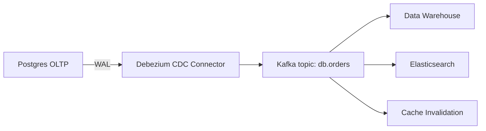

# CDC

> **Learning Path:** Data Architecture
> **Section:** 4.2.8 — Data architecture

### Problem

உங்க company-ல order service ஒன்னு இருக்கு. Postgres-ல write பண்ணுது.
அதே data analytics team-க்கு Snowflake-ல வேணும், search service-க்கு Elasticsearch-ல வேணும், recommendation service-க்கு real-time features வேணும்.

இப்போ எல்லாரும் என்ன பண்றாங்க? `last_modified > ?` என்று DB-ஐ poll பண்றாங்க. அல்லது ஒரு cron job வச்சு hourly batch ETL run பண்றாங்க.

என்ன பிரச்சனை வரும்?
- Polling செய்தால் DB-க்கு தேவையில்லாத load. Table பெருசாகும்போது full scan ஆகும்.
- Batch-னால் lag அதிகம். Order create ஆன 45 நிமிடத்துக்கு அப்புறம்தான் dashboard-ல தெரியும்.
- Service-கள் DB schema-ஐ நேரடியா தொட வேண்டியிருக்கு. Coupling அதிகம்.
- ஒரு row update ஆனால் எந்த column மாறினது, old value என்ன, new value என்ன என்று தெரியாது. Full row மட்டுமே கிடைக்கும்.

**என்ன பெயின்?** Source of truth ஒன்னு, consumers நிறைய. Source-ஐ தொடாமல் change-களை மட்டும் கேட்க வேண்டும்.

### Mental Model

CDC = Change Data Capture. Database-ல நடக்கும் change-களை, அது நடந்த உடனே, event ஆக capture பண்ணி stream-க்கு அனுப்புறது.

Mental model simple: DB ஒரு append-only log வச்சிருக்கு. நாம அந்த log-ஐ read பண்ணி, `table, pk, before, after, operation` னு ஒரு event ஆக்குறோம்.

நீங்கள் DB-ஐ பார்க்கவில்லை, DB-ன் changes-ஐ subscribe பண்றீங்க.

### How It Works

இரண்டு வழிகள் உண்டு:

**1. Log-based CDC** - இதுதான் production standard.
Postgres-ல WAL, MySQL-ல binlog, Oracle-ல redo log. Database தன்னுடைய internal write-ahead log-ல எல்லா change-ஐயும் பதிவு செய்யும். CDC connector அந்த log-ஐ tail பண்ணும்.
Debezium போன்ற tool இதை செய்யும். No trigger, no extra load on primary query path.

**2. Query-based CDC**
`last_modified` column-ஐ பார்த்து poll பண்ணுவது. Simple ஆனால் மிஸ் ஆகும், heavy.

Flow:

Connector offset-ஐ track பண்ணும். Restart ஆனாலும் காணாமல் போகாது.

### Architectural Reasoning

CDC useful ஆகும் போது:

- OLTP DB ஒன்னு, downstream systems நிறைய. Data warehouse, search index, ML feature store, event-driven services.
- Near real-time sync தேவை. Seconds level lag acceptable, minutes level இல்லை.
- DB schema change ஆனாலும், consumers independent ஆக இருக்கணும்.

Alternatives:

- Application-level events: Service write பண்ணும்போது Kafka-க்கு produce பண்ணு. Simple ஆனால் ஒவ்வொரு app-மும் தவறவிடும். Backfill கஷ்டம்.
- Batch ETL: Cost குறைவு, eventual consistency போதும் என்றால் fine.

ஏன் CDC choose பண்ணுவீங்க? Single source of truth-ஐ தொடாமல், zero code change in existing services-ல change propagation செய்ய முடியும். New consumer வந்தாலும் DB-ஐ touch பண்ண தேவையில்லை.

### Trade-offs

1. **Complexity & Operability.** Debezium, Kafka Connect, schema registry maintain பண்ணனும். WAL retention, connector lag monitor பண்ணனும். Small team-க்கு overkill.
2. **Ordering & Exactly-once.** Same partition-ல order preserve ஆகும். Cross table ordering guarantee இல்லை. Idempotent consumers வேண்டும், duplicate events வரலாம்.
3. **Schema evolution.** Column add/drop ஆனால் Debezium schema registry-ல compatibility handle பண்ணனும். Downstream break ஆகும்.
4. **Read load shift
