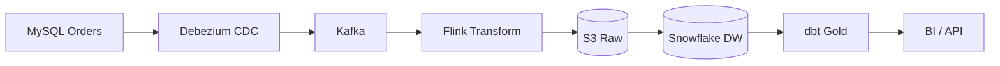

# Data pipelines

> **Learning Path:** Data Architecture
> **Section:** 4.2.9 — Data architecture

## 1. Problem

ஒரு நிறுவனத்துல data எங்கெங்கே இருக்குன்னு உங்களுக்கே தெரியாமல் போகிறது. Orders MySQL-ல, logs Elasticsearch-ல, payments third-party API-ல, marketing events CSV-ல. 

ஒவ்வொரு மாதமும் finance team-க்கு report வேண்டும். Engineer ஒருத்தர் அந்த tables-ஐ கைமுறையா pull பண்ணி, Python script-ல join பண்ணி, Excel-ல paste பண்ணுகிறார். 

இதில் என்ன பிரச்சனை?
* Data late வரும். Yesterday data கூட 3 நாள் கழித்து தான் தயாராகும்.
* Manual step இருப்பதால் error வரும். Schema மாறினால் script break ஆகும்.
* Source system-ஐ query பண்ணுவதால் production load ஏறும்.
* ஒரு முறை யாரோ ஒருவர் தான் process தெரிந்திருப்பார்.

இந்த வலி தான் data pipeline-ஐ உருவாக்குகிறது. Data-வை நகர்த்துவதும், சுத்தப்படுத்துவதும், ஒரே இடத்தில் கொண்டு வருவதும் தானாக நடக்க வேண்டும்.

## 2. Mental Model

Data pipeline என்பது assembly line போன்றது.

Raw material வரும். அதை clean பண்ணி, cut பண்ணி, pack பண்ணி, கடைக்கு அனுப்புவது. 

Pipeline-லும் அதே flow:
**Source → Ingest → Transform → Store → Serve**

ஒவ்வொரு stage-ம் independent ஆக இயங்கும். ஒரு stage fail ஆனால் முழு line நின்று விடாமல் retry, backpressure கையாள முடியும்.

## 3. How It Works

போதுமான internals வேண்டாம். Architect-க்கு தேவையானது flow தான்.

* **Ingest**: Change Data Capture, batch files, streaming events. Kafka / Kinesis / Debezium மூலம் data capture. Producer-ஐ block பண்ணாமல் buffer செய்ய வேண்டும்.
* **Transform**: Clean, dedupe, schema enforce, join. ETL vs ELT. Modern pipeline-ல் raw data-வை S3 போன்ற object storage-ல் dump செய்து, transformation பின்னர் செய்வது ELT.
* **Store**: Bronze / Silver / Gold layers. Raw, cleaned, business-ready. Data lake for raw, data warehouse for analytics, feature store for ML.
* **Serve**: BI tool, API, model training job. Read path production system-ஐ தொடாமல் இருக்க வேண்டும்.

Idempotency முக்கியம். Pipeline ஒரு batch-ஐ இரண்டு முறை process பண்ணினாலும் அதே result வர வேண்டும்.

## 4. Architectural Reasoning

Pipeline தேவைப்படுவது எப்போது?

* Multiple source systems ஒரே truth-க்கு merge வேண்டும்.
* Data freshness-க்கு guarantee வேண்டும். Real-time dashboard, fraud detection.
* Downstream consumers வேறு வேறு speed-ல் process பண்ணுவார்கள்.

Constraints:
* **Latency**: Hourly report போதுமா? அல்லது sub-second streaming?
* **Volume**: GB/day vs TB/day. Cost மாறும்.
* **Consistency**: Eventual consistency ஏற்றுக்கொள்ள முடியுமா?
* **Team size**: Small team-க்கு managed service போதும். Large team-க்கு self-hosted control.

Decision factors:
Batch pipeline = cheaper, simple, good for nightly reports. Streaming = complex, expensive, but low latency.

குறைந்த complexity-க்கு managed services: AWS Glue, dbt, Snowflake Pipelines, Databricks. Control தேவை என்றால் Kafka + Flink + S3.

## 5. Trade-offs

* **Batch vs Streaming**: Batch simple, cost effective, latency hours. Streaming real-time, operational complexity அதிகம், failure handling கடினம்.
* **Centralize vs Decentralize**: Central data team ஒரு pipeline build பண்ணினால் consistency வரும், but bottleneck ஆகும். Domain teams own their pipeline என்றால் speed வரும், but duplication வரும்.
* **Schema on write vs schema on read**: Strict schema early-ல் catch errors, but source change-க்கு rigid. Schema on read flexible, but downstream break ஆகலாம்.
* **Durability vs Cost**: Raw data-வை long time keep பண்ணுவது replay-க்கு உதவும், storage cost ஏறும்.

Failure modes முக்கியம்: Source downtime, schema drift, duplicate events, backfill. இதற்காக dead letter queue, monitoring, data quality checks வேண்டும்.

## 6. Practical Example

E-commerce company.

Order service MySQL-ல write பண்ணுகிறது. Debezium CDC மூலம் change events Kafka-க்கு போகும். 
Event -> Kafka topic `orders.raw` -> Flink job clean, enrich with product catalog -> Silver table in Snowflake. 
Daily batch job S3-ல உள்ள historical CSV-களை Glue-ல load பண்ணி Bronze-க்கு dump பண்ணும். 
dbt Silver-ல இருந்து Gold aggregates build பண்ணி, BI team PowerBI-ல serve பண்ணுகிறார்கள்.

Producer block ஆகவில்லை, replay possible, production DB-க்கு load இல்லை.

## 7. Reasoning Challenge

உங்களிடம் 20 microservices உள்ளன. ஒவ்வொன்றும் தனக்கான metrics-ஐ Prometheus-ல் emit பண்ணுகிறது. Central observability team real-time anomaly detection வேண்டும். ஆனால் சில services batch-ல் தான் logs தருகின்றன. 

இங்கே ஒரே pipeline போதுமா? Batch-க்கு streaming-க்கு எப்படி reconcile பண்ணுவீர்கள்? Latency, cost, operational complexity எப்படி balance பண்ணுவீர்கள்?

## 8. Key Takeaways

* Pipeline-ன் நோக்கம் production system-ஐ தொந்தரவு செ
