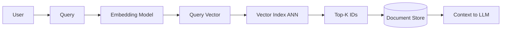

# Vector indexes

> **Learning Path:** Data Architecture
> **Section:** 4.3.3 — AI-specific data

## 1. Problem

உங்களுக்கு ஒரு enterprise RAG system இருக்கு. 10 மில்லியன் document chunks, ஒவ்வொன்றும் 1536-dim embedding. User query வந்ததும் அதன் embedding உருவாக்கி, database-ல இருக்கும் எல்லா vectors-டோடும் cosine similarity போட்டு top-10 எடுக்கணும்.

Brute force செய்தால் என்ன ஆகும்?
10M × 1536 = 15B operations ஒரு queryக்கு. Latency seconds ஆகும். GPU வச்சும் throughput குறையும். Cost பெருகும்.

பிரச்சனை painful ஆகுது: similarity search தேவைப்படும் எல்லா AI use-case-லும் — RAG, semantic search, recommendation, anomaly detection — scale ஆனதும் brute force வேலை செய்யாது.

இதுக்கு தேவை: **millions of vectors-ல இருந்து ஒரு query vector-க்கு nearest neighbours-ஐ மிக வேகமாக கண்டுபிடிக்கும் structure.**

## 2. Mental Model

Vector index என்பது high-dimensional space-க்கான phone book.

Flat list-ல தேடுவதற்கு பதில், space-ஐ partitions ஆக பிரித்து, query எந்த partition-ல இருக்குமோ அதற்கு அருகில் மட்டும் தேடு. சரியான neighbour-ஐ 100% கண்டுபிடிக்காமல், பெரும்பாலும் சரியான neighbour-ஐ மிக வேகமாக கண்டுபிடிக்கும் trade-off எடுக்கிறோம்.

அதனால் concept: **Approximate Nearest Neighbor, ANN.**

## 3. How It Works

Index பில்ட் time-ல vectors-ஐ organize பண்ணி வைக்கும். Query time-ல அதை use பண்ணி search space-ஐ drastically cut பண்ணும்.

முக்கிய குடும்பங்கள்:

**IVF - Inverted File Index**
Vectors-ஐ k-means clusters ஆக பிரி. Query வந்தால் cluster centroid-க்கு nearest few clusters மட்டும் தேர்ந்தெடு, அதுக்குள்ள brute force பண்ணு. Memory efficient, build fast. Update செய்ய கஷ்டம்.

**HNSW - Hierarchical Navigable Small World**
Graph based. ஒவ்வொரு vector-மும் ஒரு node. Layers of graphs. Query-ஐ entry point-ல இருந்து greedy walk பண்ணி nearest neighbor-க்கு நகரும். Recall மிக நல்லது, latency குறைவு. Memory அதிகம், write heavy.

**PQ - Product Quantization**
Vector-ஐ small codes ஆக compress பண்ணும். Distance calculation table lookup ஆக மாறும். Memory footprint குறைவு, billion scale-க்கு ஏற்றது. Recall கொஞ்சம் குறையும்.

Real systems இவற்றை கலந்து use பண்ணும்: IVF + PQ, HNSW + PQ.

Request flow:

## 4. Architectural Reasoning

Vector index தேவைப்படும் constraints:

* **Latency budget**: RAG-ல retrieval <100ms வேண்டும்
* **Scale**: 10M - 1B vectors
* **Recall requirement**: RAG-க்கு 0.85-0.95 போதும், exact 1.0 வேண்டாம்

Alternatives:
* Brute force: small dataset <1M, offline batch
* BM25 keyword search: semantic gap இருக்கும்
* Hybrid: vector + keyword

Architect choose பண்ணும்போது கேட்கும் கேள்விகள்:
* Data static ஆ? daily batch update போதுமா? → IVF/PQ
* Real-time insert/delete தேவையா? → HNSW
* Memory budget என்ன? RAM-ல fit ஆகுமா?
* Recall vs latency trade-off accept பண்ண முடியுமா?

## 5. Trade-offs

**Recall vs Latency**: Search depth அதிகரித்தால் recall உயரும், latency உயரும். ANN-ல இது tuning knob.

**Memory vs Accuracy**: PQ compress பண்ணி memory குறைக்கும், distance error வரும். HNSW அதிக memory.

**Build cost vs Query cost**: IVF build cheap, query fast. HNSW build heavy, query fast.

**Update cost**: Most indexes rebuild heavy. Real-time updates-க்கு HNSW or incremental IVF தேவை. Frequent updates இருந்தால் operational complexity உயரும்.

Failure modes:
* Index stale ஆனால் retrieval quality drop.
* Bad clustering / too few clusters → recall drop.
* Query embedding distribution shift ஆனால் index effectiveness குறையும்.

## 6. Practical Example

Enterprise support portal. 50M support tickets chunks, embeddings daily refresh.

Requirement: p99 <50ms, recall >0.9, cost control.

Decision: IVF-PQ with 4096 clusters, PQ 64 subquantizers. Daily offline rebuild, read replica for query.

Why not pure HNSW? 50M vectors RAM-ல fit ஆகாது, cost அதிகம். IVF-PQ ஒரு node-ல 32GB memory-ல fit ஆகும்.

Query path: user query → embedding → vector index → top 100 candidates → reranker model → top 10 → LLM.

Index தேர்வு latency-ஐ 800ms brute force-ல இருந்து 35ms-க்கு கொண்டு வந்தது. Recall 0.92.

## 7. Reasoning Challenge

உங்களிடம் 200M product embeddings இருக்கு. Catalog daily update ஆகும். Recommendation API-க்கு p95 latency 20ms வேண்டும். Recall target 0.85 மட்டும். Memory budget strict.

இங்கே IVF-PQ vs HNSW எது த
