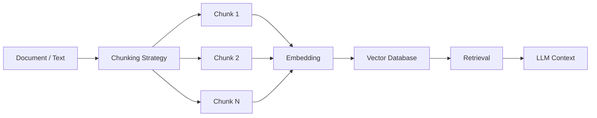

# Chunking

> **Learning Path:** Data Architecture
> **Section:** 4.3.5 — AI-specific data

### 1. Problem

உங்களிடம் ஒரு 200 பக்க contract PDF இருக்கு. User கேட்கிறார்: "இந்த contract-ல payment terms என்ன?"

LLM-க்கு முழு document-ஐயும் ஒரே சேர கொடுக்க முடியாது. Context window limit இருக்கு. Token limit மீறினால் truncate ஆகும், cost அதிகரிக்கும், latency போகும்.

ஒரு வேளை முழு document-ஐயும் embedding பண்ணி vector database-ல போட்டால், ஒரே பெரிய embedding ஆகி retrieve பண்ணும்போது relevance போய்விடும். "payment terms" என்பது page 147-ல இருக்கு, ஆனால் embedding whole document செய்தால் signal dilute ஆகும்.

அதனால் வரும் பிரச்சனை: **LLM ஒரே நேரத்தில் பார்க்கும் அளவு தகவலை மட்டும் பார்க்க முடியும், ஆனால் தேவையான தகவல் பெரிய document-ல ஆழமாக இருக்கும்.**

### 2. Mental Model

Chunking என்பது பெரிய தகவலை, LLM மற்றும் retrieval-க்கு புரியும் அளவு சிறிய, தன்னிறைவான துண்டுகளாக பிரிப்பது.

அதாவது புத்தகத்தை chapter-ஆக பிரித்து, chapter-க்கு index போடுவது போல. ஒவ்வொரு chunk-ம் தனியாக embed செய்யப்படும், தனியாக retrieve செய்யப்படும், தேவைப்பட்டால் மட்டும் LLM context-க்கு செல்லும்.

### 3. How It Works

Core decisions:

* **Chunk size**: tokens அல்லது characters. பொதுவாக 500-1500 tokens.
* **Overlap**: 50-200 tokens overlap வைத்தால் boundary-ல தகவல் cut ஆவது தவிர்க்கப்படும்.
* **Boundary**: fixed size vs semantic boundary. Paragraph, heading, sentence முடிவில் cut செய்வது சிறந்தது.
* **Metadata**: source, page number, chunk id, timestamp. Retrieval-க்கு அவசியம்.

### 4. Architectural Reasoning

Chunking தேவைப்படும் constraint:

* **Context window**: LLM ஒரு call-ல் பார்க்கும் அளவு மட்டுமே limit.
* **Retrieval relevance**: vector search என்பது small text-ல் தான் effective.
* **Cost & latency**: எல்லாவற்றையும் அனுப்பினால் cost அதிகம்.

Alternatives:

* Whole document summarize செய்து அனுப்புவது: சுருக்கம் தகவல் இழக்கும்.
* No chunking, just top-k paragraphs: context loss ஆகும்.

Architect ஏன் chunking தேர்வு செய்வார்? Retrieval quality vs completeness trade-off-ல control கிடைக்கும். Chunk size-ஐ மாற்றி, overlap-ஐ மாற்றி, system-ஐ tune செய்யலாம்.

### 5. Trade-offs

* **Chunk size small**: retrieval precise ஆகும், ஆனால் context loss ஆகும். "payment terms" விளக்கம் இரண்டு chunk-களில் பிரிந்தால் connection தெரியாது.
* **Chunk size large**: context retain ஆகும், ஆனால் embedding noisy ஆகும், irrelevant info வரும், cost அதிகரிக்கும்.
* **Overlap**: continuity காப்பாற்றும், ஆனால் storage மற்றும் duplicate retrieval அதிகரிக்கும்.
* **Semantic split vs fixed size**: semantic split quality நல்லது, ஆனால் implementation complex. Fixed size simple ஆனால் sentence cut ஆகும்.

Failure mode: Poor chunking ஆனால் retrieval hallucination அதிகரிக்கும். User கேள்விக்கு தொடர்பில்லாத chunk வந்தால் LLM wrong answer generate செய்யும்.

### 6. Practical Example

Enterprise support knowledge base. 10,000 internal Confluence pages.

Decision: Recursive character splitter use பண்ணி, heading-ஐ boundary ஆக வைத்து, 1000 tokens chunk size, 150 tokens overlap.

Implementation flow: Page fetch -> clean markdown -> split by headings -> chunk -> embedding with metadata {page_id, url, last_updated} -> vector DB upsert.

Query time: User query embed -> top 5 chunks retrieve -> rerank -> only those chunks LLM-க்கு context-ஆக கொடு.

Result: Latency குறையும், relevant answer வரும், cost control ஆகும்.

### 7. Reasoning Challenge

உங்களிடம் legal documents இருக்கு. ஒரு clause பல பக்கங்களில் spread ஆகியிருக்கு. Chunk size 800 tokens, overlap 0 வைத்தீர்கள். Retrieval செய்தால் partial clause மட்டும் வருகிறது.

இங்கே என்ன trade-off
