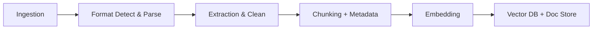

# Document processing

> **Learning Path:** Data Architecture
> **Section:** 4.3.6 — AI-specific data

## Problem

நீங்கள் ஒரு AI assistant பண்ண வேண்டும். Company-யின் 10,000+ PDFs, Word docs, emails, support tickets இருக்கு. User கேள்வி கேட்டால் அதற்கு பதில் அந்த documents-ல இருந்து தரணும்.

Raw document-ஐ direct-ஆ LLM-க்கு கொடுத்தால் என்ன ஆகும்?
Context window முடியும், token cost அதிகம், முக்கிய தகவல் காணாமல் போகும். Table, chart, image இருந்தால் text-ஆ extract ஆகாது. Versioning, author, date மாதிரி metadata இல்லை.

அதனால் **ஏன்** document processing தேவை? 
LLM-க்கு தரக்கூடிய, searchable, retrievable form-ல மாற்ற வேண்டும். அப்போதான் RAG சரியாக வேலை செய்யும்.

## Mental Model

Document processing என்பது raw material-ஐ factory-க்கு தயார் செய்வது போல.

File → Clean Text + Structure + Metadata → Chunks → Embedding → Vector database

முக்கிய யோசனை: LLM தொகுதிகளாக வேலை செய்கிறது, முழு file-ஆக இல்லை. அதனால் document-ஐ **meaningful pieces**-ஆ பிரித்து, ஒவ்வொன்றுக்கும் context கொடுத்து store பண்ண வேண்டும்.

## How It Works

ஒரு practical pipeline இப்படி இருக்கும்:

**1. Ingestion & Format Detect**
PDF, DOCX, HTML, CSV, image, scanned PDF வரும். MIME type பார்த்து parser தேர்ந்தெடு. Scanned என்றால் OCR தேவை.

**2. Extraction & Normalization**
Text extract பண்ணு. Table-ஐ structured JSON-ஆ மாற்று. Boilerplate, header/footer, page numbers நீக்கு. Language detect பண்ணு.

**3. Chunking**
முழு doc-ஐயும் ஒரே chunk-ஆ வைக்கக்கூடாது. Semantic boundary-ல cut பண்ணு: paragraph, section, table row. Overlap 10-20% வைத்து context loss தடு.

Chunking strategy முக்கியம். Fixed token size vs semantic chunking. Semantic நல்லது ஆனால் complex.

**4. Enrichment**
Chunk-க்கு metadata சேர்: doc_id, source_url, page_no, section_title, author, created_at, tags. இது filter & rerank-க்கு உதவும்.

**5. Embedding & Indexing**
Chunk-ஐ embedding model-ல run பண்ணி vector ஆக்கு. அதை vector database-ல store பண்ணு, original chunk-ஐ doc store-ல வை.

## Architectural Reasoning

இது useful ஆகும் போது?
- Unstructured corporate knowledge-ஐ RAG / agent-க்கு தரவேண்டும்
- Compliance, audit trail தேவை
- Multi-language documents

Constraints:
- **Latency**: Real-time ingestion vs batch. பெரிய PDF-க்கு async processing தேவை.
- **Fidelity**: Structure preserve பண்ணணுமா? Legal contract-ல table முக்கியம்.
- **Cost**: Embedding, OCR, LLM parsing எல்லாம் cost.
- **Operability**: New file format வந்தால் pipeline break ஆகக்கூடாது.

Alternatives:
- Raw text dump + simple split. வேகமாக ஆனால் quality கெட்டது.
- LLM-ஐ direct-ஆ parser-ஆ use பண்ணி chunk பண்ணுவது. நல்ல context ஆனால் slow & costly.
- Pre-built service like Azure Document Intelligence, AWS Textract. வேகமான ஆனால் vendor lock-in.

Architect choose பண்ணும்போது கேட்கும் கேள்வி: **நமக்கு fidelity முக்கியமா, speed முக்கியமா?** 

## Trade-offs

**Chunk size**
சிறிய chunk = precise retrieval, ஆனால் context இழப்பு. பெரிய chunk = context இருக்கு, ஆனால் noise அதிகம், embedding dilute ஆகும்.

**Structure vs flat text**
Table, heading hierarchy keep பண்ணினால் quality உயரும். ஆனால் parser complexity அதிகம். பல team-கள் flat text-ஐ எடுத்துக்கொண்டு போதும் என்கிறார்கள்.

**Sync vs Async processing**
User upload செய்த உடனே query பண்ண வேண்டும் என்றால் sync. ஆனால் PDF parsing slow. பொதுவாக async queue + status tracking நல்லது.

**Failure modes**
OCR error, encoding issue, truncated table, wrong chunk boundary. இதை கண்டறிய validation step வேண்டும். Bad chunk → bad retrieval → hallucination.

## Practical Example

Enterprise knowledge base RAG.

Sales team-க்கு product catalog PDF 500 இருக்கு. ஒவ்வொன்றிலும் specs table உள்ளது.

Pipeline: S3 upload → Event to SQS → Parser worker detects PDF → Text + table extraction via unstructured.io → Chunk by section with heading as metadata → Enrich with product_id, version → Embed with 768-dim model → Store in pgvector + S3 for original.

Query வரும்போது: user question → embed → vector search with metadata filter product_line = 'X' → top k chunks → LLM answer with citations.

இங்கே chunking strategy தேர்வு: table ஒன்றை ஒரே chunk-ஆ வைத்தோம். இல்லையெனில் row split
