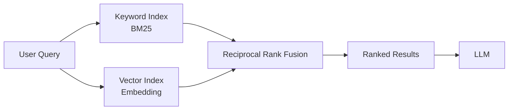

# Hybrid search

> **Learning Path:** Data Architecture
> **Section:** 4.3.8 — AI-specific data

## 1. Problem

உங்களிடம் ஒரு RAG chatbot இருக்கிறது. Vector search மட்டும் போட்டுவிட்டீர்கள்.

User கேட்கிறார்: *"நான் order cancel பண்ணினா refund எப்போ வரும்?"*

Vector retrieval தருகிறது: refund policy பற்றிய பொதுவான doc, cancellation flow doc. ஆனால் *"7 working days"* என்ற exact SLA clause கிடைக்கவில்லை. ஏனென்றால் embedding ஒத்த தன்மையைப் பார்க்கிறது, exact phrase match பார்ப்பதில்லை.

அடுத்து user கேட்கிறார்: *"cancelled orderக்கு money return எப்படி?"*

Keyword search மட்டும் போட்டிருந்தால் `money return` என்ற வார்த்தை database-ல் இல்லாததால் zero result. ஆனால் user intent `refund` தான்.

**Pain point:** Pure keyword தருகிறது precision, ஆனால் synonym, paraphrase கிடைக்காது. Pure vector தருகிறது semantic understanding, ஆனால் exact entity, number, date, SKU போன்றவற்றை தவற விடும்.

இந்த இடைவெளியை மூடுவதற்கு தான் Hybrid search வந்தது.

## 2. Mental Model

Hybrid search என்பது இரண்டு வெவ்வேறு signal-களை ஒன்றாக பயன்படுத்துவது.

* **Lexical signal:** keyword match, BM25. Exact term, typo, entity பிடிக்கும்.
* **Semantic signal:** embedding similarity. Intent, paraphrase, context பிடிக்கும்.

ஒரு query வந்தால் இரண்டு index-லும் தேடி, பிறகு result-களை fuse பண்ணி ஒரு ranked list தருவது.

Analogy: ஒரு librarian ஒருவர் title exact match பார்க்கிறார், இன்னொருவர் meaning பார்க்கிறார். இரண்டு பட்டியலையும் கலந்து சிறந்த books தருகிறார்.

## 3. How It Works

Architecture simple தான்.

1. Query-ஐ அப்படியே keyword index-க்கு அனுப்பு. BM25 score கிடைக்கும்.
2. Query-ஐ embed பண்ணி vector database-ல் similarity search.
3. இரண்டு top-k list-கள் வந்துவிடும்.
4. Fuse பண்ணு. பிரபலமான முறை **Reciprocal Rank Fusion**:
   `score = 1/(k + rank_keyword) + 1/(k + rank_vector)`
   No training needed, robust.

Implementation-ல் கவனிக்க வேண்டியது: query preprocessing ஒரே மாதிரி இருக்க வேண்டும், vector model மற்றும் keyword tokenizer consistency வேண்டும். பெரும்பாலும் keyword search-க்கு separate inverted index பயன்படுத்துவார்கள்: Elasticsearch, OpenSearch. Vector-க்கு Pinecone, Weaviate, pgvector.

## 4. Architectural Reasoning

Hybrid எப்போது useful?

* Query-ல் exact entity இருக்கும் போது: `iPhone 15 Pro Max 256GB`, `invoice #12345`, `SLA 7 days`
* Query-ல் intent/paraphrase இருக்கும் போது: `money return`, `cancelled order refund`

இரண்டும் ஒன்றாக வரும் real world-ல் தான்.

Alternatives:
* Vector only + better embedding = synonym handle ஆகும் ஆனால் exact match இழக்கும்.
* Keyword only + synonym expansion = brittle, maintenance heavy.
* Rerank with LLM = accurate ஆனால் latency மற்றும் cost high.

Hybrid தேர்வு செய்யும் ஒரு architect காரணம்: **no single retrieval signal is sufficient for production RAG**. You want both precision and recall.

## 5. Trade-offs

* **Latency:** இரண்டு retrieval paths. Parallel call பண்ணினாலும் 2x cost, P99 latency அதிகரிக்கும். Cache or async prefetch பண்ணி manage செய்ய வேண்டும்.
* **Cost & Complexity:** இரண்டு index maintain பண்ண வேண்டும். Embedding model, keyword analyzer, fusion logic, tuning parameter k.
* **Tuning:** keyword vs vector weight balance domain-க்கு மாறும். E-commerce-ல் keyword weight அதிகம், support FAQ-ல் semantic weight அதிகம். Blind default use பண்ணினால் degradation வரும்.
* **Failure mode:** இரண்டு system-லும் failure வந்தால் fallback என்ன? Vector down ஆனால் keyword only fallback வேண்டும். இல்லை என்றால் complete outage.

## 6. Practical Example

Enterprise e-commerce search.

User query: *"best camera phone under 50k for low light"*

Keyword search `50k` மற்றும் `camera phone` என்ற term-ஐ exact match பண
