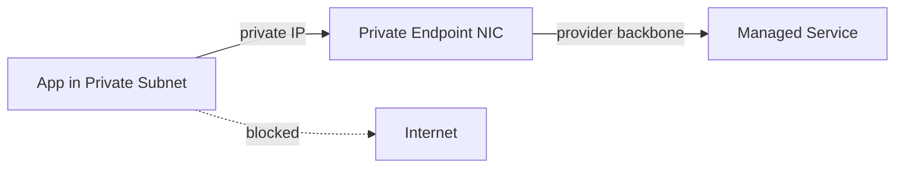

# Private endpoints

> **Learning Path:** Cloud & Infrastructure Architecture
> **Section:** 5.1.10 — Cloud fundamentals

# Private Endpoints

## 1. Problem

உங்கள் app ஒரு VNet / VPC-ல் private subnet-ல் ஓடுகிறது. அதற்கு Azure SQL, S3, Azure Storage, Key Vault மாதிரி managed service தேவை.

இன்று பெரும்பாலும் அந்த service-ஐ public endpoint மூலமாக அணுகுகிறீர்கள். Traffic VPC-லிருந்து NAT Gateway / Internet Gateway வழியாக வெளியே போய், பின்னர் public internet வழியாக service-க்கு திரும்ப வருகிறது.

இங்கே என்ன வலிகள் வரும்?

* **Security**: Data பொது internet-ல் போகிறது. Firewall rule, IP allowlist மட்டுமே நம்ப வேண்டும். Compliance audit-ல் "no internet egress" என்று சொன்னால் fail ஆகும்.
* **Latency & cost**: Every call internet hop + NAT Gateway data processing charge.
* **Control**: Public endpoint என்பது பொதுவான entry point. உங்கள் VPC-க்கு எது தேவையோ அதற்கு மட்டும் திறக்க முடியாது.

இந்த வலி போதுமானதாக இருக்கும்போது Private Endpoint தேவைப்படுகிறது.

## 2. Mental Model

Private Endpoint என்பது உங்கள் VNet-க்குள் உருவாக்கப்படும் ஒரு **private IP-யுடன் கூடிய network interface**, அது managed service-ஐ உள்ளே இருந்து நேரடியாக அணுக வழி செய்கிறது.

அது ஒரு private phone line மாதிரி. Public switchboard-க்கு போகாமல், provider backbone-ல் தான் call போகிறது.

உங்கள் DNS அந்த service name-ஐ உங்கள் private IP-க்கு resolve செய்துவிடும். Traffic எப்போதும் public internet-க்கு போகாது.

## 3. How It Works

Azure-ல் Private Link, AWS-ல் PrivateLink, GCP-ல் Private Service Connect - அடிப்படை ஒன்றே.

1. நீங்கள் ஒரு Private Endpoint-ஐ உங்கள் VNet-ல் ஒரு subnet-ல் create செய்வீர்கள். அதற்கு VNet-க்கு உள்ளே ஒரு private IP கிடைக்கும்.
2. அந்த endpoint, managed service-இன் service endpoint resource-உடன் link ஆகிறது.
3. DNS integration மூலம் service FQDN உங்கள் VNet-ல் அந்த private IP-க்கு point ஆகும்.
4. App service-ஐ அழைக்கும்போது, traffic VNet-ல் இருந்து provider backbone வழியாக service-க்கு போகிறது. Internet touch ஆகாது.

Public endpoint முற்றிலும் மறைந்துவிடாது. ஆனால் உங்கள் network-லிருந்து அது reachable இல்லை.

## 4. Architectural Reasoning

Private Endpoint பயன்படும் சூழல்கள்:

* **Compliance / zero-trust**: Data plane traffic public internet-க்கு போகக்கூடாது என்ற requirement இருந்தால்.
* **Internal PaaS access**: App மற்றும் managed service ஒரே region-ல் இருக்கும்போது, latency குறையும்.
* **Centralized data plane**: Multiple workloads ஒரே service-ஐ பயன்படுத்தும்போது, அவற்றுக்கு private access தரலாம்.

Alternatives என்ன?

* Public endpoint + IP allowlist + private link proxy. Simple ஆனால் internet dependency உள்ளது.
* Self-managed service on VMs. Full control, ஆனால் operational overhead huge.
* Service mesh with egress proxy. Extra hop, complexity.

ஆர்கிடெக்ட் தேர்வு செய்யும்போது கேட்க வேண்டியது: Traffic உண்மையில் private இருக்க வேண்டுமா? அல்லது allowlist போதுமா? Cost vs security vs operability எது முக்கியம்?

## 5. Trade-offs

* **Cost**: Private Endpoint per subnet per region-க்கு charge ஆகும். அதிக subnet இருந்தால் cost accumulate ஆகும்.
