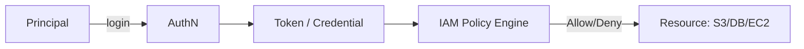

# IAM

> **Learning Path:** Cloud & Infrastructure Architecture
> **Section:** 5.1.11 — Cloud fundamentals

## 1. Problem

உங்க company cloud-ல வந்து 2 வருஷம் ஆச்சு. 20 engineers, 3 environments, 50+ services. ஆரம்பத்தில் எல்லாருக்கும் ஒரே admin access கொடுத்தீங்க. சுலபம்.

இப்போ என்னாகுது?
* ஒருத்தர் தப்பா production DB-ஐ delete பண்ணிட்டார்
* CI/CD pipeline-ல hardcoded AWS keys இருக்கு, GitHub-ல leak ஆகி போச்சு
* Contractor-க்கு கொடுத்த access-ஐ மறக்கிட்டு, 6 மாசம் கழிச்சும் அவர் resources-ஐ access பண்ண முடியுது
* Audit வந்தா யார் என்ன பண்ணினார்னு சொல்ல முடியல

இதெல்லாம் painful ஆகும்போது தான் IAM தேவைப்படுது. Identity and Access Management என்பது **யார் என்ன செய்யலாம்** என்பதை central-ஆ கட்டுப்படுத்துவது.

## 2. Mental Model

IAM-ஐ ஒரு club-ன் bouncer மாதிரி நினைச்சுக்கோங்க.

Authentication = ID card பார்க்கிறது. நீ யாருன்னு verify பண்றது.
Authorization = உனக்கு எந்த room-க்கு entry இருக்கு. என்ன permission இருக்குன்னு decide பண்றது.

இரண்டும் வேற. நீ login ஆனாலும், எல்லா resource-க்கும் அணுகல் கிடையாது.

Core concepts:
* **Principal**: user, service account, role, external app
* **Policy**: யாருக்கு என்ன permission, எந்த resource-ல, எந்த condition-ல
* **Role**: permission-ஐ group பண்ணி reuse பண்றது

## 3. How It Works

Request flow ரொம்ப simple.

1. Principal authenticate ஆகி token வாங்குது
2. Resource-க்கு request போகும்போது token attach ஆகும்
3. IAM policy evaluate பண்ணி Allow / Deny சொல்லும்
4. Audit log-ல யார் என்ன try பண்ணான்னு record ஆகும்

Cloud-ல இது centralized. AWS IAM, Azure AD, GCP IAM போன்றவை இதே model-ஐ enforce பண்றது.

## 4. Architectural Reasoning

IAM useful ஆகும்போது:
* Multiple humans + services ஒரே cloud-ஐ use பண்றாங்க
* Access temporary ஆக வேணும், revoke பண்ணணும்
* Compliance / audit வேணும்
* Blast radius குறைக்கணும்

Alternatives என்ன?
* Per service ACL: manage பண்ண முடியாது, drift ஆகும்
* Hardcoded keys: rotate பண்ண முடியாது, leak ஆகும்
* Everyone admin: fast ஆனா unsafe

Architect ஆக நீங்க choose பண்றது: **centralized identity plane + decentralized enforcement**.

Identity ஒரு இடத்தில், ஆனா ஒவ்வொரு service-ம் policy-ஐ enforce பண்ணும். இது scale ஆகும், audit ஆகும்.

## 5. Trade-offs

**Least privilege vs velocity**
குறைவான permission கொடுத்தால் safe, ஆனா dev-க்கு தடையாகும். Too permissive கொடுத்தால் fast, ஆனா risk அதிகம்.

**Central control vs team autonomy**
Platform team எல்லா policy-யும் control பண்ணால் consistency இருக்கும், ஆனா teams slow ஆகும். Self-service roles கொடுத்தால் fast, ஆனா policy sprawl வரும்.

**Complexity**
Policy condition, condition keys, role chaining அதிகம் ஆகும். Review பண்ணாமல் விட்டால் privilege creep வர
