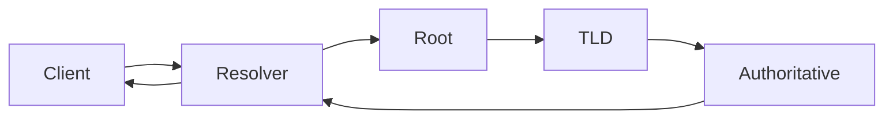

# DNS

> **Learning Path:** Cloud & Infrastructure Architecture
> **Section:** 5.1.4 — Cloud fundamentals

## 1. Problem

உங்க service-க்கு `api.example.com`னு ஒரு பெயர் வச்சிருக்கீங்க. ஆனா network-ல அது போக வேண்டியது ஒரு IP address.

அந்த IP மாறினால் என்ன ஆகும்? Hardcode பண்ணியிருந்தா எல்லா client-ஐயும் மாத்தணும். Load balancer add பண்ணினா, instance scale பண்ணினா, region மாற்றினா எல்லாம் IP மாறும்.

அதனால் வேண்டியது: human readable name -> IP mapping, அது dynamically update ஆகணும், மில்லியன் request-க்கு scale ஆகணும், ஒரு central point fail ஆகக்கூடாது.

இதுதான் DNS-க்கு வேர்காரணம்.

## 2. Mental Model

DNS என்பது distributed phonebook.

ஆனா ஒரே புத்தகமில்லை. Hierarchy-ல பிரிக்கப்பட்டிருக்கு. ஒவ்வொரு zone-க்கும் ஒரு authoritative nameserver இருக்கு, அது தனக்கு சொந்தமான names-ஐ மட்டும் தெரியும்.

Resolver என்பது உங்க device-க்கு பக்கத்தில் இருக்கும் local librarian. அவன் cache பார்ப்பான், தெரியலன்னா மேலே chain பண்ணுவான்.

## 3. How It Works

ஒரு query வரும்போது flow இப்படி:

Client `api.example.com` கேட்டால்:
1. OS resolver cache பார்க்கும்
2. இல்லைன்னா recursive resolver-க்கு போகும்
3. Resolver root nameserver-கிட்ட கேட்கும்: .com எங்கே?
4. .com TLD nameserver சொல்லும்: example.com எங்கே?
5. Authoritative nameserver for example.com சொல்லும்: api.example.com -> A record 203.0.113.10
6. அந்த result TTL வரை cache ஆகும்.

TTL என்பது cache freshness-ன் கன்ட்ரோல். குறைவான TTL = fresh ஆனா அதிக query load.

## 4. Architectural Reasoning

DNS ஏன் architect-க்கு முக்கியம்?

**Service location abstraction.** IP மாறினாலும் name அப்படியே. Deployment, failover, scaling எல்லாம் DNS level-ல manage பண்ணலாம்.

**Decentralized control.** example.com-ன் records உங்க authoritative server-ல இருக்கும். Cloud provider-க்கு தெரியாது. இதனால் no single point of failure.

**Traffic steering.** Route53, Cloudflare, etc. A record-க்கு பதிலாக latency-based routing, geolocation routing, failover பண்ணலாம். Application code மாறாமல் traffic-ஐ மாற்றலாம்.

Alternative என்ன? Hardcoded IP, Consul / etcd service discovery. அவை internal service discovery-க்கு நல்லது. Internet facing name resolution-க்கு DNS தான் universal protocol.

## 5. Trade-offs

**TTL vs Consistency.** TTL குறைச்சா propagation fast, ஆனா resolver load அதிகம், DDoS surface அதிகம். Production-ல 60s TTL common, critical failover-க்கு 30s வரை போகலாம்.

**Caching vs Freshness.** Browser, OS, ISP resolver எல்லாம் cache பண்ணும். நீங்க record மாற்றினாலும் உலகம் உடனே பார்க்காது. இது DNS-ன் fundamental trade-off.

**Security.** DNS hijacking, cache poisoning, spoofing. DNSSEC இதை குறைக்கும், ஆனா adoption partial. Internal DNS-ஐ public expose பண்ணாதீங்க.

**Operability.** DNS change என்பது global. தவறான record போட்டால் உலகம் முழுக்க பாதிக்கும். Change process slow, validate செய்யணும்.

## 6. Practical Example

உங்களிடம் multi-region API இருக்கு. Mumbai, Singapore.

நீங்கள் Route53-ல `api.example.com` க்கு latency-based routing set பண்ணீங்க. Client query வந்தால் nearest healthy endpoint-க்கு போகும்.

Blue-green deployment பண்ணும்போது: new version IP வந்தது. TTL 60s வச்சிருக்கீங்க. DNS update பண்ணினால் 1-2 நிமிடத்தில் traffic gradually shift ஆகும். Rollback வேண்டும்னா record-ஐ திருப்பி மாற்றினால் போதும். Client code மாற்ற வேண்டாம்.

Cost? DNS query cheap. ஆனா high query rate-ல resolver cache miss ஆனால் authoritative server load அதிகம் ஆகும்.

## 7. Reasoning Challenge

உங்க payments service `pay.example.com` 99.99% availability வேண்டும். Primary datacenter down ஆனால் automatic failover வேண்டும். DNS failover use பண்ணலாம்.

நீங்கள் TTL 300s வச்சிருக்கீங்க. Primary down ஆனதும் secondary IP-க்கு மாற்றினீங்க. ஏன் சில users-க்கு இன்னும் 5 ந
