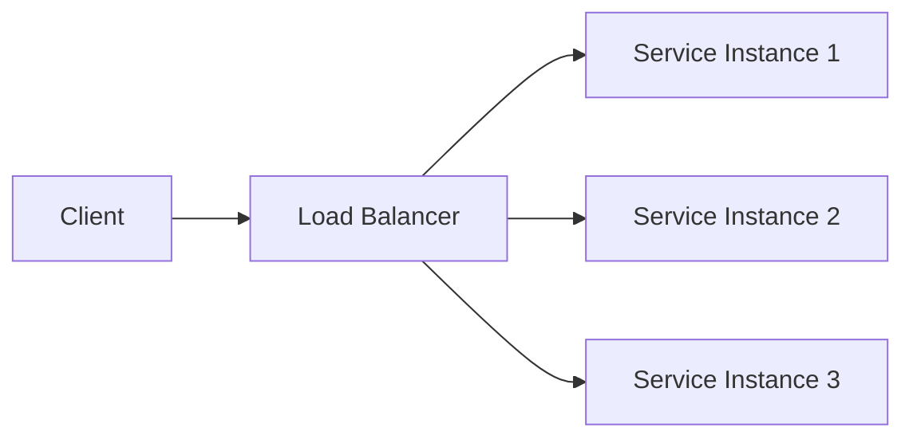

# Load balancing

> **Learning Path:** Cloud & Infrastructure Architecture
> **Section:** 5.1.5 — Cloud fundamentals

## 1. Problem

ஒரு API service-ஐ நீங்கள் launch பண்ணினீர்கள். ஆரம்பத்தில் ஒரு server போதும். Traffic வளர்ந்து 10x ஆகும்போது என்ன ஆகும்?

ஒரே server CPU, memory, network-ஐ exhaust பண்ணும். Latency spike ஆகும். Request timeout ஆகும். Server crash ஆனால் முழு service-மே down.

இப்போது 3, 5, 10 servers வைத்து scale பண்ணினீர்கள். ஆனால் user-கள் எப்போதும் ஒரே server-ஐ தான் hit பண்ணினால்? மற்ற servers idle-ல் இருக்கும். Single point of failure தான்.

**Pain point:** Traffic-ஐ சரியாக distribute பண்ணாமல் scaling பயனற்றது.

## 2. Mental Model

Load balancer என்பது traffic police மாதிரி.

Client request வரும். Load balancer அதை பார்த்து healthy instances-க்கு distribute பண்ணும். Server down ஆனால் அதற்கு traffic போகாமல் தடுக்கும். New instance add ஆனால் automatic-ஆ traffic போகும்.

நீங்கள் server-களை manage பண்ணாமல், load balancer ஒரு single entry point ஆகி மறைத்து விடும்.

## 3. How It Works

Basic flow:

Load balancer இரண்டு level-ல் வேலை செய்யும்.

**L4 - Transport Layer:** IP and port பார்த்து distribute பண்ணும். Fast, dumb. TCP connection-ஐ backend-க்கு pass-through.

**L7 - Application Layer:** HTTP headers, path, host, cookies பார்த்து route பண்ணும். A/B testing, canary, path-based routing செய்ய முடியும்.

Algorithm examples:
* **Round Robin:** ஒவ்வொரு request-ஐயும் மாறி மாறி கொடுக்கும்.
* **Least Connections:** எந்த instance-ல் active connections குறைவோ அங்கு போடும்.
* **IP Hash:** Same client-ஐ same instance-க்கு stick பண்ணும் - session affinity-க்கு useful.

Health check மிக முக்கியம். Load balancer பின்னால் உள்ள instances-ஐ periodically ping பண்ணும். Unhealthy ஆனால் traffic-ஐ கட் பண்ணும்.

## 4. Architectural Reasoning

Load balancer தேவைப்படும் constraints:

* **Throughput > Single instance capacity:** Requests per second limit மீறுகிறது.
* **Availability:** Instance failure ஆனாலும் service continue ஆக வேண்டும்.
* **Scalability:** Traffic peak-க்கு instances add/remove பண்ண வேண்டும்.

Alternatives என்ன?
* Client-side load balancing: Client-க்கு server list கொடுத்து client தான் choose பண்ணும். Complex, client-ல் logic வரும்.
* DNS round robin: Simple ஆனால் slow failover, health awareness இல்லை.

Architect ஏன் load balancer choose பண்ணுவார்?
Centralized control, transparent failover, observability ஒரே இடத்தில். Autoscaling group-உடன் இணைத்தால் traffic spike வந்தால் new instance spin up ஆகி load balancer automatic-ஆ include பண்ணும்.

## 5. Trade-offs

**Latency vs distribution:** Load balancer ஒரு hop கூடுதல். Cross-AZ traffic வந்தால் latency அதிகமாகும். But uneven load-ஐ தவிர்க்கிறது.

**Single point of failure:** Load balancer தானே down ஆனால் முழு system down. அதனால் load balancer-ஐயும் highly available-ஆக run பண்ண வேண்டும் - multiple AZ, active-active.

**Complexity:** Health check tuning தவறாக இருந்தால் flapping ஆகும். Too aggressive health check = good instance-ஐ remove பண்ணும். Too slow = bad traffic தொடரும்.

**Session affinity cost:** Stateful service-க்கு stickiness வேண்டும் என்றால் load distribution uneven ஆகும். Better to make service stateless.

Failure mode: Load balancer saturation. LB itself CPU/network limit மீறினால் முழு cluster-க்கும் traffic போகாது. Rate limiting and LB sizing முக்கியம்.

## 6. Practical Example

E-commerce site, sale day.

API servers 3 instances, autoscaling enabled. ALB in front.

Morning traffic normal. 2 PM-ல் spike. CPU > 70%. Autoscaling policy trigger ஆகி 3 new instances launch ஆகிறது. ALB health check 30 sec-ல் pass ஆனதும் new instances-க்கு traffic போகிறது.

ஒரு instance network partition ஆனால் health check fail ஆகி ALB அதை out ஆக remove பண்ணி விடுகிறது. Users-க்கு error தெரியாது.

Checkout service-க்கு session affinity தேவை இல்லை. Payment service idempotent. அதனால் round robin போதும். Catalog service-ல் cache heavy, least connections better.

## 7. Reasoning Challenge

உங்களிடம் API service 5 instances உள்ளது. ஒரு instance மற்றதை விட 2x slow. Database connection pool limit உள்ளது. User-கள் session stickiness வேண்டும் என்று கேட்கிறார்கள்.

இந்த scenario-ல் round robin use பண்ணினால் என்ன problem வரும்? Least connections அல்லது L7 routing எப்படி help பண்ணும்? Session affinity-ஐ avoid பண்ண முடியுமா? ஏன்?

## 8. Key Takeaways

* Load balancer-ன் core job traffic distribute பண்ணுவது அல்ல, **risk distribute பண்ணுவது** - failure-ஐ
