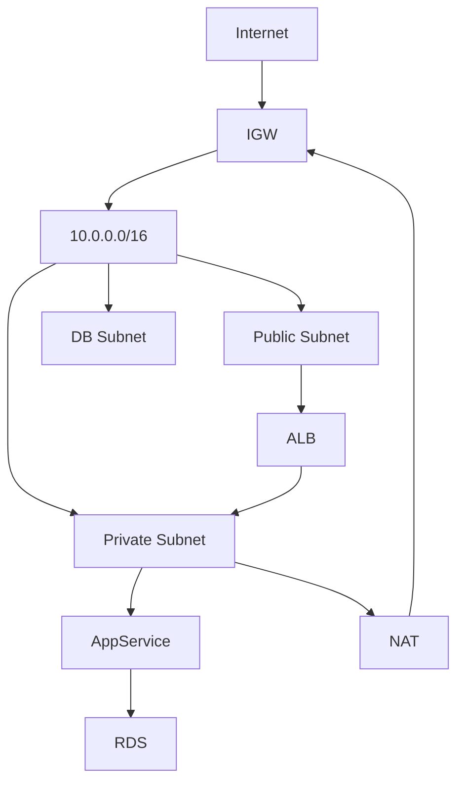

# VPC/VNet

> **Learning Path:** Cloud & Infrastructure Architecture
> **Section:** 5.1.7 — Cloud fundamentals

## VPC / VNet — cloud-ல உன் network-ஐ எப்படி isolate பண்ணுறது

### 1. Problem

On-prem data center-ல நீங்கள் உங்க network-ஐ முழுசா control பண்ணுவீங்க. VLAN, firewall, routing எல்லாம் உங்க கையில்.

Cloud-க்கு வந்ததும் அந்த control போயிடும். எல்லா customers-உம் ஒரே physical network-ல இருக்காங்க. நீங்கள் EC2 instance ஒன்னு launch பண்ணினா அது default-ஆ public internet-க்கு திறந்து கிடக்கும்.

இதனால் என்ன problem வரும்?
* Database, internal service எல்லாம் இன்டர்நெட்டுக்கு expose ஆகும்.
* ஒரு tenant-ன் traffic இன்னொரு tenant-க்கு leak ஆகும்.
* IP range, routing, security policy-ஐ நீங்கள் define பண்ண முடியாது.

என்ன தேவை? Cloud provider-ன் physical network-க்குள்ளே உங்களுக்கு ஒரு private, isolated network boundary.

அதுதான் VPC. Azure-ல VNet, GCP-ல VPC.

### 2. Mental Model

VPC = virtual private cloud. உங்களுக்கு சொந்தமான virtual data center.

நீங்கள் ஒரு CIDR block claim பண்ணுவீங்க, எ.கா. `10.0.0.0/16`. அதுக்குள்ள நீங்கள் subnets create பண்ணுவீங்க. அது உங்கள் apartment complex மாதிரி. Complex-க்கு வெளியே உலகம், உள்ளே உங்களுக்கு மட்டும் தெரியும் private IP-கள்.

ஒவ்வொரு VPC-யும் default-ஆ மற்ற VPC-களிலிருந்து isolate ஆக இருக்கும். நீங்கள் விரும்பினால் மட்டுமே அதை connect பண்ண முடியும்.

### 3. How It Works

VPC-வை புரிஞ்சுக்கணும்னா 4 விஷயம் போதும்.

**CIDR and Subnets:** VPC-க்கு ஒரு private IP range தேவை. அதை subnets-ஆ பிரிப்பீங்க. Public subnet, Private subnet.

**Route Table:** ஒரு subnet-லிருந்து traffic எங்க போகணும்னு route table decide பண்ணும். Public subnet-க்கு `0.0.0.0/0` -> Internet Gateway. Private subnet-க்கு `0.0.0.0/0` -> NAT Gateway.

**Internet Gateway vs NAT Gateway:** Internet Gateway = public subnet-ல இருக்கும் instance-க்கு internet access கொடுக்கும். NAT Gateway = private subnet-ல இருக்கும் instance-க்கு outbound internet மட்டும் கொடுக்கும், inbound வராது.

**Security:** இரண்டு layer.
* Security Group - stateful, instance-level firewall. Allow/deny inbound/outbound.
* Network ACL - stateless, subnet-level firewall.

இந்த மாடல்-ல உங்க service-களுக்கு public IP தேவையில்லாமலே communication ஆகும், ஏனெனில் அது same VPC-ல private IP-ல run ஆகும்.

### 4. Architectural Reasoning

VPC தேவைப்படும் constraints:

* **Security & Isolation:** Database, internal API-களை public internet-ல இருந்து மறைக்கணும்.
* **Network control:** IP range, routing, segmentation நீங்கள் define பண்ணணும்.
* **Compliance:** Data residency, private connectivity தேவைப்படும்.

Alternatives என்ன?
* Default cloud network - பயன்படுத்த முடியாது, shared.
* VPN / Direct Connect to on-prem - hybrid case-க்கு.
* Service mesh only - network isolation தராத
