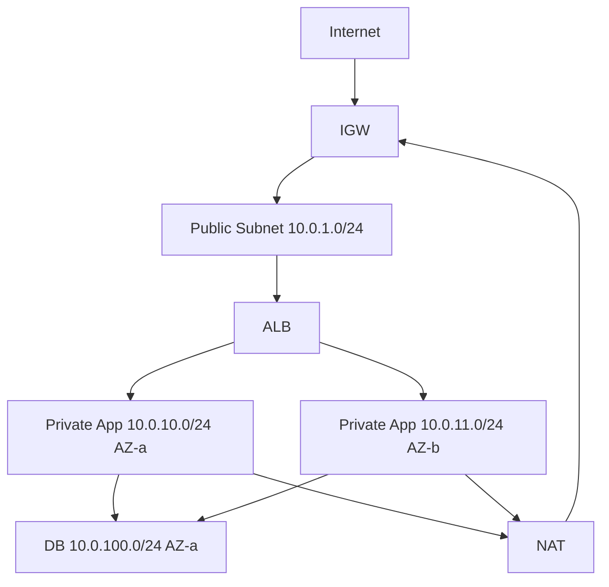

# Subnets

> **Learning Path:** Cloud & Infrastructure Architecture
> **Section:** 5.1.8 — Cloud fundamentals

## 1. Problem

நீங்கள் cloud-ல் infrastructure raise பண்ண ஆரம்பிக்கிறீங்க. ஒரு VPC create பண்ணினீங்க, `10.0.0.0/16` block கொடுத்தீங்க. இப்போ அதுக்குள்ள எல்லா service-உம் ஒரே pool-ல இருக்கு.

என்ன பிரச்சனை வரும்?

* எல்லா instance-க்கும் public IP கொடுத்தால் security risk. DB-க்கு internet வேண்டாம்.
* ஒரு team-ன் workloads இன்னொரு team-ஐ தாக்காமல் isolate பண்ண வேண்டும்.
* Availability வேண்டும் என்றால் different AZ-ல deploy பண்ண வேண்டும். ஆனால் IP range எப்படி manage பண்ணுவது?
* Scale பண்ணும்போது IP exhaustion வரும்.

இங்கே தான் subnet தேவைப்படுகிறது. ஒரு பெரிய IP block-ஐ smaller, manageable neighbourhood-க்களாக பிரிப்பது.

## 2. Mental Model

Subnet = VPC-க்குள்ள ஒரு neighbourhood.

VPC என்பது ஒரு city. Subnet என்பது அந்த city-க்குள்ள ஒரு area code. ஒரு area-க்கு என்ன access இருக்கும், எந்த AZ-ல இருக்கும், எந்த route table அதை control பண்ணும் என்பது தனியாக set பண்ணலாம்.

ஒரு subnet எப்போதும் ஒரு AZ-க்கு bind ஆகி இருக்கும். அதனால் high availability-க்கு நாம் same CIDR-ஐ multiple AZ-களில் repeat பண்ணி subnet create பண்ணுவோம்.

## 3. How It Works

Cloud provider-ல VPC-க்கு ஒரு CIDR block கொடுக்கிறோம். உதாரணமாக `10.0.0.0/16`. இதை நாம் subnet-க்களாக split பண்ணுகிறோம்.

* `10.0.1.0/24` - Public subnet AZ-a
* `10.0.2.0/24` - Public subnet AZ-b
* `10.0.10.0/24` - Private app subnet AZ-a
* `10.0.11.0/24` - Private app subnet AZ-b
* `10.0.100.0/24` - DB subnet AZ-a

ஒவ்வொரு subnet-க்கும் ஒரு route table attach ஆகும்.

Public subnet route table: `0.0.0.0/0 -> Internet Gateway`. Instance-க்கு public IP இருந்தால் internet வரும்/போகும்.

Private subnet route table: `0.0.0.0/0 -> NAT Gateway`. Outbound internet மட்டும். Inbound internet இல்லை.

DB subnet route table: வெறும் VPC internal route மட்டும். அல்லது private app subnet-க்கு மட்டும் allow.

Security group and NACL என்பது additional layer. Subnet என்பது network boundary + routing boundary.

## 4. Architectural Reasoning

Subnet-ஐ எப்போது பயன்படுத்துவது?

* **Isolation by tier**: Public facing workloads vs private workloads vs data workloads. ஒவ்வொன்றுக்கும் தனி subnet, தனி route table.
* **AZ spread**: ஒரு service-க்கு multiple subnet-கள், different AZ-களில். Auto Scaling Group / ECS / EKS spread ஆகும். AZ down ஆனாலும் app up இருக்கும்.
* **Security boundary**: Public subnet-ல் internet gateway இருக்கும். Private subnet-ல் இருக்காது. DB subnet-ல் internet route இருக்கவே கூடாது.
* **IP planning**: `/24` ~ 251 usable IPs. எதிர்கால scale-க்கு சரியான size தேர்வு செய்ய வேண்டும்.

Alternatives?

ஒரே subnet-ல் எல்லாம் வைத்தால் simple ஆனால் security, availability, operability போய்விடும். Separate VPC per workload என்பது மிகவும் heavy. Subnet என்பது VPC-க்குள் fine-grained control.

## 5. Trade-offs

* **CIDR fragmentation**: ஒரு முறை VPC CIDR allocate பண்ணினால் மாற்ற முடியாது. Subnet size சிறியதாக வைத்தால் waste ஆகும், பெரியதாக வைத்தால் ஒரு subnet-ல் பல tier-கள் mix ஆகும். IP planning long term impact உள்ளது.
* **Operational complexity**: Public, private, DB subnet எல்லாம் வைத்தால் route table, NAT Gateway, AZ mapping manage பண்ண வேண்டும். Team small என்றால் over-engineering ஆகலாம்.
* **Cost**: NAT Gateway per AZ cost ஆகும். Private subnet-க்கு internet வேண்டும் என்றால் NAT தேவை. அதற்கு பதில் public subnet-ல் வைத்தால் free ஆனால் security trade-off.
* **Failure mode**: Subnet-ல் IP exhaustion ஆனால் new instance launch fail ஆகும். Monitoring `Available IPs
