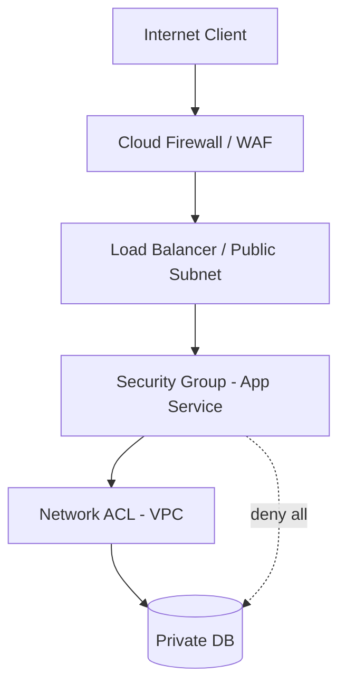

# Firewalls

> **Learning Path:** Cloud & Infrastructure Architecture
> **Section:** 5.1.9 — Cloud fundamentals

## Problem

உங்க company-க்கு public internet-ல expose ஆன API இருக்கு. அது ஒரு auto-scaling group-ல ஓடுது, database மட்டும் private subnet-ல இருக்கு.

இப்போ எந்த IP-ல இருந்தும் எந்த port-க்கும் hit பண்ண முடியுமா? ஆமாம்.

என்ன ஆகும்?
- Random internet scanners brute force பண்ணும், SSH/RDP port scan வரும்.
- ஒரு developer தப்பா public subnet-ல database instance திறந்துட்டா, direct internet-ல இருந்து connect ஆகிடும்.
- உள்ளே இருக்கும் service ஒன்னு compromised ஆனா, அது lateral movement பண்ணி மற்ற services-ஐ தாக்கும்.
- Compliance audit-ல "எப்படி unauthorized access-ஐ தடுக்கிறீர்கள்?"னு கேட்டா பதில் இல்லை.

**Firewall இல்லாம ஒரு system-க்கு perimeter இல்லை.** Traffic filter பண்ண ஒரு கட்டுப்பாடு இல்லாம போகும்.

## Mental Model

Firewall என்பது network-க்கு வரும் போக்குவரத்துக்கு gatekeeper.

ஒரு club-ல bouncer மாதிரி. List-ல பேர் இருந்தா உள்ளே விடு, இல்லைனா block பண்ணு. அவ்வளவுதான்.

Cloud-ல அது rule-based filter: யார், எங்கிருந்து, எந்த port, எந்த protocol, எந்த time-ல வரலாம் என்பதை define பண்ணுவீர்கள்.

## How It Works

Firewall packet-ஐ inspect பண்ணி allow / deny decision எடுக்கும்.

**Stateful vs Stateless**
- Stateless firewall: ஒவ்வொரு packet-ஐயும் தனியாக பார்க்கும். Fast, ஆனால் connection context தெரியாது.
- Stateful firewall: connection table வச்சு track பண்ணும். SYN வந்தா connection open, அதற்கு தொடர்பான packets மட்டும் allow. இது ரொம்ப common.

**Layer என்ன பார்க்குது**
- L3/L4: IP, port, protocol. `Allow 10.0.0.0/16 -> 443 TCP`. இது security group / network ACL level.
- L7: HTTP method, URL path, headers. `Block /admin* from non-VPN`. இது WAF level.

Cloud-ல பொதுவாக மூன்று layer இருக்கும்:

Traffic வெளியே போகும் போது egress rule முக்கியம். Compromised instance internet-க்கு curl பண்ணி data exfiltrate பண்ணாம தடுக்க.

## Architectural Reasoning

Firewall-ஐ use பண்ணும் காரணம் **default deny** principle-ஐ enforce பண்ண.

Constraints எதை solve பண்ணும்?
- **Exposure**: Public internet-ல இருந்து unnecessary access-ஐ குறைக்க.
- **Lateral movement**: Compromised tier A ல இருந்து tier B-க்கு போகாம தடுக்க.
- **Compliance**: PCI-DSS, SOC2-க்கு network segmentation proof வேண்டும்.

Alternatives என்ன?
- Security Groups: Instance level, stateful, VPC internal. அது firewall இல்லை, host level control.
- Network ACLs: Subnet level, stateless, broad.
- Service Mesh / mTLS: Identity based access, east-west traffic.
- Zero Trust: Never trust, always verify. Firewall மட்டும் போதாது.

Architect எப்போ firewall-ஐ தேர்வு செய்வார்?
Public ingress இருக்கும் போது, முதல் line of defense. Internal segmentation தேவைப்படும் போது.

## Trade-offs

1. **Security vs Operability**: Rules அதிகமாகும் போது false positive வரும். Legit traffic block ஆகும். Rule management-க்கு ownership வேண்டும்.

2. **Performance vs Inspection**: Deep packet inspection, TLS decryption slow ஆக்கும். High throughput API-க்கு அது latency-க்கு முக்கியம்.

3. **Centralized vs Distributed**: Cloud managed firewall central control கொடுக்கும், ஆனால் vendor lock-in. Self-managed firewall ஒன்னு operational overhead கூடும்.

4. **Perimeter vs Identity**: Firewall IP-based. IP spoof ஆகலாம், IP இல்லாத internal threat-ஐ catch பண்ணாது. அதனால் firewall + IAM + mTLS combination தேவை.

Failure mode: Rule too permissive -> `0.0.0.0/0:443 allow`. Rule too restrictive -> production outage. எல்லா firewall change-க்கும் rollback plan வேண்டும்.

## Practical Example

E-commerce API, cloud VPC-ல இருக்கு.

- Public ALB `10.0.1.0/24` public subnet-ல.
- App service `10.0.2.0/24` private subnet.
- DB `10.0.3.0/24` private subnet.

Decision:
- Security Group on ALB: Allow 443 from `0.0.0.0/0`, deny all else.
- Security Group on App: Allow 8080 from ALB SG only.
- Security Group on DB: Allow 5432 from App SG only.
- Network ACL: Default deny all egress to internet for private subnets, allow only outbound to known update servers.
- Cloud WAF in front of ALB: Rate limit, block SQLi, block requests from known bad ASNs.

இப்போ DB direct internet-ல இருந்து reachable இல்லை. App compromised ஆனாலும் DB-க்கு access இருக்கும், ஆனால் internet-க்கு data அனுப்ப முடியாது.

## Reasoning Challenge

உங்க system-ல 20 micro
