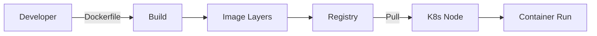

# Images

> **Learning Path:** Cloud & Infrastructure Architecture
> **Section:** 5.2.3 — Containers

## Problem

ஒரு service-ஐ develop பண்ணி உள்ளூர்ல ஓடுது. Same code-ஐ production-ல deploy பண்ணினா `library version mismatch`, `missing system package`, `OS version வேற`ன்னு crash ஆகுது.

அடுத்து dev team கிட்ட "என்னோட machine-ல வேலை செய்யுது" வரும். Ops team கிட்ட "environment தெரியல" வரும்.

Scale பண்ணணும்னா ஒவ்வொரு server-லும் manual install செய்ய முடியாது. Rolling update பண்ணணும்னா என்ன மாறியிருக்குன்னு track பண்ண முடியாது.

இந்த pain-க்கு root cause என்ன? App மட்டும் இல்ல, அதோட runtime + dependencies + config + OS சூழல் எல்லாம் சேர்ந்தது ஒரு முழு execution environment. அதை reproduce பண்ண முடியல.

## Mental Model

Container image = அந்த execution environment-ஐ immutable ஆக freeze பண்ணி, package பண்ணின artifact.

ஒரு image என்பது layered filesystem snapshot + metadata. அதை எடுத்து எந்த host-ல போட்டாலும் same process tree, same dependency graph, same behavior கிடைக்கும்.

Think of it like: app + runtime + libs + OS userland = one sealed box. அந்த box-ஐ build பண்ணினதும் hash வந்துரும். அதே hash-ஐ யார் pull பண்ணாலும் same box.

## How It Works

Build time:

`Dockerfile` என்பது recipe. Base image-ல இருந்து start பண்ணி, RUN, COPY, ENV மாதிரி instructions-ஐ அடுக்கடுக்காக apply பண்ணுவோம். ஒவ்வொரு instruction-மும் ஒரு read-only layer உருவாக்கும். Union filesystem அந்த layers-ஐ stack பண்ணி final view தரும்.

```
FROM python:3.12-slim
WORKDIR /app
COPY requirements.txt .
RUN pip install -r requirements.txt
COPY . .
CMD ["python", "app.py"]
```

இதை build பண்ணினா ஒரு image id வரும். அதை registry-க்கு push பண்ணலாம். Docker Hub, ECR, GCR மாதிரி.

Run time:

Kubernetes node / Docker daemon image-ஐ pull பண்ணும். Layers cache இருந்தா மீண்டும் download பண்ண வேண்டாம். Image unpack ஆகி container filesystem உருவாகும். Container start ஆகும்போது process run ஆகும், network namespace, cgroup isolation கொடுக்கும்.

Build → Push → Pull → Run flow:



## Architectural Reasoning

Container image ஏன் தேவை?

* Reproducibility: dev, staging, prod எல்லாம் same image hash. "works on my machine" பிரச்சனை முடியும்.
* Immutable artifact: deploy என்பது image tag-ஐ மாற்றுவது. Rollback என்பது பழைய tag-க்கு திரும்புவது.
* Portability: image build ஆனதும் எந்த cloud, எந்த node-லும் run ஆகும்.
* Scale & orchestration: Kubernetes pod replica பண்ணும்போது same image-ஐ மீண்டும் மீண்டும் schedule பண்ண முடியும்.

Constraint address பண்ணுறது: environment drift, manual dependency management, slow & error-prone provisioning.

Alternative என்ன? VM image, bare metal script, PaaS buildpack. VM heavy, slow boot. Script non-deterministic. Image lightweight, fast start, declarative.

## Trade-offs

* **Image size vs startup time**: அதிக layers, big base image = slow pull, slow scale up. Distroless / slim base, multi-stage build use பண்ணி size குறைக்கலாம். ஆனா build complexity ஏறும்.
* **Layer caching vs invalidation**: Early layers மாறாம இருந்தா cache hit. `COPY . .` முதல்ல வச்சா ஒவ்வொரு code change-க்கும் pip install மீண்டும் run ஆகும். Layer order முக்கியம்.
* **Immutability vs mutability**: `latest` tag use பண்ணினா என்ன image வரும்னு தெரியாது. Pin digest / semantic version use பண்ணனும். ஆனா அது operational overhead.
* **Security**: Image ஒரு attack surface. Base image vulnerable ஆனா எல்லா deployment-லயும் பரவும். Scanning, minimal base, non-root user must. Every image update = rebuild whole fleet.
* **Registry cost & availability**: Image pull fail ஆனா pod stuck. Multi-region registry, image pull secrets, rate limits பிரச்சனை.

Failure mode: image pull backoff, manifest not found, layer corruption, node disk full.

## Practical Example

E-commerce order service. Python 3.12 app, Redis client, Postgres driver.

Dev உள்ளூர்ல `requirements.txt` வச்சு run பண்ணுவார். Prod-ல Ubuntu 22.04 வேற, Python 3.11 வேற. Bug.

Solution: `python:3.12-slim` base எடுத்து multi-stage build:

1. Build stage-ல dependencies install.
2. Final stage-ல runtime மட்டும் copy.
3. Image tag = `order-svc:v1.4.2-abc123`. Build CI-ல build ஆகி ECR-க்கு push.
4. Kubernetes deployment image tag-ஐ மாற்றினா rolling update நடக்கும். Rollback வேண்டும்னா previous tag-க்கு revert.

Ops-க்கு எதுவும் manual install இல்ல. Image hash-ஐ audit முடியும்.

## Reasoning Challenge

உங்களுக்கு 20 microservices இருக்கு. எல்லாம் `node:20` base image use பண்ணுது. Base image-ல security patch வந்திர
