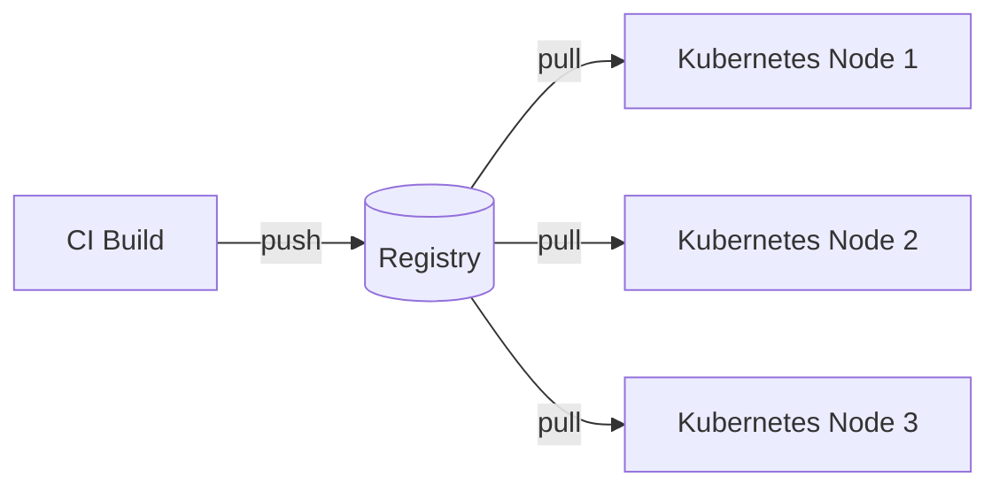

# Registries

> **Learning Path:** Cloud & Infrastructure Architecture
> **Section:** 5.2.4 — Containers

## 1. Problem

நீங்கள் ஒரு microservices app build பண்ணினீங்க. `Dockerfile` இருக்கு, `docker build` பண்ணி image கிடைத்துவிட்டது. இப்போ அதை 10 node-களுக்கு deploy பண்ணணும்.

அப்போ என்ன பண்ணுவீங்க?

Image-ஐ tar file ஆக்கி SCP பண்ணுவீங்களா? Version எது latest? `v1.2.3` build பண்ணியது யார்? Production-ல இருக்கிற image-க்கும் CI-ல build ஆன image-க்கும் match ஆகுதா? New node join ஆனால் அதற்கு image எப்படி கிடைக்கும்?

Manual copy பண்ணுவது scale ஆகாது. Network failure-ல பாதி node-க்கு image போய், பாதிக்கு போகாமல் இருக்கும். Rollback பண்ண வேண்டுமென்றால் எந்த image-ஐ எடுக்க வேண்டும் என்று தெரியாது.

இந்த pain-தான் registry வந்த காரணம்.

## 2. Mental Model

Registry என்பது container image-களுக்கான centralized artifact repository.

npm registry-ல் package போல, container registry-ல் image போல.

Developers `push` பண்ணுவார்கள், runners / nodes `pull` பண்ணும். Image என்பது ஒரு immutable object, அதற்கு name, tag, digest இருக்கும். யார் வேண்டுமானாலும் same digest-ஐ pull பண்ணி exact same bits-ஐ பெற முடியும்.

## 3. How It Works

ஒரு image என்பது layers-ன் stack. ஒரே base image-ஐ பல images use பண்ணும். Registry layers-ஐ content-addressable ஆக store பண்ணும்.

Pull flow எப்படி இருக்கும்:

1. **Push**: `docker build` பண்ணியதும் `docker push myregistry.com/app:v1.2.3`. Registry image manifest-ஐ பெறும், இல்லாத layers-ஐ store செய்யும்.
2. **Pull**: Node `docker pull myregistry.com/app:v1.2.3` செய்யும். Registry manifest கொடுக்கும், node ஏற்கனவே இருக்கும் layers-ஐ skip செய்யும்.
3. **Tag vs Digest**: Tag mutable, digest immutable. `v1.2.3` என்பது pointer. `sha256:abc...` என்பது exact content.

Authentication, HTTPS, and signed manifests மூலம் trust உறுதி செய்யப்படும்.

## 4. Architectural Reasoning

Registry எப்போது தேவை?

* **Multiple consumers**: பல nodes, clusters, environments ஒரே image-ஐ தேவைப்படும் போது.
* **Build once, run anywhere**: CI-ல build ஆன image production-க்கு நகர்த்த வேண்டும்.
* **Versioning & rollback**: Tag/digest மூலம் exact version track செய்ய.
* **Reuse**: Base layers cache ஆகி network transfer குறையும்.

Alternatives?
* Peer-to-peer copy, shared NFS volume. Work செய்யும் ஆனால் consistency, security, discovery இல்லை.
* Git LFS போன்றது. Image binary-க்கு inefficient.

Architect ஏன் registry choose பண்ணுவார்? System boundary clear ஆகிறது. Image production pipeline-க்கும் runtime-க்கும் ஒரு single source of truth கிடைக்கிறது.

## 5. Trade-offs

* **Central point of failure**: Registry down ஆனால் new pod schedule ஆகாது. Pull cache இருந்தால் existing pods run ஆகும், new scaling stop ஆகும். High availability, replication தேவை.
* **Pull latency & egress cost**: Image பெரியது. Node start slow ஆகும். Registry region அருகில் இருக்க வேண்டும் அல்லது pull-through cache / mirror வைக்க வேண்டும்.
* **Security vs availability**: Image signing, vulnerability scanning, admission controller enforce செய்யலாம். ஆனால் scanning delay deploy-ஐ slow பண்ணும்.
* **Registry hygiene**: Unused tags, multi-arch manifests, large history. Storage cost வளரும். Garbage collection தேவை.

Failure mode: Tag overwrite ஆனால் rollback கடினம். Digest use செய்யாவிட்டால் drift வரும்.

## 6. Practical Example

Enterprise CI/CD pipeline:

CI build `myapp:sha-<git-commit>` push செய்யும் private registry `registry.corp.internal` -க்கு. Tag `latest` மட்டும் mutable.

Kubernetes cluster imagePullSecrets மூலம் registry-ஐ authenticate செய்யும். Pod start ஆகும் போது node registry-லிருந்து pull பண்ணும். ImagePullPolicy `IfNotPresent` என்றால் node local cache use ஆகும்.

Production incident வந்தால், deployment manifest-ல் digest-க்கு pin செய்து rollback செய்யலாம். `myapp@sha256:...` exact same bits திரும்ப வரும்.

## 7. Reasoning Challenge

உங்களிடம் multi-region deployment இருக்கு. Mumbai region-ல build ஆன 2GB image-ஐ Singapore node-கள
