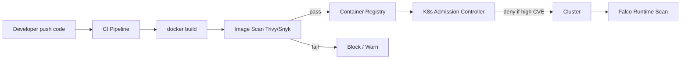

# Security scanning

> **Learning Path:** Cloud & Infrastructure Architecture
> **Section:** 5.2.5 — Containers

## 1. Problem

நீங்கள் ஒரு microservices team-ல இருக்கீங்க. ஒவ்வொரு service-மும் Docker image-ஆ build ஆகி Kubernetes-ல deploy ஆகுது.

ஒரு நாள் base image `node:18-alpine` update ஆகாம இருக்கு. அதுல இருக்கும் `openssl` library-ல CVE இருக்கு. அதை நீங்கள் தெரிஞ்சுக்காம production-க்கு push பண்ணிட்டீங்க. இல்லை ஒரு developer npm install பண்ணும்போது `left-pad` மாதிரி compromised package ஒன்னு சேர்ந்துடுது.

இப்போ என்ன ஆகும்?

* Image build ஆகி registry-ல போயிடும், யாருக்கும் தெரியாது.
* Deploy ஆனதும் runtime-ல exploit ஆகலாம்.
* Rollback பண்ணாலும் அந்த vulnerable layer அடுத்த build-லயும் திரும்ப வரும்.

**Problem painful ஆகும் இடம்:** Vulnerability தெரியாம கொண்டு போயிட்டா, fix பண்ணுவது மெதுவா, costly-ஆ இருக்கும். Production-ல break கூட வரும்.

## 2. Mental Model

Security scanning என்பது **build time-ல image/package-ஐ X-ray பண்ணுவது**.

நீங்கள் ஒரு container image-ஐ ஒரு suitcase-ன்னு நினைச்சுக்கோங்க. அதுல நிறைய layers இருக்கு. ஒவ்வொரு layer-ம் ஒரு OS package, language runtime, application code, third-party library. Scanning என்பது அந்த suitcase-ல ஆபத்தான பொருள் இருக்கான்னு பார்க்குறது.

இது முக்கியமா shift-left concept. Production-ல பிடிக்காம, build/CI-லயே பிடிக்கணும்.

## 3. How It Works

Container security scanning mainly 3 layers-ல நடக்கும்:

**Image / Dependency Scanning - Static**
Build ஆன image-ஐ scan பண்ணுறது. Base OS packages, language dependencies, system libraries-ல known CVE-கள் இருக்கான்னு database-ல compare பண்ணும். Tools: Trivy, Grype, Snyk, Clair.

உதாரணம்: `docker build` முடிஞ்சதும் `trivy image myapp:1.2.3` ஓடும். அது `CVE-2023-...` high severity ன்னு சொல்லும்.

SBOM generate பண்ணுவது இங்கே உதவும். Software Bill of Materials என்பது image-ல என்ன என்ன components இருக்குன்னு inventory. இதை scan பண்ணினால் supply chain tracking எளிது.

**Source / IaC Scanning**
Dockerfile, Kubernetes manifests, Helm charts-ல insecure patterns இருக்கான்னு பார்க்கும். `root user` ல run பண்ணுதா? Secrets hardcoded-ஆ இருக்கா? `latest` tag use பண்ணுதா?

**Runtime Scanning**
Image build ஆகிட்டது, deploy ஆகிட்டது. இப்போ running container-ல anomalous behavior, privileged mount, new process spawn ஆகுதான்னு watch பண்ணும். Falco, eBPF based tools இதை பண்ணும்.

ஆர்கிடெக்சர்-ல இதை CI pipeline-ல integrate பண்ணுவது தான் முக்கியம்.

## 4. Architectural Reasoning

**When becomes useful?**
Team size > 3, multiple services, fast release cadence. Manual review impossible. Base image updates frequent.

**What constraint it addresses?**
Speed vs Safety. நீங்கள் fast ship பண்ணணும், ஆனால் vulnerable image production-க்கு போகக்கூடாது.

**Options:**
1. Scan only on release to prod
2. Scan on every build + block on critical
3. Scan on build + runtime monitoring

Architect choose பண்ணும்போது இதை பார்க்கணும்:
* Do we block pipeline on high severity? அல்லது warning மட்டும்?
* False positive rate. Trivy ரொம்ப noise கொடுக்கும். Baseline define பண்ணணும்.
* Scan speed. Large image-ல 2-3 min ஆகும். Parallelize பண்ணணும்.

ஒரு practical decision: CI-ல **build-time scan + fail on Critical/High**. Registry-ல **policy enforcement via admission controller** - `image-policy-webhook` or OPA Gatekeeper. Runtime-ல **selective monitoring** for critical workloads only.

## 5. Trade-offs

* **Coverage vs Speed**: Deep scan + SBOM + license check = slow. Fast release வேணும்னா scope குறைக்கணும்.
* **Block vs Warn**: Strict policy safe, ஆனால் developer velocity drop ஆகும். பல teams warning first, then gradually hard block பண்ணும்.
* **Static vs Runtime**: Static scan known CVE-களை பிடிக்கும். Zero-day, misconfiguration, runtime exploitation-ஐ பிடிக்க runtime தான் முடியும். இரண்டும் வேற வேற problem.
* **Noise vs Signal**: Scanning tool CVE database பெருசு. Scanned image-ல `libssl` vulnerable ஆனாலும் அது reachable இல்லைன்னா risk low. Risk scoring பண்ணாம block பண்ணினா alert fatigue வரும்.

Failure mode: Scan pass ஆன image-க்கு அடுத்த நாள் new CVE publish ஆகும். அதனால image registry-ல periodic rescan வேணும். Continuous monitoring வேணும்.

## 6. Practical Example

Enterprise e-commerce platform. 40 microservices, daily releases.

அவங்க pipeline இப்படி வச்சிருக்காங்க:
* Dockerfile build ஆனதும் Trivy scan run ஆகும். Critical = fail build. High = warning + Jira ticket auto create.
* Image push ஆனதும் registry webhook Trivy-ஐ trigger பண்ணி SBOM-ஐ store பண்ணும்.
* Kubernetes admission controller OPA Gatekeeper use பண்ணி, high severity CVE உள்ள image-ஐ deploy block பண்ணும்.
* Production cluster-ல Falco run ஆகி privileged container escape முயற்சியை alert பண்ணும்.

இதனால வந்த benefit: Production incident குறை
