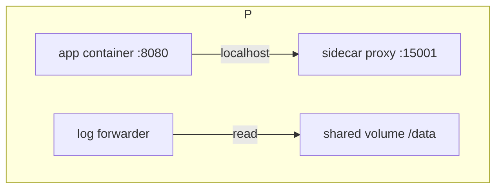

# Pods

> **Learning Path:** Cloud & Infrastructure Architecture
> **Section:** 5.3.1 — Kubernetes

## 1. Problem

நீங்கள் ஒரு microservice-ஐ container-ல run பண்ணி Kubernetes-ல deploy பண்ணினீர்கள். App container ஒன்று மட்டும் இருந்தால் போதாது.

Logging agent வேணும், metrics exporter வேணும், mTLS proxy வேணும், app config-ஐ ஒரு volume-ல mount பண்ணி முதலில் init பண்ண வேணும். இதையெல்லாம் தனித்தனி Pod-ஆக விட்டால் என்ன ஆகும்?

Containers-க்கு இடையே network call பண்ண வேண்டியிருக்கும், localhost இல்லாமல் போகும், port conflict, lifecycle sync செய்ய முடியாது. ஒரு container crash ஆனால் மற்றது தெரியாமல் இருக்கும்.

இதற்காக Kubernetes scheduling unit-ஐ container அல்ல, Pod என்று வடிவமைத்தது. ஏனெனில் ஒன்றாக இருக்க வேண்டிய containers-ஐ ஒன்றாக schedule பண்ணி, ஒன்றாக kill பண்ணி, ஒரே network identity கொடுக்க வேண்டும்.

## 2. Mental Model

Pod = ஒரே host-ல ஒன்றாக run ஆகும், தொடர்புடைய containers-ன் logical grouping.

ஒரு Pod என்பது ஒரு mini VM மாதிரி. அதற்கு ஒரு IP address, ஒரு network namespace, ஒரு set of shared volumes உண்டு. அதற்குள் இருக்கும் containers அனைத்தும் அதே IP-யை பார்க்கும், localhost ஒன்றாக இருக்கும்.

ஒரு Pod-ல் ஒரு main container இருக்கும், மற்றவை sidecar, init container போல helper ஆக இருக்கும்.

> Pod என்பது "எதை ஒன்றாக வைக்க வேண்டும்" என்பதன் பதில். Container என்பது "என்ன run பண்ண வேண்டும்" என்பதன் பதில்.

## 3. How It Works

Kubernetes scheduler ஒரு Pod-ஐ ஒரு node-ல schedule செய்கிறது. அந்த Pod-க்கு ஒரு shared network namespace கொடுக்கிறது.



அதே Pod-ல் உள்ள containers அனைத்தும் `localhost` மூலம் பேச முடியும். ஒரே volume-ஐ mount பண்ண முடியும். Init containers முதலில் run ஆகி, success ஆன பிறகே main containers start ஆகும்.

Pod என்பது ephemeral. Pod die ஆனால் அதன் IP, network namespace அழியும். State வெளியே persistent volume-ல தான் வைக்க வேண்டும்.

ஒரு simple Pod manifest:

```yaml
apiVersion: v1
kind: Pod
metadata:
  name: checkout-pod
spec:
  containers:
  - name: app
    image: checkout:v1
    ports:
    - containerPort: 8080
  - name: log-sidecar
    image: log-forwarder:latest
```

இரண்டும் ஒரே Pod-ல இருப்பதால் app stdout-ஐ sidecar நேரடியாக read பண்ண முடியும்.

## 4. Architectural Reasoning

Pod தேவைப்படும் constraint:

* **Tight coupling**: containers ஒன்றுக்கொன்று low latency-ல பேச வேண்டும், localhost தேவை.
* **Shared lifecycle**: ஒன்று start ஆனால் மற்றதும் start ஆக வேண்டும், ஒன்று die ஆனால் மற்றதும் restart ஆக வேண்டும்.
* **Shared resources**: same volume, same network identity.

இதற்கு alternative என்ன? தனித்தனி Pod-ல வைத்து Service mesh மூலம் connect பண்ணலாம். ஆனால் அது network hop, extra latency, complexity அதிகம்.

எப்போது ஒரு container per Pod வைக்க வேண்டும்? App ஒரு independent service ஆக இருந்தால், scale செய்யும் போது granular control வேண்டும் என்றால்.

Architect முடிவு: Sidecar pattern தேவைப்படும் போது Pod-
