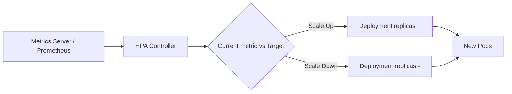

# HPA

> **Learning Path:** Cloud & Infrastructure Architecture
> **Section:** 5.3.10 — Kubernetes

## Problem

உங்கள் API service க்கு traffic திடீரென 3x ஆகிறது. Peak hour-ல latency spike ஆகிறது, error rate ஏறுகிறது. Off-peak-ல போய் 70% pods idle-ல இருக்கிறது, cost waste ஆகிறது.

Static replica count வச்சா இரண்டு பிரச்சனையும் ஒரே நேரத்தில் வரும். Manual scaling செய்யலாம், ஆனால் அது slow, human error, night/weekend-ல miss ஆகும்.

**What goes wrong if we don't have auto scaling?** Capacity தயாராக இல்லாமல் user experience கெடும். Capacity அதிகமாக இருந்தால் பணம் waste ஆகும். Architect-க்கு தேவை: load-க்கு ஏற்ப capacity தானாக adjust ஆக வேண்டும், human இல்லாமல்.

## Mental Model

HPA = thermostat for pods.

Thermostat room temperature-ஐ measure பண்ணி AC-ஐ on/off செய்யும். HPA pod metrics-ஐ measure பண்ணி replica count-ஐ up/down செய்யும்.

இது magic இல்லை. இது **reactive scaling** மட்டுமே. Traffic வந்த பிறகு தான் scale ஆகும். அதனால் cold start delay ஒரு constraint ஆக இருக்கும்.

## How It Works

Kubernetes-ல HPA controller ஒரு control loop ஆக run ஆகும்.

1. **Metrics source**: முதலில் metrics-server தேவை. CPU, memory utilization கிடைக்கும். Custom metrics வேணும்னா Prometheus + Adapter தேவை. Business metric like request per second, queue length என்றால் custom metrics API வேண்டும்.
2. **Target set**: நீங்கள் target CPU utilization or custom metric value set செய்வீர்கள். உதாரணம்: CPU 50% இல் வைக்க வேண்டும்.
3. **Calculation**: HPA current average utilization-ஐ பார்த்து desired replica = ceil(current replicas * current metric / target metric). MinReplicas, MaxReplicas limit set செய்யலாம்.
4. **Actuation**: Deployment replica count update ஆகும். New pods spin up ஆகும்.

Scale up policy, scale down policy, stabilization window கொடுக்கலாம். திடீர் spike-க்கு பதிலாக தடுமாறாமல் இருக்க.

## Architectural Reasoning

HPA எப்போது useful?

* Workload bursty, predictable pattern இல்லாதது.
* Pod scale ஆவது cheap and fast, stateless service.
* Latency requirement moderate, few seconds cold start acceptable.

What constraint it addresses? **Cost vs availability trade-off**-ஐ automate செய்யும்.

Alternatives:
* **Manual scaling**: Simple, ஆனால் slow, error prone.
* **Vertical Pod Autoscaler - VPA**: Pod-ன் CPU/memory request-ஐ மாற்றும். Pod restart தேவை. Stateful apps-க்கு கஷ்டம்.
* **Cluster Autoscaler**: Node level scale. HPA pod scale செய்தால் போதாவிட்டால் node add செய்யும். இரண்டும் சேர்ந்து தான் full auto scaling வரும்.
* **KEDA**: Event-driven scale, external queue length பார்த்து scale செய்யும்.

Architect decision point: Stateless API, background worker மாதிரி workloads-க்கு HPA primary choice. Database, StatefulSet மாதிரி stateful components-க்கு HPA கவனமாக use செய்ய வேண்டும்.

## Trade-offs

**Scale up lag**: Pod ready ஆக 20-60 seconds ஆகலாம். Traffic spike sudden ஆனால் initial requests shed ஆகும். இதற்கு buffer replicas, predictive scaling, or over-provisioning தேவை.

**Metric choice matters**: CPU utilization பார்த்தால், request latency high ஆகியிருக்கும் போதும் CPU low இருக்கலாம். CPU metric laggy. Custom metric like request rate per pod, queue length துல்லியமானது, ஆனால் setup complex.

**Scale down delay & thrashing**: Scale down stabilization window இல்லாமல் traffic dip-ல போய் போட்கள் குறைந்து, மீண்டும் ஏறி, oscillation ஆகும். Pod termination cost, connection reset கூட இருக்கும்.

**HPA scales pods, not nodes**: New pods create ஆனால் node இல்லாவிட்டால் Pending state-ல stuck ஆகும். Cluster Autoscaler இல்லாமல் HPA முழுமையாக வேலை செய்யாது.

**Cost**: MinReplicas வச்சு 24x7 run பண்ணினாலும் cost உண்டு. Auto scale down night-ல செய்தால் cost save ஆகும், ஆனால் morning spike-க்கு scale up time தேவை.

## Practical Example

Enterprise e-commerce API service, 3 replicas baseline.

HPA config:
* metric: requests per second per pod, target 1000 RPS/pod
* minReplicas: 3, maxReplicas: 30
* scale up stabilization: 60s, scale down: 300s

Sale event-ல traffic 5x ஆனது. HPA 3 → 12 replicas ஆக scale செய்தது. Pods ready ஆகும் வரை existing pods load அதிகம். API latency 200ms-ல இருந்து 600ms ஆனது 40 seconds. அதன் பிறகு stabilize ஆனது.

Night-ல traffic குறைந்ததும் HPA 12 → 3 ஆக slowly scale down செய்தது. Cost save ஆனது.

இங்கே architect பார்த்த trade-off: CPU metric மட்டும் போதாது, அதனால் custom metric via Prometheus use செய்தார். Warm pool இல்லாததால் first minute latency spike ஏற்பட்டது. அதை குறைக்க அவர் minReplicas அதிகமாக வைத்தார் off-peak-ல.

## Reasoning Challenge

உங்களிடம் payment processing service இருக்கிறது. Pod scale ஆக 90 seconds ஆகிறது. Traffic spike ஒவ்வொரு மணிக்கும் 2 நிமிடம் மட்டும் நடக்கிறது. HPA target CPU 70%. 

Scale up பண்ணும்போது spike முடிந்து விடும். எப்படி design செய்வீர்கள்? HPA மட்டும் போதுமா? இல்லை என்றால் என்ன add செய்வீர்கள்?

## Key Takeaways

* HPA reactive scaling மட்டுமே. Cold start lag உண்டு, spike-க்கு முன் capacity வைக்க முடியாது.
* Metric தேர்வு architecture-ஐ தீர்மான
