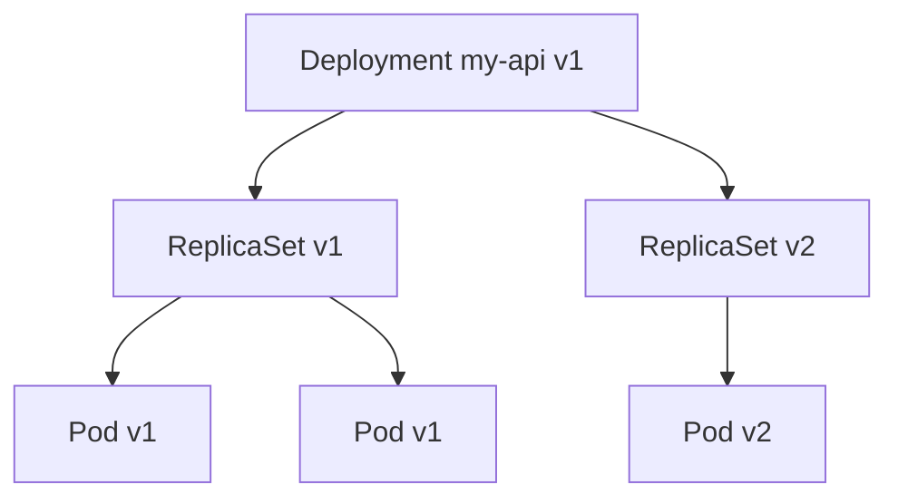

# Deployments

> **Learning Path:** Cloud & Infrastructure Architecture
> **Section:** 5.3.2 — Kubernetes

## 1. Problem

உங்களிடம் ஒரு API service இருக்கு, 3 replicas-ல run ஆகுது. ஒரு bug fix வந்துச்சு.

இப்போ என்ன நடக்கும்?
- Manual-ஆ பழைய pods-ஐ kill பண்ணி புது image-உடன் pods உருவாக்கணும்
- அந்த இடைவெளியில் traffic drop ஆகும், error வரும்
- Scale பண்ணணும்னா, எத்தனை replicas வேணும், எப்போ add பண்ணுறது என்பது manual
- ஒரு node down ஆனால் pod restart ஆகுமா? யார் பார்ப்பது?
- Rollback பண்ணணும்னா பழைய image tag என்ன, எப்படி மீண்டும்?

பெரிய system-ல இது repeat ஆகும். Human error, downtime, slow rollback வரும். இதுதான் problem.

## 2. Mental Model

Kubernetes-ல Deployment என்பது **desired state controller** ஆகும்.

நீங்கள் சொல்வது: `my-api` என்ற app 3 replicas, image `v1.2.3`, label `app=my-api`.

Kubernetes controller தொடர்ந்து கண்காணித்து, actual state-ஐ desired state-க்கு கொண்டு வரும்.

ஒரு புது version வந்தால், controller தானாக பழைய pods-ஐ குறைத்து புதிய pods-ஐ உருவாக்கும். Node fail ஆனால் pod-ஐ மறுபடி schedule செய்யும்.

Mental model: **You declare what, Kubernetes figures out how**.

## 3. How It Works

Deployment object → ReplicaSet → Pod

Deployment ஒரு ReplicaSet-ஐ manage பண்ணும். ReplicaSet ஒரு குறிப்பிட்ட pod template-க்கு எத்தனை copies வேண்டும் என்பதை உறுதி செய்யும்.

Rolling update நடக்கும்போது:
1. Deployment புதிய ReplicaSet உருவாக்கும்
2. புதிய pods படிப்படியாக start ஆகும், readiness probe pass ஆன பிறகுதான் service traffic போகும்
3. பழைய ReplicaSet-ன் pods maxSurge / maxUnavailable வரை குறையும்
4. வெற்றி என்றால் பழைய ReplicaSet வைத்திருக்கும், rollback-க்கு தேவைப்பட்டால் திரும்பப் பயன்படும்

kubectl apply செய்ததும் controller loop தொடங்கும்.

## 4. Architectural Reasoning

எப்போது Deployment தேவை?

- Stateless services, APIs, workers எங்கே uptime முக்கியம்
- Zero-downtime rollout வேண்டும்
- Auto-healing, self-healing வேண்டும்
- Scale replicas declaratively வேண்டும்

Constraints-ஐ address பண்ணுகிறது:
- **Availability**: Rolling update + readiness probe = downtime இல்லாமல் release
- **Operability**: Replica count ஒரே இடத்தில் manage, drift இல்லை
- **Reliability**: Pod crash ஆனால் ReplicaSet தானாக recreate செய்யும்

Alternatives:
- DaemonSet / StatefulSet - வேறு use cases
- Manual pods - small test, ஆனால் production-க்கு இல்லை
- Blue-green / Canary - Deployment-ன் strategy-ஐ override செய்யலாம், ஆனால் basic safety rolling update தருகிறது

Architect choose பண்ணும்போது பார்ப்பது: service stateless-ஆ? version history தேவையா? rollback speed என்ன?

## 5. Trade-offs

**Complexity vs Safety**: Deployment controller, ReplicaSet, rollout history என்பது abstraction கொடுக்கிறது, ஆனால் learn curve உள்ளது. `kubectl rollout status` புரிந்து கொள்ள வேண்டும்.

**Rolling speed vs Risk**: `maxSurge` அதிகமாக்கினால் rollout வேகம், ஆன
