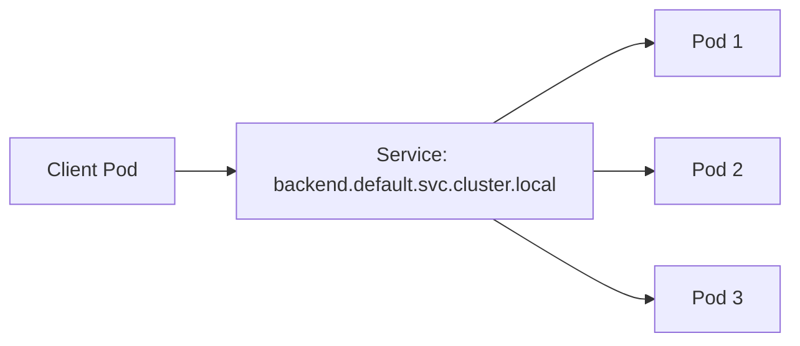

# Services

> **Learning Path:** Cloud & Infrastructure Architecture
> **Section:** 5.3.3 — Kubernetes

### Problem

Kubernetes-ல் ஒரு Deployment-ஐ scale பண்ணும்போது pods create ஆகும், terminate ஆகும். ஒவ்வொரு pod-க்கும் ஒரு ephemeral IP கிடைக்கும்.

இப்போ ஒரு frontend service இன்னொரு backend service-ஐ call பண்ணணும். Backend-ன் pod IPs தொடர்ந்து மாறுகிறது. DNS ஐ hardcode பண்ண முடியாது. Load balancer எங்கே வைக்கிறது? புது pod வந்தால் அதை எப்படி தெரிஞ்சுக்கறது? பழைய pod போனால் traffic அதுக்கு போகக்கூடாது.

இந்த pain இல்லாமல் போகவே Kubernetes Service வந்தது.

### Mental Model

Service என்பது **stable network identity + load balancing** கொடுக்கும் ஒரு abstraction.

உண்மையில் pods தான் மாறுகின்றன. Service என்பது அந்த pods க்கு ஒரு fixed IP மற்றும் DNS name கொடுக்கும். அதை உள்ளேயும் வெளியேயும் use பண்ணலாம்.

அனாலஜி: ஒரு கம்பெனிக்கு ஒரு main phone number. அந்த number-க்கு பின்னால் யார் பணியில் இருக்கிறார்களோ அவர்களுக்கு call divert ஆகும். ஊழியர் வந்தால் போனால் number மாறாது.

### How It Works

நீங்கள் ஒரு Service ஐ deploy பண்ணும்போது:

* `selector` மூலம் எந்த pods உடன் இது bind ஆக வேண்டும் என்று சொல்கிறீர்கள்
* Kubernetes `Endpoints` ஐ update செய்கிறது. Running pods list தான் endpoints.
* `kube-proxy` ஒவ்வொரு node-லும் iptables / IPVS rules வைத்து Service IP-க்கு வரும் traffic ஐ backend pods-க்கு distribute செய்கிறது.

Request flow:

Pod IP மாறினாலும் Service DNS / IP மாறாது.

முக்கிய வகைகள்:

* **ClusterIP**: Default. Cluster உள்ளே மட்டும் reachable. inter-service communication-க்கு.
* **NodePort**: Cluster ஒவ்வொரு node-ன் ஒரு port ல் expose பண்ணும். External access-க்கு quick hack.
* **LoadBalancer**: Cloud provider-ல் external LB உருவாக்கும். Production ingress-க்கு.
* **ExternalName**: Cluster-க்கு வெளியே உள்ள DNS name ஐ alias பண்ணும்.
* **Headless Service**: `clusterIP: None`. DNS A record ஆக நேரடியாக pods list கொடுக்கும். StatefulSet, direct pod addressing-க்கு பயன்படும்.

### Architectural Reasoning

Service வேண்டும் என்று தோன்றும் போது:

* **Stable address தேவை**: Client க்கு backend pods IP தெரிய வேண்டாம். Service name போதும்.
* **Load balancing தேவை**: Traffic ஐ healthy pods-க்கு spread பண்ண வேண்டும்.
* **Decoupling**: Pod lifecycle மாறினாலும் client code மாறக்கூடாது.

இது service discovery problem-ஐ solve பண்ணும். DNS + virtual IP + kube-proxy மூலம் simple ஆக.

Alternative: நீங்கள் external service mesh / Consul / Eureka use பண்ணலாம். அது fine-grained traffic control கொடுக்கும். ஆனால் Kubernetes native Service ஆனது zero config ல் basic load balancing + discovery கொடுக்கும்.

### Trade-offs

* **Abstraction vs visibility**: Service ஒரு black box ஆக இருக்கும். எந்த pod-க்கு request போகிறது என்பதை default-ல் தெரியாது. Debugging கடினம்.
* **Network hop**: kube-proxy மூலம் extra iptables rule. High throughput-ல் overhead உண்டு.
* **No advanced routing**: Service level-ல் canary, header based routing, retries இல்லை. அதற்கு Ingress Controller / Service Mesh தேவை.
* **Session affinity**: Default random. Sticky session வேண்டுமென்றால் explicit `sessionAffinity` வைக்க வேண்டும். அது state குவிக்கும்.

Failure mode: Endpoint controller slow ஆக update ஆனால் terminated pod-க்கு traffic போகும். Readiness probe சரியாக வைக்காவிட்டால் unhealthy pod-க்கும் traffic போகும்.

### Practical Example

உங்களிடம் `payment-service` என்ற Deployment 3 replicas உள்ளது. Frontend இதை `http://payment-service:8080` என்று அழைக்கிறது.

Deployment scale 3 → 5 ஆனாலும் frontend code மாற வேண்டாம். Service selector `app=payment` பார்த்து endpoints ஐ auto update செய்யும். kube-proxy node-ல் rules update செய்யும்.

External access வேண்டுமென்றால், API Gateway வெளியே NodePort / LoadBalancer Service வைக்கலாம் அல்லது Ingress Controller மூலம் HTTP routing செய்யலாம்.

RAG pipeline-ல் vector database service ஒன்று உள்ளது. Embedding service இதை ClusterIP service மூலம் அழைக்கும். Pod restart ஆனாலும் service name stable இருப்பதால் pipeline break ஆகாது.

### Reasoning Challenge

உங்களிடம் `order-service` உள்ளது. இதற்கு strict ordering தேவை. ஒரு request எப்போதும் ஒரே pod-ல் தான் process ஆக வேண்டும். Session affinity enable பண்ணலாம். அல்லது Service-ஐ headless ஆக்கி client side load balancing செய்யலாம்.

இரண்டில் எதை தேர்வு செய்வீர்கள்? எந்த trade-off உருவாகும்? Pod failure ஆனால் என்ன நடக்கும்?

### Key Takeaways

* Service என்பது pods-க்கு stable DNS/IP + built-in load balancing கொடுக்கும் abstraction.
* Pod IP ephemeral. Service identity stable. இத
