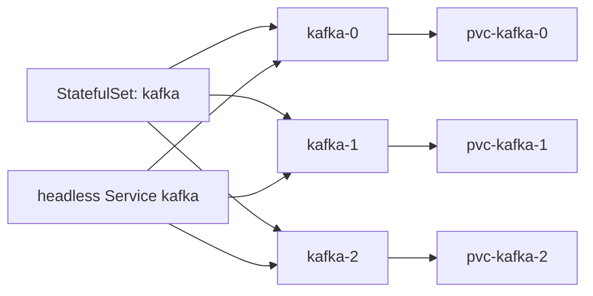

# StatefulSets

> **Learning Path:** Cloud & Infrastructure Architecture
> **Section:** 5.3.7 — Kubernetes

## 1. Problem

நீங்கள் Kubernetes-ல ஒரு MySQL Galera cluster அல்லது Kafka brokers ஓட்றீங்க. 3 replicas வேணும். Deployment போட்டீங்கன்னா என்ன ஆகும்?

Pod name random: `mysql-7c9d8-abc`, `mysql-7c9d8-def`. Pod die ஆகி new pod வந்தா புது name வந்துரும். அந்த pod-க்கு முன்னாடி இருந்த data எங்கே இருக்கும்? Shared PVC use பண்ணினா concurrent write-ல corrupt ஆகும். Separate PVC கொடுத்தாலும், எந்த PVC எந்த pod-க்கு போகும்னு guarantee இல்லை.

இன்னும் முக்கியம்: stateful app-கள் தங்களுக்குள்ளே பேசும்போது stable network identity வேணும். `mysql-0` எப்பவும் `mysql-0` தான் இருக்கணும். Client-களும், cluster members-ம் அதை reference பண்ணணும். Pod IP change ஆனாலும் DNS name stable இருக்கணும்.

இதை Deployment handle பண்ணாது. Deployment = stateless, interchangeable pods. ஒரு stateful service-க்கு அது போதாது.

**Problem became painful:** stable identity + stable storage + ordered start/stop தேவைப்பட்டது.

## 2. Mental Model

StatefulSet என்பது **identity உள்ள pods-க்கான controller**.

Deployment-ல pods interchangeable. StatefulSet-ல pods ordinal indexed: `myapp-0`, `myapp-1`, `myapp-2`.

ஒவ்வொரு pod-க்கும்:
* **Stable network identity** : DNS name எப்பவும் `myapp-0` என்றே இருக்கும்
* **Stable storage** : `myapp-0` எப்பவும் `myapp-0` PVC-யை தான் attach பண்ணும்
* **Ordered operations** : scale up/down, rolling update எல்லாம் order-ல தான் நடக்கும்

Analogy: Deployment = hotel room, யார் வந்தாலும் எந்த room வேண்டுமானாலும் ஒதுக்கலாம். StatefulSet = apartment building, flat number 0,1,2 என fixed.

## 3. How It Works

StatefulSet controller ReplicaSet மாதிரி தான், ஆனால் மூன்று extra guarantees கொடுக்கும்.

**Naming & Identity**
StatefulSet `kafka` என்றால் pods `kafka-0`, `kafka-1` என்று deterministic ஆக create ஆகும். Headless Service `kafka` இருந்தால் DNS entry `kafka-0.kafka.default.svc.cluster.local` எப்பவும் அதே pod-ஐ point பண்ணும்.

**Storage**
`volumeClaimTemplates` define பண்ணினால், StatefulSet ஒவ்வொரு pod-க்கும் unique PVC auto create பண்ணும்: `kafka-0-pvc`, `kafka-1-pvc`. Pod delete ஆனாலும் PVC delete ஆகாது. Pod மீண்டும் வந்தால் அதே PVC திரும்ப attach ஆகும்.

**Ordering**
Scale up போது `kafka-0, kafka-1` முன்னாடி `kafka-2` create ஆகும். Scale down போது reverse order. Rolling update போது pod-கள் ஒவ்வொன்னாக sequential ஆக update ஆகும்.

## 4. Architectural Reasoning

**எப்போது useful?**
* Database clusters: MySQL, PostgreSQL, MongoDB replica set
* Messaging: Kafka, RabbitMQ quorum
* Coordination: ZooKeeper, etcd
* Distributed storage: Elasticsearch, Cassandra

இவை எல்லாம் persistent local storage + stable peer identity தேவைப்படும்.

**என்ன constraint address பண்ணுது?**
* Data locality: Pod move ஆனாலும் data அதே PVC-யில் இருக்கும்
* Cluster formation: Members தங்களை ஒருவருக்கொருவர் stable name-ல கண்ட
