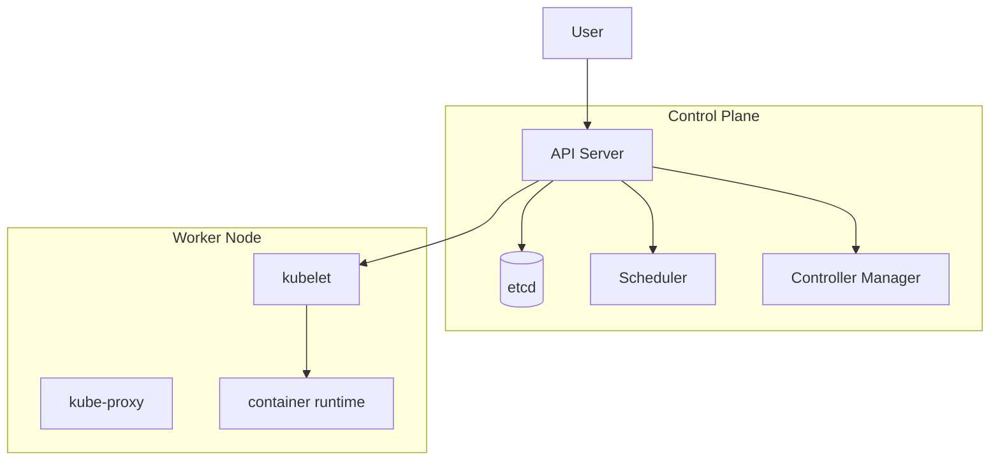

# Kubernetes architecture

> **Learning Path:** Cloud & Infrastructure Architecture
> **Section:** 5.4.1 — Platform engineering

### 1. Problem

நீங்க 10-15 microservices ஓட்டுறீங்க. ஒவ்வொன்னும் வெவ்வேறு release cycle, வெவ்வேறு scale தேவை.

முதல்ல VMs-ல ஒவ்வொன்னா deploy பண்ணீங்க. பின்னால Docker வந்தது. ஒவ்வொரு service-க்கும் ஒரு VM, அதுல container ஓடும். சரி.

அப்புறம் என்ன பிரச்சனை வரும்?
- ஒரு node down ஆனா அதுல ஓடுற எல்லா containers-ம் போயிடும்.
- Traffic spike வந்தா எப்படி scale பண்ணுவீங்க? எந்த service-க்கு எத்தனை replica வேணும், எப்போ start/stop பண்ணனும்?
- Rolling update செய்யும்போது downtime வராம எப்படி பார்ப்பது?
- Service A, Service B-ஐ எப்படி கண்டுபிடிக்கும்? IP மாறிக்கிட்டே இருக்கும்.
- Team ஒவ்வொருத்தரும் தனித்தனியா servers manage பண்ணுனா, capacity planning, security patching எல்லாம் chaos.

இந்த manual toil தான் painful. Engineers வேண்டியது: **declare what you want, system should make it so** - self-healing, self-scaling, declarative.

### 2. Mental Model

Kubernetes ஒரு container orchestration platform. இதோட core mental model:

**Cluster = Control Plane + Worker Nodes**

Control plane ஒரு service-ஐ *desired state*-க்கு கொண்டு வர முயற்சிக்கும். Worker node-கள்ல kubelet ஓடும். அது Pod-களை schedule பண்ணி, health check பண்ணி, container runtime மூலம் containers ஓட்டும்.

ஒரு Pod தான் Kubernetes-ல் deploy செய்யக்கூடிய smallest unit. ஒரு service பல replicas-ல் வரும், அது ஒரு Service object மூலம் stable network identity பெறும்.

நினைச்சுக்கோங்க: நீங்க CEO-க்கு போல policy சொல்றீங்க, control plane அதை implement பண்ணும்.

### 3. How It Works

குறைந்த அளவு internals:

Control Plane components:
- **API Server**: எல்லா interaction-க்கும் entry point. Declarative API.
- **etcd**: cluster-ன் source of truth. Desired state, actual state எல்லாம் இங்கே.
- **Scheduler**: free node இருந்தா புது Pod-ஐ எங்கே வைக்கணும் என்பதை முடிவு செய்யும்.
- **Controller Manager**: ஒவ்வொரு controller-ம் desired vs actual check பண்ணி reconcile செய்யும். Deployment controller, ReplicaSet controller...

Worker Node components:
- **kubelet**: node-ல agent. Pod spec-ஐ API server-ல இருந்து படித்து container runtime-ல start பண்ணும்.
- **kube-proxy**: network rules manage பண்ணி Service abstraction-ஐ implement பண்ணும்.
- **Container runtime**: containerd/CRI-O போன்றது.

Flow: நீங்க `kubectl apply -f deployment.yaml` செய்யுறீங்க → API server etcd-ல save பண்ணும் → controller desired replicas 3 என பார்த்து ReplicaSet-ஐ உருவாக்கும் → scheduler node தேர்ந்தெடுக்கும் → kubelet Pod-ஐ start பண்ணும். Node down ஆனாலும் controller புது Pod-ஐ வேற node-ல உருவாக்கும்.

### 4. Architectural Reasoning

Kubernetes useful ஆகும் போது:
- Multiple services, multiple teams, shared infrastructure தேவை.
- Scale up/down automatic ஆக வேண்டும், rolling update zero downtime வேண்டும்.
- Failure tolerance வேண்டும்: node/pod crash ஆனாலும் app up இருக்கணும்.

Constraint it addresses: **operational toil + consistency of desired state**.

Alternatives:
- VMs + manual scripts / Ansible: simple, but no self-healing.
- ECS/EKS managed services: same model but vendor lock-in.
- Nomad: simpler scheduler, less ecosystem.
- Docker Swarm: simpler but limited.

ஏன் Kubernetes? Portability + ecosystem. Helm, Operators, Service Mesh, GitOps எல்லாம் standardised. Large team-க்கு platform abstraction தரும்.

### 5. Trade-offs

1. **Complexity vs control**. Kubernetes powerful, ஆனால் learning curve steep. Control plane HA setup, etcd backup, network CNI, storage CSI - எல்லாம் operate பண்ணனும். Small workload-க்கு overkill.
2. **Abstraction leak**. Network policy, resource limits, node affinity - தப்பா configure
