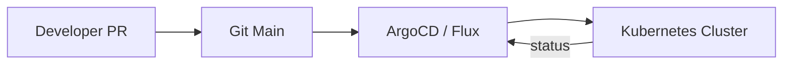

# GitOps

> **Learning Path:** Cloud & Infrastructure Architecture
> **Section:** 5.4.3 — Platform engineering

## Problem

நீங்க ஒரு platform team-ல இருக்கீங்க. 30 microservices, 3 environments. Production-ல ஒரு service திடீர்னு down ஆகுது.

`kubectl get pods` பார்த்தா deployment image பழையது இருக்கு, ஆனா dashboard-ல latest version காட்டுது.

யார் மாத்தினா? எப்ப மாத்தினா? Rollback எப்படி பண்ணுறது? Manual `kubectl apply -f` பண்ணினவங்க Slack-ல சொல்ல மறந்துட்டாங்க.

இது தான் painful point. Infrastructure-க்கும் application code-க்கும் ஒரே source of truth இல்லாம போனா, drift வரும், audit இல்லாம போகும், 2 AM incident-ல root cause கண்டுபிடிக்க 2 மணி நேரம் ஆகும்.

## Mental Model

GitOps-ன் core idea ஒன்னு தான்: **Git repo தான் desired state-ன் single source of truth.**

Actual state என்னன்னு Kubernetes கிட்ட இருக்கு. Git-ல இருக்குறது என்னன்னு controller தெரிஞ்சுக்கும். Difference இருந்தா reconciliation loop மூலமா actual-ஐ desired-க்கு align பண்ணும்.

Manual SSH பண்ணி server-ல மாற்றம் பண்ணுறதுக்கு பதிலா, மாற்றம் = Pull Request. Merge = Deploy.

## How It Works

பொதுவா இப்படி இருக்கும்:

`Git repo` -> `PR + review + approval` -> `merge to main` -> `GitOps operator` -> `Kubernetes`

Repo-ல என்ன இருக்கும்?
- Kubernetes manifests, Helm charts / Kustomize overlays
- ConfigMaps, Secrets reference, environment-specific values
- Infrastructure as Code - Terraform files, ArgoCD Application manifests

ArgoCD அல்லது Flux போன்ற controller cluster-ல run ஆகும். அது git repo-வை poll பண்ணும் அல்லது webhook-ல தெரிஞ்சுக்கும்.

Desired state மாறினா, controller automatically diff பார்த்து apply பண்ணும். Drift detect ஆனா alert / auto-sync பண்ணும்.



Pull-based தான் முக்கியம். Cluster தான் git-ஐ pull பண்ணி மாற்றம் கொண்டு வரும். Push-based CI-யை விட secure மற்றும் auditable.

## Architectural Reasoning

இது useful ஆகும் போது:
- Multiple services, multiple environments, multiple teams
- Compliance / audit trail வேணும். Who changed what, when, why?
- Self-healing வேணும். யாராவது manual kubectl apply பண்ணினா, controller திரும்ப git state-க்கு revert பண்ணும்.
- Rollback என்பது git revert + merge தான்.

Alternatives என்ன?
- Traditional CI/CD push pipeline: Jenkins/GitLab CI build artifact பண்ணி kubectl apply பண்ணும். Problem: pipeline-ல தான் state இருக்கு, Git-ல இல்லை.
- Manual ops: SSH + run commands. Scale ஆகாது.

Architect ஏன் GitOps தேர்வு பண்ணுவார்? **Operability மற்றும் trust** வேணும். Git review process already team-க்கு familiar. Infrastructure change-க்கும் code review தரலாம்.

## Trade-offs

1. **Speed vs Safety**: PR review, approval gates எடுக்கும். Hotfix-க்கு slow ஆகலாம். அதை தீர்க்க emergency access மற்றும் break-glass procedure வேணும்.

2. **Complexity moves**: Manual kubectl complexity குறையும், ஆனா GitOps operator, repo structure, sync policies manage பண்ண வேண்டும். Secrets-ஐ Git-ல வைக்க முடியாது. External secret operator, Sealed Secrets, Vault integration தேவை.

3. **Drift handling**: Auto-sync enable பண்ணினா controller திரும்ப மாற்றும். Disable பண்ணினா drift hide ஆகும். இது operational decision.

4. **Blast radius**: ஒரே repo-ல எல்லா cluster config இருந்தா, ஒரு தவறான merge எல்லாத்தையும் பாதிக்கும். Environment separation, mono-repo vs multi-repo தேர்வு முக்கியம்.

Failure mode: Controller down ஆனா, deploy stop ஆகும். Git repo corrupted ஆனா? Backup முக்கியம்.

## Practical Example

E-commerce platform, 3 teams.

Repo structure:
```
/apps/
  /checkout/
    base/
    overlays/dev, staging, prod
/infra/
  argocd-apps.yaml
```

Developer checkout service image tag update பண்ணி PR open பண்ணார். PR-ல description-ல ticket link, automated test results இருக்கு. Team lead approve பண்ணார். Merge ஆன உடனே ArgoCD prod application sync start ஆகும், canary strategy apply ஆகும். Sync failed ஆனா Slack-ல alert வரும்.

Audit: எந்த pod எப்போ deploy ஆச்சு, எந்த commit-ல இருந்து வந்ததுன்னு git log-ல கிடைக்கும். Rollback என்பது git revert commit + merge
