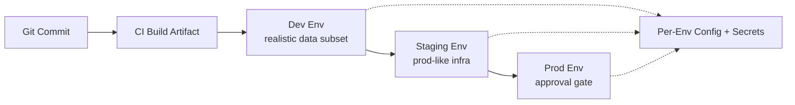

# Environment management

> **Learning Path:** Cloud & Infrastructure Architecture
> **Section:** 5.4.7 — Platform engineering

## 1. Problem

உங்கள் team-ல 5 engineers இருக்காங்க. அவங்க local-ல code run பண்ணும்போது `localhost:5432` connect ஆகுது. CI-ல test run பண்ணும்போது test DB use பண்ணுது. Staging-ல deploy பண்ணினா production-ஐ பார்த்துக்கிட்டு இருக்கும் external payment gateway-க்கு call போயிடுது. Prod-ல deploy பண்ணினதும் app crash ஆகுது, ஏன்னா prod config-ல `API_KEY` வேற, timeout value வேற.

இது ஏன் நடக்குது? Code ஒன்னு தான், ஆனா **environment வேறுபடுது**. Code, config, data, infra எல்லாம் சேர்ந்து ஒரு context. அந்த context-ஐ reproduce பண்ண முடியலை.

இன்னொரு பக்கம், dev-ல ஒருத்தர் production DB-க்கு connect ஆகி data மாத்திட்டார். அல்லது prod secret GitHub-ல leak ஆயிடுச்சு.

> What goes wrong if we don't have environment management? Blast radius, config drift, manual errors, unrepeatable deploys, secrets leak.

## 2. Mental Model

Environment என்பது **code + config + data + infrastructure** ஒரு isolated snapshot.

Dev, Test, Staging, Prod என்பது lifecycle stages அல்ல, அது **risk levels**. ஒவ்வொரு stage-மும் same shape-ல இருக்கணும், ஆனா different data, different secrets, different scale, different safety controls.

Mental model: Environments are cattle, not pets. ஒரு environment-ஐ recreate பண்ண முடியணும், destroy பண்ண முடியணும். Manual tweaks கூடாது.

## 3. How It Works

Architecture-level-ல environment management 3 விஷயங்களை solve பண்ணுது:

**1. Separation of config from code**
Code repo-ல environment-specific values இருக்கக்கூடாது. `config.yaml`, `.env` போன்றது repo-ல வரக்கூடாது. Terraform variables, Helm values, Kubernetes ConfigMap/Secret, environment variables மூலம் inject பண்ணுவோம்.

**2. Immutable infrastructure as code**
Dev, Staging, Prod infra Terraform / Pulumi / CloudFormation-ல define ஆகணும். `terraform workspace` or separate state files-ல per-env infra manage பண்ணலாம். Manual console click கூடாது.

**3. Promotion pipeline**
Git flow → CI build artifact → deploy to dev → automated tests → promote same artifact to staging → manual approval → prod. Artifact ஒன்று தான், config மாறும்.

Secrets-க்கு Vault, AWS Secrets Manager, Parameter Store. Rotation, access audit இருக்கும். Config values Git-ல இல்லை.

## 4. Architectural Reasoning

Environment management useful ஆகும் போது:

* **Multiple teams, multiple services**: 20 microservices இருந்தா ஒவ்வொருவரும் தனித்தனியா test பண்ணணும். Shared dev environment-ல conflict வரும்.
* **Compliance & safety**: Prod data-வை dev-ல touch பண்ணக்கூடாது. PCI, HIPAA கண்ட்ரோல்ஸ்.
* **Release frequency**: Frequent deploy வேண்டும் என்றால், safe promotion path தேவை.

Alternatives:
* **Single environment**: Cost குறைவு, ஆனா risk அதிகம். Production incident நேரடியா business impact.
* **Feature flags மட்டும்**: Environments-ஐ குறைக்கலாம், ஆனா data parity, performance testing இன்னும் தேவை.

Architect choose பண்ணும்போது கேட்கும் கேள்வி: *எந்த environment-ல என்ன fail ஆனாலும் அது எவ்வளவு செலவு?*

## 5. Trade-offs

**Speed vs Safety**
Dev environment-ஐ auto-create / destroy பண்ணினா engineer speed ஆகும். ஆனா shared staging-ல test செய்வது consistency கொடுக்கும். Per-branch ephemeral envs கொடுத்தால் cost அதிகம்.

**Parity vs Cost**
Prod-like staging-ல same instance type, same DB version வைத்தால் confidence அதிகம். Cost double ஆகும். பல companies staging-ல smaller scale run பண்ணி trade-off பண்ணும்.

**Isolation vs Operability**
ஒவ்வொரு team-க்கும் தனி dev env கொடுத்தால் noisy neighbor இல்லை. ஆனா monitoring, logging centralize பண்ண கஷ்டம்.

Failure modes:
* Config drift: Prod-ல manual fix பண்ணினா IaC-ல sync இல்லாமல் போகும்.
* Secret leak: Secret repo-ல commit ஆனா irreversible.
* Promotion gap: Dev-ல pass ஆனது Prod-ல fail ஆகும் ஏனெனில் data volume வேறு.

## 6. Practical Example

Enterprise AI platform. RAG service, vector database, LLM gateway, API gateway.

Dev: engineers local docker compose, mock vector DB, fake API keys.
Test: CI spins ephemeral Kubernetes namespace, test data subset, real vector DB small instance.
Staging: prod-like infra, real secrets from Vault staging path, production data anonymized snapshot, load tests run.
Prod: multi-zone, autoscaling, separate secrets path, rate limits enabled.

Promotion: Git tag v1.2.3 build ஆன
