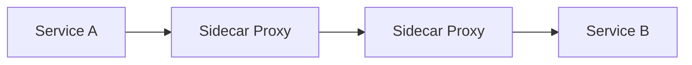

# Service mesh

> **Learning Path:** Cloud & Infrastructure Architecture
> **Section:** 5.4.8 — Platform engineering

# Service Mesh

## 1. Problem

உங்களிடம் 50-100 microservices இருக்கு. Service A Service B-ஐ call பண்ணுது, Service B Service C-ஐ call பண்ணுது. இது நடக்கும்போது என்ன என்ன வேணும்?

retry, timeout, circuit breaker, load balancing, mTLS, authentication, authorization, observability, tracing, traffic split for canary.

இதையெல்லாம் நீங்கள் app code-லேயே போட்டால் என்ன ஆகும்?

ஒவ்வொரு service-லும் ஒரே boilerplate திரும்ப திரும்ப. ஒரு team retry logic-ஐ சரியா பண்ணும், இன்னொரு team பண்ணாது. Security policy மாறினால் 100 repo-வை மாற்ற வேண்டும். Business logic கலந்து cross-cutting concern வந்துவிடும். Bug வரும், test செய்ய கஷ்டம்.

இந்த பிரச்சனை painful ஆனதால்தான் service mesh வந்தது.

## 2. Mental Model

Service mesh என்பது service-to-service communication-க்கான dedicated infrastructure layer.

ஒவ்வொரு service-க்கும் பக்கத்தில் ஒரு sidecar proxy இருக்கும். Service தன்னுடைய business logic-ஐ மட்டும் பார்க்கும். Proxy communication concerns-ஐ எடுத்துக்கும்.

இது ஒரு data plane + control plane.

Data plane = sidecar proxies. Control plane = configuration, discovery, policy push.

அனலாகி: ஒவ்வொரு வீட்டுக்கும் பக்கத்தில் ஒரு security guard இருக்கார். வீட்டுக்காரர் உள்ளே என்ன வேலை பார்க்கிறாரோ பார்க்கட்டும். யார் உள்ளே வரலாம், யாரை அனுப்பலாம், எப்படி log பண்ணனும் என்பதை guard முடிவு செய்வார். Guard-களுக்கு central command கட்டளை கொடுக்கும்.

## 3. How It Works

Kubernetes-ல் service deploy ஆகும்போது ஒரு sidecar pod-ல் இணைந்து வரும். பெரும்பாலும் Envoy.

Request flow:

Service A தன்னுடைய sidecar-க்கு localhost:port-க்கு call பண்ணும். Sidecar control plane-லிருந்து பெற்ற config படி retry, timeout, mTLS, routing முடிவு செய்து மறுபக்க sidecar-க்கு forward பண்ணும். Response திரும்ப வரும்.

Control plane service discovery, certificate management, policy config பண்ணும். Data plane config-ஐ pull/push பண்ணிக்கும்.

இதனால் app code மாறாமல் behavior மாற்ற முடியும்.

## 4. Architectural Reasoning

Service mesh useful ஆகும் போது:

* Service count அதிகம், team count அதிகம். Communication pattern complex.
* Security requirement: zero trust, mTLS across all services mandatory.
* Observability தேவை: distributed tracing, metrics, access logs ஒரே இடத்தில்.
* Traffic management தேவை: canary, blue-green, A/B testing, rate limiting.

Alternative என்ன?

* Client library / SDK: retry, timeout, metrics எல்லாம் library-ல். ஆனால் library upgrade அனைத்து service-லும் செய்ய வேண்டும். Policy enforcement inconsistent.
* Service API gateway / ingress only: external traffic மட்டும் handle ஆகும். East-west traffic handle ஆகாது.
* Sidecar வேண்டாம், service mesh இல்லை: simple monolith அல்லது சில மைக்ரோசர்வீஸ் என்றால் ok.

Architect முடிவு செய்யும் போது கேட்க வேண்டியது: communication concerns-ஐ application-லிருந்து எடுக்க வேண்டுமா? அதற்கான operational cost தர முடியுமா?

## 5. Trade-offs

* **Complexity & Operability:** இன்னொரு distributed system ஓட வேண்டும். Control plane down ஆனால் data plane existing config-ஐ தொடரும். ஆனால் upgrade, debugging கடினம்.
* **Latency & Resource Overhead:** ஒவ்வொரு request-மும் extra hop, extra CPU/memory sidecar-க்கு. Small payload, high RPS system-ல் overhead கவனிக்க வேண்டும்.
* **Consistency vs Control:** Mesh centralized policy கொடுக்கும், ஆனால் service specific fine-grained logic இன்னும் app-ல் தேவைப்படலாம். Over-abstraction ஆகும் ரிஸ்க்.
* **Failure modes:** Sidecar crash ஆனால் service unreachable. Network partition-ல் control plane config sync fail ஆகும். mTLS misconfiguration-ல் entire mesh down.

Every architectural solution creates another trade-off. Mesh communication concerns-ஐ simplify பண்ணும், ஆனால் platform
