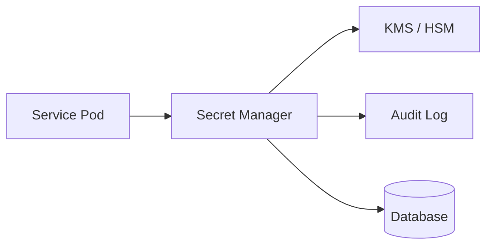

# Secrets

> **Learning Path:** Security Architecture
> **Section:** 6.1.10 — Application security

## 1. Problem

உங்க team ஒரு payment service build பண்ணுது. Database password, Stripe API key, internal service token எல்லாம் `appsettings.json`-ல் இருக்கு. Code review-ல் catch ஆகல. ஒரு engineer அதை GitHub-க்கு push பண்ணிட்டார்.

அடுத்த நாள் அந்த repo public ஆகி இருக்கு. API key leak ஆயிடுச்சு. 
இன்னொரு case: production DB password மாறணும். நீங்க 20 microservices-ல எல்லாம் hardcode பண்ணி இருக்கீங்க. எங்கெங்க மாற்றுவது என்று தெரியல. Restart வேண்டும். Downtime வரும்.

இதுதான் secrets problem. 
**Code மாறாமல், மாற்றக் கூடிய sensitive data** நிர்வகிக்க முடியாமல் போகுது. Hardcode பண்ணினால் leak ஆகும். Config file-ல் வைத்தால் rotation கஷ்டம். Environment variable-ல் வைத்தால் container image build-ல் தெரிந்துவிடும்.

> What problem became painful? Leak, rotation, audit முடியாதது, access control இல்லாதது.

## 2. Mental Model

Secret என்பது configuration அல்ல. இது **lifecycle உள்ள sensitive data**.

அதை 3 விஷயங்களால் வரையறுக்கலாம்:
- **Confidentiality**: யார் பார்க்கலாம், யார் பார்க்கக்கூடாது
- **Rotation**: எளிதாக மாற்ற முடிய வேண்டும்
- **Auditability**: யார் எப்போது access பண்ணினார்கள் என்று தெரிய வேண்டும்

Code repository-ல் வைக்கக்கூடாது. Secrets வேறு ஒரு boundary-ல் இருக்க வேண்டும், code-ல் இருந்து மாற்றி பெறப்பட வேண்டும்.

## 3. How It Works

நடைமுறையில் architecture இப்படி இருக்கும்:

Service start ஆகும்போது அல்லது runtime-ல், Secret Manager-க்கு authenticate ஆகி secret-ஐ fetch பண்ணும். 
Secret at rest encrypted-ஆக இருக்கும், KMS/HSM-ல் key manage ஆகும். Access IAM policy-ல் control ஆகும்.

பல systems dynamic secrets-ஐயும் தரும்: DB password-ஐ தற்காலிகமாக உருவாக்கி, TTL முடிந்ததும் தானாக revoke பண்ணும். இதனால் long-lived credential இல்லாமல் போகும்.

## 4. Architectural Reasoning

Secrets-ஐ manage பண்ண ரியலிஸ்டிக் options:

**Env vars / config files** - local dev-க்கு மட்டும். Production-க்கு இல்லை. Leakage risk அதிகம்.

**Centralized Secret Manager** - AWS Secrets Manager, GCP Secret Manager, Azure Key Vault, HashiCorp Vault. Single source of truth. Rotation, audit, access control ஒரே இடத்தில்.

**KMS only** - encryption keys மட்டும் manage பண்ணும். Secret storage logic உங்களிடம்.

Architect ஏன் central manager தேர்வு செய்வார்?
- Multi-service, multi-env scenario-ல் consistency வேண்டும்
- Compliance audit வேண்டும்
- Rotation-ஐ automate பண்ண வேண்டும்
- Blast radius குறைக்க வேண்டும்

Trade-off: service secret manager-ஐ call பண்ணும் போது latency சேரும். அதனால் startup-ல் fetch செய்து memory-ல் cache பண்ணுவார்கள், with in-memory protection.

## 5. Trade-offs

**Centralization vs availability**: Secret Manager ஒரு SPOF போல் தோன்றும். அது down ஆனால் service start ஆகாது. அதனால் caching + local fallback strategy தேவை.

**Latency vs freshness**: ஒவ்வொரு request-க்கும் secret fetch பண்ணினால் secure ஆனால் slow. Cache பண்ணினால் fast ஆனால் rotation propagate ஆக தாமதம்.

**Static vs dynamic secrets**: Static secret எளிது, ஆனால் leak ஆனால் impact நீண்ட நாள். Dynamic secret சிக்கலானது, ஆனால் TTL குறைவு.

**Access scope**: Principle of least privilege. Service-க்கு தேவையான secret மட்டும் தரவும். Wildcard access கொடுத்தால் ஒரு compromise-ல் எல்லாம் போகும்.

Failure mode முக்கியம்: secret rotation செய்த பிறகும் old secret cache-ல் இருந்தால் connection fail ஆகும். அதனால் dual-read / graceful rotation வேண்டும்.

## 6. Practical Example

Enterprise-ல் 15 microservices, 3 envs. Payment service Stripe key, DB credential, internal API token வைத்திருக்கு.

எல்லா service-க்கும் common secret manager. IAM role per service. Service startup-
