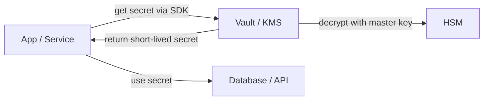

# Key management

> **Learning Path:** Security Architecture
> **Section:** 6.1.12 — Application security

## 1. Problem

உங்கள் application-ல் database encryption key, JWT signing key, payment gateway API key எல்லாம் எங்கே இருக்கு?

பெரும்பாலான team-கள் ஆரம்பத்தில் இதை code-ல் hardcode பண்ணி விடுவார்கள், அல்லது repo-வில் `.env` file-ஆ போட்டு விடுவார்கள். 

அப்புறம் என்ன ஆகும்?

* GitHub-ல public repo-வுக்கு push ஆகி leak ஆகும்.
* Developer laptop-ல local copy இருக்கும்.
* Production key-உம் dev key-உம் ஒன்றாக இருக்கும்.
* Key rotate பண்ணனும் என்றால் 20 microservices-ஐயும் redeploy பண்ண வேண்டும்.
* யார் key-ஐ access பண்ணினார்கள், எப்போது பயன்படுத்தினார்கள் என்ற audit இல்லை.

ஒரு key leak ஆனால் அது பெரிய breach. ஒரு key rotate பண்ண முடியாமல் போனால் அது operational nightmare. இதுதான் key management தேவைப்படும் இடம்.

## 2. Mental Model

Key-ஐ code-ஆக பார்க்காதீர்கள். Key என்பது **sensitive material** , credential போன்றது.

ஒரு house-க்கு master key இருக்கு. அதை எல்லார் பாக்கெட்டிலும் வைத்திருக்க முடியாது. ஒரு secure place-ல வைத்து, தேவைப்படும் நேரத்தில் தேவையான நபருக்கு மட்டும் தற்காலிக access கொடுப்பது போலதான் key management.

Core idea: **keys should never live in application code or config files.** அவை centrally store ஆகி, access controlled ஆகி, audited ஆகி, rotate செய்ய கூடியதாக இருக்க வேண்டும்.

## 3. How It Works

நடைமுறையில் இது மூன்று layer-ஆ work ஆகும்.

**Secret storage:** Vault / KMS போன்ற centralized store. Secrets encrypted at rest. Master key HSM-ல் hold ஆகும்.

**Access control:** யார் எந்த key-ஐ எப்போது read/write பண்ணலாம் என்பதை IAM policy-ல் define பண்ணுவீர்கள். Service identity, not human user, பெரும்பாலும் access பண்ணும்.

**Lifecycle:** Rotation, versioning, audit log.

ஒரு typical flow:

Envelope encryption pattern:
Data key AES-256 போன்ற symmetric key-ஆல் data encrypt செய்யப்படும். அந்த data key-ஐ மீண்டும் KMS master key-ஆல் encrypt செய்து store செய்வார்கள். App-க்கு data key மட்டும் தேவை, master key app-க்கு தெரியாது.

## 4. Architectural Reasoning

Key management useful ஆகும் போது:

* Multiple services same secret-ஐ use பண்ணும் போது.
* Compliance தேவைப்படும் போது - PCI, SOC2.
* Zero trust model-ல் short-lived credentials தேவைப்படும் போது.

Options:

* **Cloud KMS / Secrets Manager** - AWS KMS, GCP Secret Manager. Managed, audit ready, low ops. Latency ~ few ms. Cost per API call.
* **Self-hosted Vault** - HashiCorp Vault. Full control, dynamic secrets generate பண்ண முடியும். Ops overhead அதிகம்.
* **HSM** - FIPS compliant workloads-க்கு. Physical security. Expensive.

எப்போது எதை தேர்வு செய்வது?
Small team, cloud native -> Cloud KMS + Secrets Manager. 
High security, financial data -> HSM backed KMS.
Multi-cloud / on-prem -> Vault.

## 5. Trade-offs

* **Centralization vs Availability:** Central vault single point of failure ஆகும். Vault down ஆனால் app secrets fetch பண்ண முடியாது. Cache செய்யலாம், ஆனால் cache = exposure window.
* **Latency vs Security:** Every secret fetch network call. Hot path-ல் key fetch பண்ணினால் latency spike. Solution: in-memory cache with TTL, or local agent.
* **Rotation complexity:** Key rotate செய்வது easy என்று தோன்றும். ஆனால் running connections, in-flight data, backup decryption எல்லாம் version handle பண்ண வேண்டும். Zero downtime rotation-க்கு dual read support தேவை.
* **Blast radius:** ஒரு service-க்கு அதிக privileges கொடுத்தால் key leak ஆனால் damage அதிகம். Principle of least privilege, per-service key.

Failure mode: developer `kubectl exec` பண்ணி secret-ஐ print பண்ண
