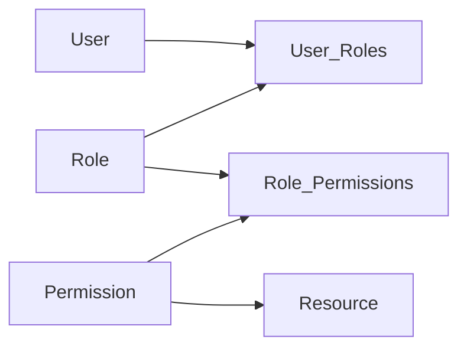

# RBAC

> **Learning Path:** Security Architecture
> **Section:** 6.1.3 — Application security

## 1. Problem

ஒரு SaaS product பில்ட் பண்றோம். Users, Admin, Support Agent, Billing Manager எல்லாம் இருக்கு.

முதல்ல code-ல if/else போடுறோம்:

`if user.email == "admin@..."` அல்லது `if user.role == "admin"` என்று.

பிரச்சனை வளர வளர ஆரம்பிக்கும்.

* ஒரு user-க்கு இரண்டு role வேணும். Support Agent-ஆக இருந்து, தற்காலிகமாக Billing-ம் பார்க்கணும்.
* நிறுவனம் வளர்ந்து, Finance team-க்கு மட்டும் invoice export permission வேணும், refund கூடாது.
* Audit-க்கு "யாருக்கு என்ன access இருக்கு?" என்று கேட்டால் code-ல தேட வேண்டி வரும்.

இப்படி permission-கள் user-ல இருந்து தனியாக grow ஆகும்போது, hardcoded checks வைத்தால் bug வரும், security hole வரும். ஒரு permission மாற்றினால் deploy பண்ண வேண்டி வரும்.

இதுதான் RBAC வந்த reason.

## 2. Mental Model

RBAC என்பது **Users -> Roles -> Permissions -> Resources** என்ற மூன்று layer.

User-களை ஒரே மாதிரியான அணுகல் தேவை உள்ள குழுக்களாக பிரித்து **role** என்று பெயர் வைக்கிறோம். Role-க்கு **permission** கொடுக்கிறோம். Permission என்பது `action + resource` combo: `read:invoice`, `create:ticket`, `delete:user`.

User-க்கு direct permission கொடுக்காம, role வழியாக கொடுக்கிறோம். ஒரு user-க்கு பல role வரலாம்.

இது principle of least privilege-ஐ implement பண்ண ஒரு practical way.

## 3. How It Works

Data model எளிமையாக இருக்கும்:

* `users` table
* `roles` table - `admin`, `support_agent`, `billing_viewer`
* `permissions` table - `invoice:read`, `invoice:write`, `user:delete`
* `user_roles` - many-to-many
* `role_permissions` - many-to-many

Check எப்படி நடக்கும்?

Request வரும்போது: `user -> அவன் roles -> அந்த roles-ன் permissions -> இந்த action + resource allow ஆ?`

இதை middleware-ல செக் பண்ணலாம். Policy engine இல்லைன்னா simple DB join. Scale ஆனால் permission set-ஐ cache பண்ணி JWT claim-ல வைக்கலாம், அல்லது central PDP use பண்ணலாம்.

## 4. Architectural Reasoning

RBAC useful ஆகும் போது:

* Access pattern role-களாக தெளிவாக group ஆகிறது. Company org structure-க்கு ஏற்ப.
* Permission set அடிக்கடி மாறாது, ஆனால் users அடிக்கடி மாறுவார்கள்.
* Audit முக்கியம். "Who can delete customer data?" என்று role list பார்த்தால் போதும்.

Alternatives:

* **ACL - Access Control List**: User-க்கு direct permission. Fine-grained ஆனால் management nightmare. 10k users, 100 resources என்றால் matrix explode ஆகும்.
* **ABAC - Attribute Based Access Control**: Policy = user attributes + resource attributes + environment. `user.department == resource.department && time < 18:00`. Very dynamic, but complexity high.
* **RBAC + ABAC hybrid**: Role for broad grouping, attributes for context.

Architect decision: Team size சிறியது, permission model stable ஆனால் RBAC போதும். Multi-tenant, data-level isolation வேணும் என்றால் ABAC/ ReBAC தேவைப்படும்.

## 5. Trade-offs

* **Role explosion**: Role-கள் அதிகமாகி, `support_agent_level1_india` போல் ஆகிவிடும். அப்போது Role Hierarchy அல்லது ABAC-க்கு மாற வேண்டும்.
* **Static vs Dynamic**: RBAC static. `user can refund if amount < 1000` போன்ற condition support பண்ணாது. அதற்கு ABAC தேவை.
* **Performance**: Every request-ல DB join செய்ய முடியாது. Permission cache, short-lived token claims, or centralized policy service தேவை. Cache invalidation tricky.
* **Security failure mode**: Role assignment தவறாக செய்தால், ஒரே தவறு நூறு users-க்கு பரவும். So role assignment-க்கு approval workflow முக்கியம்.

## 6. Practical Example

Enterprise SaaS, multi-tenant.

Roles: `tenant_admin`, `account_manager`, `support_readonly`, `billing_owner`.

Permissions:
`account:read`, `account:update`, `invoice:read`, `invoice:export`, `user:invite`

`support_readonly` role-க்கு `account:read` மட்டும். `billing_owner` role-க்கு `invoice:read`, `invoice:export` மட்டும்.

API gateway-ல middleware permission check பண்ணும். `GET /invoices` -> need `invoice:read`. `POST /invoices/refund` -> need `invoice:write`.

Onboarding-ல user-க்கு role assign பண்ணும்போது, audit log-ல `who assigned which role to whom` save ஆகும். Compliance audit எளிது.

## 7. Reasoning Challenge
