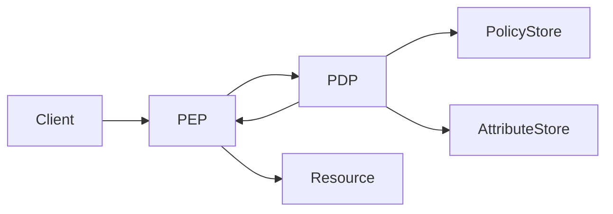

# ABAC

> **Learning Path:** Security Architecture
> **Section:** 6.1.4 — Application security

## 1. Problem

ஒரு hospital application பண்ணுகிறீர்கள். Role-based access control, RBAC, வச்சிருக்கீங்க. Roles: `doctor`, `nurse`, `admin`.

ஒரு doctor-க்கு எல்லா patient records-க்கும் read access கொடுக்கணுமா? இல்லை. அவர் சேர்ந்த hospital-க்குள்ள மட்டும். அவர் on-call-ல இருக்கும்போது மட்டும் ICU patients-ஐ பார்க்கணும். Patient consent இல்லாத sensitive record-ஐ தொடக்கூடாது.

RBAC-ல இதை செய்ய `doctor_hospitalA_oncall_ICU_consent` மாதிரி roles ஆயிரம் உருவாகும். Role explosion ஆகும். ஒரு user-க்கு பல role, ஒரு role-க்கு ஆயிரம் user. Policy மாறும்போது role-களை திருத்தவேண்டும், deployment வேண்டும்.

இங்கே வலிக்கிறது: **access decision user-க்கும் resource-க்கும் மட்டுமல்ல, context-க்கும் தொடர்புடையது.**

## 2. Mental Model

ABAC = Attribute-Based Access Control.

Access decision ஒரு function: `allow = f(subject attributes, object attributes, action, environment attributes)`

Subject = யார் request பண்ணுகிறார். Object = எந்த resource. Action = read/write/delete. Environment = time, location, device, IP.

Role ஒரு attribute மட்டுமே. ABAC-ல role-ஐயும் ஒரு attribute-ஆக பார்க்கிறோம்.

Mental model simple: **Policy என்பது if-then rule**. Attributes எல்லாம் dynamic-ஆக வரும். Policy engine அவற்றை evaluate பண்ணி allow/deny சொல்லும்.

## 3. How It Works

Architecture-ல மூன்று பகுதிகள்:

* **PEP - Policy Enforcement Point**: API gateway / service layer. Request வரும்போது request-ஐ intercept பண்ணி PDP-க்கு அனுப்பும்.
* **PDP - Policy Decision Point**: Policy engine. Attributes-ஐ சேகரித்து policy-ஐ evaluate பண்ணும்.
* **Policy Store & Attribute Store**: Policies, user attributes, resource attributes எங்கே இருக்கு.

Flow:

PEP request-ஐ தடுத்து subjectId, resourceId, action, environment-ஐ அனுப்பும். PDP அதற்கு தேவையான attributes-ஐ attribute store-ல இருந்து fetch பண்ணி policy-யுடன் compare பண்ணும். Decision திரும்ப வரும்.

Policy எடுத்துக்காட்டு: `subject.role == 'doctor' AND subject.hospitalId == resource.hospitalId AND environment.time in workingHours AND resource.sensitivity != 'restricted' OR subject.onCall == true`

## 4. Architectural Reasoning

ABAC useful ஆகும் போது:

* Fine-grained access வேண்டும். Row-level, field-level.
* Access context dependent: time, location, device compliance, patient consent.
* Multi-tenant SaaS-ல tenant, department, data classification மாதிரி dimensions combine ஆக வேண்டும்.
* Policies centralize பண்ணி runtime-ல மாற்ற வேண்டும், code deploy இல்லாமல்.

Alternatives:
* RBAC: simple, fast, but coarse. Role explosion ஆகும்.
* PBAC / ReBAC: relationship based. சில cases-ல பொருந்தும்.
* ACL: resource-centric, scale ஆகாது.

Architect choose பண்ணும்போது கேள்வி: **policy எத்தனை dynamic? attributes எவ்வளவு frequently change ஆகும்?** அதிக dynamic என்றால் ABAC.

## 5. Trade-offs

* **Complexity vs Flexibility**: Policy எழுதுவது கடினம். Policy language, testing, versioning தேவை. Debugging-ல "ஏன் deny ஆச்சு?" என்பதை trace பண்ண கஷ்டம்.
* **Latency & Performance**: ஒவ்வொரு request-க்கும் attributes fetch + policy evaluate. PDP call synchronous என்றால் latency கூடும். Cache policy decision, attribute cache செய்ய வேண்டும். Stale attribute risk.
* **Attribute Freshness & Trust**: Decision தரமானது attribute தரத்தில் தங்கி இருக்கும். User department மாறினால் attribute store update ஆக வேண்டும். Eventually consistent attribute store = wrong decision.
* **Operability**: Policy audit, who allowed what and why. Audit log-ல subject, object, attributes snapshot வைக்க வேண்டும். Compliance-க்கு must.

Failure mode: PDP down ஆனால் default deny? default allow? Fail-closed design தேவை.

## 6. Practical Example

Enterprise loan approval system.

Subject attributes: `role=loan_officer`, `department=retail`, `clearanceLevel=2`, `managerApproved=true`
Resource attributes: `loan.amount=5L`, `loan.type=personal`, `loan.region=south`
Environment attributes: `time=14:30`, `ipCountry=IN`, `device.compliant=true`

Policy: 
* amount <= 10L AND role == loan_officer AND clearanceLevel >=2 AND ipCountry == IN -> allow approve
* amount > 10L -> need `managerApproved == true` AND role == senior_loan_officer

PEP API gateway-ல இருக்கும். Request வரும்போது PDP-க்கு அனுப்பும். Policy மாறினாலும் code மாற்ற தேவையில்லை. New regulation வந்தால் policy store-ல rule add பண்ணினால் போத
