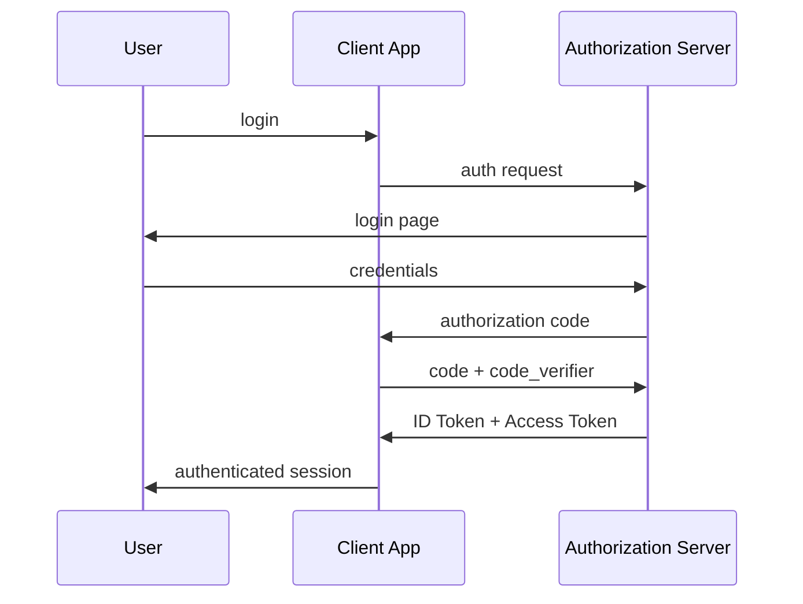

# OIDC

> **Learning Path:** Security Architecture
> **Section:** 6.1.6 — Application security

### 1. Problem

உங்க company-ல 5-6 internal apps இருக்கு. HR portal, expense app, dashboard, support tool. ஒவ்வொன்னும் தனியா login வச்சிருக்கு. User-க்கு 5 password நினைவு வைக்கணும். Password reset ticket எல்லாம் support-க்கு வருது.

அப்புறம் third-party integration வருது. Customer-க்கு "Sign in with Google" வேணும். உங்க API-களை வெளியிலிருந்து யார் அணுகலாம் என்று தெரியணும். ஒவ்வொரு service-உம் தனியா user table வச்சு authenticate பண்ணினா, password leak ஆனால் impact எல்லா இடத்துலயும் வரும்.

முக்கிய பிரச்சனை: **Authentication-ஐ centralize பண்ணி, அதே நேரம் authorization எப்படி prove பண்ணுவது?** OAuth 2.0 access token கொடுக்கும், ஆனால் அது "who is the user?" என்று சொல்லாது. அது access கொடுக்கும். Identity தனியாக தேவை.

இதான் OIDC வந்த reason.

### 2. Mental Model

OIDC = OAuth 2.0 + Identity layer.

OAuth 2.0: delegation. User-ன் permission-ஐ client-க்கு கொடு.
OIDC: அதோட மேலே, **verified identity assertion** கொடு.

Mental model: 
Identity Provider = Authorization Server + UserInfo endpoint.
Client = உங்க app.
User = end user.

OIDC ஒரு standard JWT format-ல ID Token கொடுக்கும். அதுல `sub`, `email`, `name`, `iss`, `aud`, `exp` இருக்கும். அதை verify பண்ணினால் போதும், user யார் என்று தெரியும். Session உங்க app-ல வைக்க வேண்டாம்.

### 3. How It Works

அதிகம் பயன்படுவது Authorization Code Flow with PKCE.

1. User உங்க app-ல login click பண்ணுறார்.
2. App user-ஐ Authorization Server-க்கு அனுப்பும்: `auth?client_id=...&redirect_uri=...&code_challenge=...`
3. User IdP-ல authenticate ஆகிறார். Consent கொடுக்கிறார்.
4. IdP redirect_uri-க்கு authorization code திருப்பி அனுப்பும்.
5. App அந்த code-ஐ ரகசியமாக IdP-க்கு மாற்றி access_token + ID token வாங்கும்.
6. ID token-ஐ verify பண்ணி, user session உருவாக்கும். access_token-ஐ resource server-க்கு காட்டும்.

Flow:

PKCE public client-க்கு முக்கியம், code interception தடுக்கும்.

### 4. Architectural Reasoning

OIDC use பண்ணும்போது நீங்கள் solve பண்ணுவது:

* **Single Sign-On**: ஒரே identity provider-ல login ஆனால் பல apps-ல access.
* **Centralized authentication**: Password store, MFA, risk detection ஒரே இடத்தில்.
* **Third-party trust**: Social login, enterprise SSO like Azure AD, Okta.
* **Stateless verification**: ID token JWT ஆக இருப்பதால், உங்க service database hit இல்லாமல் verify பண்ணலாம்.

When to choose:
App ஒன்றுக்கு மேற்பட்ட services/tenants share user base.
Mobile / SPA public clients.
Microservices இடையே user context propagate பண்ண வேண்டும்.

Alternative:
SAML - legacy enterprise SSO, XML heavy.
Session cookies + central auth server - simple but scale கடினம்.
Custom JWT issuance - control உண்டு ஆனால் standard இல்லை, integration கஷ்டம்.

### 5. Trade-offs

**Complexity vs Security.** OIDC flow சரியாக implement பண்ணனும். redirect_uri validation, state parameter, nonce, token validation misses பண்ணினால் open redirect / replay attack வரும்.

**Stateless vs Revocation.** ID token short-lived. Revoke பண்ணணும்னா access_token blacklist அல்லது short TTL + refresh token rotation வேண்டும். Immediate logout கஷ்டம்.

**Token size & latency.** ID token-ல claims அதிகம் வைத்தால் request size பெரியது. UserInfo endpoint call சேர்த்தால் extra round trip.

**Operational dependency.** Identity provider down ஆனால் எல்லா apps-உம் login பண்ண முடியாது. High availability, disaster recovery IdP-க்கு முக்கியம்.

### 6. Practical Example

Enterprise SaaS product. Web app + mobile app + partner API.

Identity provider: Keycloak / Azure AD.

Web app SPA: Authorization Code + PKCE. ID token வாங்கி session cookie set பண்ணும். Access token memory-ல வைத்து API calls-க்கு Authorization header-ல அனுப்பும்.

Mobile app: Same flow. Refresh token rotate பண்ணி secure storage-ல வைக்கும்.

Partner API: Partner app உங்க API-க்கு access வேண்டும். அவர்கள் client registration பண்ணி, OIDC client credentials flow வழியாக access token வாங்குவார்கள். User context இல்லாத machine-to-machine case.

ஒரே IdP. Audit log centralized. MFA policy ஒரே
