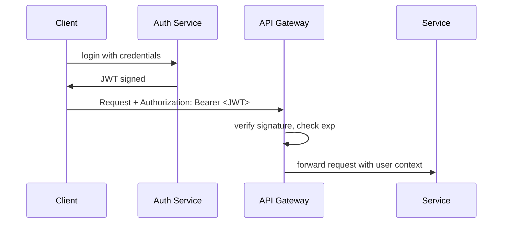

# JWT

> **Learning Path:** Security Architecture
> **Section:** 6.1.7 — Application security

## 1. Problem

உங்களிடம் ஒரு stateless API உள்ளது. Mobile app, web app, third-party integrations எல்லாம் அதை call பண்ணுது. ஒவ்வொரு request-லும் `who is this user?` என்பதை எப்படி தெரிஞ்சுக்கறது?

பழைய முறை: server-side session. User login ஆனதும் server-ல் session ID வச்சு ஒரு table-ல் user data வைத்துக்கொள்வது. ஒவ்வொரு request வந்தாலும் அந்த session ID-வை வைத்து DB lookup பண்ணி user-ஐ verify பண்ணுவது.

இது சரியாக இருந்தாலும் scale பண்ணும்போது பிரச்சினை வரும்.
* 50 microservices, 10 regions. Session data-வை எல்லா node-க்கும் share பண்ண வேண்டும். Sticky session வேண்டும்.
* New service spin up ஆனதும் அதற்கு session store-ஐ access செய்ய வேண்டும். Coupling அதிகம்.
* Latency: ஒவ்வொரு request-க்கும் DB/Redis hit.

என்ன வேண்டும்? Server ஒவ்வொரு request-க்கும் central state-ஐ பார்க்காமல், client-ஐயே ஒரு tamper-proof proof-ஐ கொண்டு வரச் செய்யலாம் என்றால்?

அதுதான் JWT வந்த கதை.

## 2. Mental Model

JWT என்பது ஒரு **signed note**. Issuer அதாவது auth service, user பற்றிய சில claims-ஐ எழுதி, தன்னுடைய private key-ல் கையெழுத்திட்டு கொடுக்கிறது. 

Client அந்த note-ஐ ஒவ்வொரு request-லும் கொண்டு வருகிறது. Service அந்த கையெழுத்தை verify பண்ணினால் போதும். Note மாற்றப்பட்டிருந்தால் signature invalid ஆகிவிடும். Server-side session table வேண்டாம்.

Note-ஐ படிக்கலாம், ஆனால் base64 encoded மட்டுமே. முழுமையாக secret இல்லை. நம்பிக்கை signature-ல் இருக்கிறது.

## 3. How It Works

JWT என்பது 3 பகுதிகள்: `header.payload.signature`

`header` - algorithm, e.g. HS256 / RS256
`payload` - claims. `sub`, `email`, `role`, `exp`, `iat` போன்றவை.
`signature` - header + payload + secret/key-ஐ hash பண்ணி உருவாக்கப்பட்டது.

Flow:

Verification என்பது stateless. Secret அல்லது public key இருந்தால் போதும். Database hit இல்லை.

முக்கியமான விஷயம்: JWT by default **encrypted இல்லை**. Base64 decode பண்ணினால் payload தெரியும். Sensitive data வைக்கக்கூடாது. Confidentiality வேண்டுமென்றால் JWE வேண்டும்.

## 4. Architectural Reasoning

JWT எப்போது useful?
* Stateless, horizontally scalable services. API gateway ஒருமுறை verify பண்ணி downstream services-க்கு trust pass பண்ணலாம்.
* Distributed system-ல் multiple services-க்கு same identity தேவை. Central session store dependency குறையும்.
* Mobile / SPA clients. Cookie management கடினம். Authorization header-ல் token அனுப்ப எளிது.

Alternatives:
* **Server-side session + cookie**: Simple, revocation easy. ஆனால் stateful, scaling cost உள்ளது.
* **Opaque access token**: Auth server-ல் introspection endpoint. Token என்பது random string மட்டும். State server-side-ல் இருக்கும். Revocation easy, ஆனால் ஒவ்வொரு request-க்கும் introspection latency/cost.

Decision: Architect JWT-ஐ தேர்வு செய்வது scalability மற்றும் decoupling-க்காக. Trade-off என்னவென்றால் revocation மற்றும் token lifecycle management நாம் தான் கவனிக்க வேண்டும்.

## 5. Trade-offs

**Revocation கடினம்.** JWT once issued, valid until `exp`. User logout ஆனாலோ, password change ஆனாலோ, token-ஐ உடனே invalidate செய்ய முடியாது. Workaround: short expiry + refresh token, அல்லது token blacklist in Redis - அது மீண்டும் stateful ஆக்கிவிடும்.

**Size.** Payload base64 ஆக பெரிதாகும். ஒவ்வொரு request-லும் header-ல் போகிறது. 4KB cookie limit கவனம்.

**Security pitfalls.** 
* `none` algorithm attack, algorithm confusion HS256 vs RS256.
* `exp` check மறக்காமல் செய்ய வேண்டும்.
* Secret leak ஆனால் எல்லாம் போய்விடும்.
* Token theft = session hijack. HTTPS, secure storage முக்கியம்.

**Not a session replacement.** JWT identity proof. Authorization logic, permissions என்பதை service-ல் மீண்டும் evaluate செய்ய வேண்டும்.

## 6. Practical Example

Enterprise SaaS: Auth service, API Gateway, Billing service, Reporting service.

User login ஆனதும் Auth service RS256-ல் JWT issue பண்ணுகிறது. `sub=user123`, `role=admin`, `exp=15min`.

Mobile app ஒவ்வொரு API call-க்கும் `Authorization: Bearer <JWT>` அனுப்புகிறது. API Gateway public key-ஐ வைத்து signature verify பண்ணி, claims-ஐ extract பண்ணி request context-ல் வை
