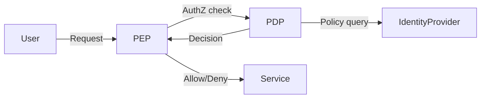

# Zero Trust

> **Learning Path:** Security Architecture
> **Section:** 6.2.1 — Enterprise security

## 1. Problem

உங்கள் company-க்கு traditional security இருக்கு: firewall வெளியே, VPN உள்ளே. Inside corporate network என்றால் trust பண்ணலாம்.

இப்போது reality என்ன?
* ஊழியர்கள் remote-ல இருந்து work பண்றாங்க
* SaaS apps, cloud services, third-party vendors எல்லாம் connect ஆகி இருக்கு
* Laptop ஒன்னு malware பிடிச்சா, அது VPN வழியா உள்ளே வந்துடும்
* ஒரு compromised credential கிடைச்சா, அதுக்கப்புறம் lateral movement ல எல்லா internal service-க்கும் போயிடலாம்

Perimeter எங்கே இருக்கு? இல்லை. Trust boundary blur ஆகிடுச்சு.

**Pain point:** "உள்ளே வந்துட்டா சரி" என்ற assumption தான் breach ஆக காரணம் ஆகுது. நீங்கள் எவ்வளவு firewall வைத்தாலும், once trust கொடுத்துவிட்டால் அதற்கு பின்னால் எல்லாம் open.

இந்த problem தான் Zero Trust-ஐ தேவைப்படுத்துகிறது.

## 2. Mental Model

Zero Trust = **Never trust, always verify.**

Location, network, device, internal/external என்று வேறுபாடு இல்லை. Every access request-க்கும் verify பண்ண வேண்டும்.

Analogy: Airport security. Traditional model என்பது club-ல் உள்ளே நுழைந்த பிறகு எல்லாரும் free. Zero Trust என்பது ஒவ்வொரு gate-லயும் ID check, ticket check.

Identity தான் new perimeter.

## 3. How It Works

Core idea 3 layers:

**1. Identity is the perimeter.** User + device + context தான் trust signal. Strong authentication, ideally MFA. Service access token short-lived.

**2. Continuous verification, not one-time.** Login பண்ணினதும் trust கிடைக்காது. ஒவ்வொரு request-க்கும் policy check ஆகும். Device posture, location, time, risk score பார்த்து decide பண்ணும்.

**3. Least privilege + micro-segmentation.** ஒரு service-க்கு மட்டும் தேவையான access தரணும். Network-ஐ zones ஆக cut பண்ணி, east-west traffic-க்கும் policy enforce பண்ணணும்.

Typical flow:

PEP = Policy Enforcement Point, PDP = Policy Decision Point. Telemetry எல்லாம் collect ஆகி policy refine ஆகும்.

Encryption எப்போதும். mTLS for service-to-service.

## 4. Architectural Reasoning

**When it becomes useful?**
* Hybrid / multi-cloud enterprise
* Large remote workforce
* High-value data, financial / healthcare
* Third-party integration அதிகம்
* Compliance need for auditability

**What constraint it addresses?**
Perimeter disappears. Blast radius குறைக்கணும். Compromise ஒன்னு ஆனாலும் அது spread ஆகக்கூடாது.

**Alternatives**
* VPN + firewall + internal trust. Simple, cheap. But breach ஆனால் game over.
* Network segmentation only. Good but identity not enforced.

**Why choose Zero Trust?**
Attack surface குறைக்கும். நீங்கள் trust assumption-ஐ remove பண்ணி, verification-ஐ explicit ஆக்குறீங்க.

Trade-off என்ன? Complexity. Identity system தான் single point of failure ஆகுது.

## 5. Trade-offs

* **Complexity & Operability:** Policy engine, device posture checks, identity federation, logging — team size & skill தேவை. Small org-க்கு overkill ஆகலாம்.
* **Latency:** Every request verify ஆகும். Token validation, policy lookup overhead வரும். Cache & fast PDP தேவை.
* **Identity risk increases:** Identity provider compromised ஆனால் எல்லாம் போய்விடும். So IdP security, MFA, secrets management critical ஆகும்.
* **User friction:** Continuous verification, device compliance checks frustrate users. Balance பண்ணணும்.

Failure mode: false positive deny ஆனால் business impact. Policy too strict ஆனால் productivity down.

## 6. Practical Example

Enterprise banking app.

Employee laptop-லிருந்து internal customer DB-க்கு access.

Traditional: VPN connect ஆனதும் trust. Laptop compromised ஆனாலும் access இருக்கும்.

Zero Trust flow:
1. User login with MFA, device certificate validated. Device compliance check: OS patched? EDR active?
2. Short-lived access token issue ஆகும், scoped to `read:customer` only.
3. DB service receives request, PEP verifies token signature, checks PDP policy: user role, location = office IP? time = business hours? risk score low?
4. Allow. Every 5 min token refresh, re-verify.

Vendor support engineer-க்கு temporary access தேவைப்பட்டால், just-in-time access token with 2 hour expiry, recorded. No standing privilege.

Blast radius limited.

## 7. Reasoning Challenge

உங்களிடம் 2000 employees, 300 microservices, on-prem + AWS. Developers frequently need production DB read access for debugging.

Zero Trust implement பண்ணும்போது, full micro-segmentation உடனே பண்ணலாமா, அல்லது identity-based access control முதலில் பண்ணி network segmentation பிறகா? 

எதை முதலில் தொடங்குவீர்கள்? ஏன்
