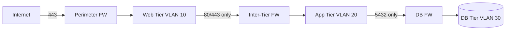

# Network segmentation

> **Learning Path:** Security Architecture
> **Section:** 6.2.2 — Enterprise security

### 1. Problem

உங்கள் company-ல ஒரு flat network இருக்கு. எல்லா VM-களும், laptop-களும், database-களும் ஒரே subnet-ல இருக்கு. 

ஒரு developer-ன் laptop-ல phishing mail வந்து malware install ஆகுது. அந்த machine இப்போ attacker-க்கு கட்டுப்பட்டது. அடுத்த 5 நிமிடத்தில் அவன் network-ல உள்ள எல்லா service-களுக்கும் scan பண்ணி, internal API-களை அணுகி, database-க்கு connect பண்ணி data எடுத்துட்டு போயிட்டான்.

இதுதான் flat network-ன் பிரச்சனை. **Blast radius** மிக பெரியது. ஒரு compromise ஆனா முழு enterprise-மே compromised.

Compliance கூட பிரச்சனை. PCI, HIPAA, RBI guideline-கள் சொல்லும்: card data இருக்கும் system-களை public internet-ல இருந்து தனியாக பிரிக்கணும். Flat network-ல அது சாத்தியமில்லை.

### 2. Mental Model

Network segmentation = building-ல compartmentalization மாதிரி.

Bank-ல public lobby, staff area, vault என தனித்தனி zone இருக்கும். யார் எந்த zone-க்குள் போகலாம் என்பதற்கு door lock உண்டு.

Network-லயும் அதே. Traffic-ஐ zones / security domains-ஆ பிரித்து, zone-க்கு zone இடையே explicit allow/deny rules வைக்கிறோம். Compromise ஆனாலும் attacker-க்கு side-to-side move பண்ண கஷ்டம்.

### 3. How It Works

பெரும்பாலும் இது 3 layer-ல வேலை செய்யும்:

**Perimeter segmentation:** Internet -> DMZ -> Internal. Perimeter firewall traffic-ஐ filter பண்ணும்.

**Tier segmentation:** Web tier, App tier, DB tier என தனித்தனி subnet / VLAN-ல வைத்து, firewall அல்லது security group மூலம் east-west traffic-ஐ control பண்ணுவது.

**Microsegmentation:** Service level-ல segmentation. Pod to pod, container to container வரை policy வைக்கிறோம். Kubernetes NetworkPolicy, cloud security groups, service mesh mTLS இதில் வரும்.

உதாரண flow:

Web server app server-ஐ தவிர வேற எதையும் தொட முடியாது. App server DB server-ஐ தவிர வேற எதையும் தொட முடியாது.

### 4. Architectural Reasoning

Segmentation தேவைப்படும் போது:

* **Blast radius குறைக்க வேண்டும்.** One breach = whole network இல்லை.
* **Compliance boundary** வேண்டும். PCI zone, production vs non-prod தனித்தனியாக இருக்கணும்.
* **Data classification** வேண்டும். Public data, confidential data, regulated data வெவ்வேறு zone.

Alternatives என்ன?
Flat network + endpoint protection மட்டும். செலவு குறைவு, ஆனால் trust model மிகவும் weak.

Full Zero Trust. Every connection authenticate and authorize. Ideal ஆனால் operational complexity அதிகம்.

Network segmentation என்பது Zero Trust-ன் first practical step. Macro segmentation ஆரம்பம், பிறகு microsegmentation-க்கு முன்னேறலாம்.

Architect choose பண்ணும் போது பார்க்கும் constraints: latency, operational complexity, team size, cloud vs on-prem.

### 5. Trade-offs

* **Complexity vs Security:** Rules அதிகமாகும். Firewall rule sprawl, misconfiguration risk வரும். Change management கடினமாகும்.
* **East-west inspection cost:** Inter-tier traffic கூட firewall / IDS கடந்து போகும். Latency மற்றும் throughput impact வரலாம். Cloud-ல inter-AZ data transfer cost.
* **Operability:** Developers "why can't I connect?" என்று அடிக்கடி கேட்பார்கள். Self-service network policy, good documentation, visibility மிக முக்கியம்.
* **Failure mode:** Segmentation rule தவறாக போட்டால் production outage வரும். Too permissive = no value. Too restrictive = business breaks.

### 6. Practical Example

Enterprise e-commerce system:

Zone 1: Internet DMZ - ALB, WAF
Zone 2: Web Tier - public facing services, auto-scaling group
Zone 3: App Tier - business logic, internal API
Zone 4: DB Tier - Postgres, Redis
Zone 5: PCI Zone - payment processing, isolated subnet, separate logging

Firewall rules:
Web -> App: 443 only, from specific security group
App -> DB: 5432 only, from specific security group
PCI Zone: No internet egress, only allow from App tier via private link

ஒரு web server compromised ஆனாலும், attacker DB-க்கு நேரடியாக போக முடியாது. App tier firewall-ல deny இருக்கும். Time window குறையும், detection chance அதிகரிக்கும்.

### 7. Reasoning Challenge

உங்கள் company-ல microservices 150 இருக்கு, Kubernetes cluster-ல run ஆகுது. இப்போ எல்லா pod-ம் default allow network policy-ல இருக்கு.

Security audit சொல்லுது: lateral movement risk அதிகம். Network segmentation வேண்டும்.

Option A: Namespace level segmentation மட்டும். Frontend namespace, backend namespace, db namespace என பிரிக்கிறோம்.

Option B: Service level microsegmentation. ஒவ்வொரு service pair-க்கும் explicit
