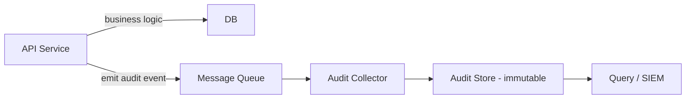

# Audit logging

> **Learning Path:** Security Architecture
> **Section:** 6.2.7 — Enterprise security

### 1. Problem

ஒரு production incident வந்துச்சு. Customer account-ல இருந்து 10 lakh transfer ஆகியிருக்கு. Support ticket-ல user சொல்றார், "நான் பண்ணல". Backend team சொல்றாங்க, "API call வந்தது". Security team கேட்குது, "யார் அந்த request-ஐ அனுப்பினது? எந்த IP-ல இருந்து? எந்த service அதை approve பண்ணுச்சு? அந்த user session valid ஆ?"

இப்போ உங்களிடம் application logs மட்டும் இருக்கு. Logs rotate ஆகி போயிருக்கு. ஒரு service log-ல request இருக்கு, மற்றொரு service log-ல அதை process பண்ணினது இருக்கு. Timeline-ஐ stitch பண்ண முடியல. யார் மாற்றினார்ன்னு prove பண்ண முடியல.

Compliance audit வரும்போது கேட்கும்: PCI DSS, SOX, GDPR-க்கு "who did what, when, from where"ன்னு ஒரு tamper-proof trail வேண்டும். இல்லன்னா fine, legal liability.

Application log என்பது debugging-க்கு. Audit log என்பது trust & accountability-க்கு.

### 2. Mental Model

Audit log = ஒரு immutable, append-only journal of security-relevant actions.

ஒரு நிறுவனத்தின் CCTV camera மாதிரி. Video-வை யாரும் edit பண்ணக் கூடாது. Record மட்டும் பண்ணணும். பிறகு பார்க்கலாம்.

ஒரு event-க்கு குறைந்தபட்சம் இது வேண்டும்:
**who** - user id, service principal
**what** - action, resource
**when** - timestamp with trusted clock
**where** - source IP, service name
**result** - success / failure

இதை application code-உடன் mix பண்ணக் கூடாது.

### 3. How It Works

Service business logic run பண்ணும்போது, அதே time-ல ஒரு audit event generate பண்ணு. அதை main request path-ல block பண்ணாமல் async-ஆ அனுப்பு.

பொதுவான flow:

Collector event-ஐ normalize பண்ணி, schema enforce பண்ணி, write பண்ணும். Store என்பது append-only, WORM storage. முக்கியம்: audit log write failure என்பது business operation-ஐ fail பண்ணக் கூடாது, ஆனால் அதை alert பண்ணணும்.

### 4. Architectural Reasoning

Audit logging தேவைப்படுவது எப்போ?

* Compliance boundary உள்ளது
* Financial transaction, PII access, privilege change மாதிரி high-risk actions உள்ளது
* Post-incident forensics வேண்டும்
* Non-repudiation வேண்டும்

Options:

1. **In-app logging**: Service-க்குள்ளே logger. Simple ஆனால் tamperable, inconsistent schema.
2. **Centralized audit service**: எல்லா service-மும் அதுக்கு call பண்ணும். Consistent schema, single policy.
3. **Sidecar / eBPF collector**: Service-க்கு தெரியாமல் network/OS events capture. Strong tamper resistance, complex.

Architect choice: central collector + async shipping. Schema ஒன்று. Access control கடுமையானது. Audit store-க்கு write permission யாருக்கும் இல்லை, read only for compliance team.

### 5. Trade-offs

* **Completeness vs Performance**: ஒவ்வொரு read-உம் audit பண்ணினால் volume அதிகம். என்ன log பண்ண வேண்டும் என்று policy வைக்கணும். Too much noise = forensics கடினம்.
* **Tamper-proof vs Cost**: Immutable object storage + cryptographic signing cost ஆகும். Database-ல log வைத்தால் cheap ஆனால் admin மாற்றலாம்.
* **Privacy vs Auditability**: Audit log-ல PII வரும். GDPR right to erasure-க்கு முரண். எனவே PII-ஐ mask/tokenize பண்ணி, retention policy வைக்கணும்.
* **Synchronous vs Asynchronous**: Synchronous என்றால் audit loss இல்லை, ஆனால் latency increase. Asynchronous என்றால் fast, ஆனால் event loss risk.

Failure modes: clock skew -> ordering மாறும். Collector down -> events drop. Log injection -> fake events. எனவே signing, monotonic sequence, centralized time source முக்கியம்.

### 6. Practical Example

Banking transfer service.

User login -> OTP verify -> transfer request -> risk check -> approve.

ஒவ்வொரு step-க்கும் audit event:

`{actor: user123, action: transfer.initiated, resource: account456, amount: 100000, ip: 203.0.113.5, timestamp: 2026-01-10T09:12:03Z, result: success, correlationId: req-abc}`

இதை service emit பண்ணும். Collector அதை Kafka-க்கு அனுப்பும். Audit store-ல append-only table-ல write. 7 years retain. Signing key HSM-ல இருக்கும்.

Incident-ல fraud claim வந்தால், correlationId-ஆல் end-to-end trail பார்க்க முடியும். யார் approve பண்ணினார், எந்த service, எந்த policy bypass ஆச்சு என்பது தெரியும்.

### 7. Reasoning Challenge

உங்களிடம் e-commerce platform உள்ளது. 20 microservices. Refund API-க்கு 3 different teams access உள்ளது. Finance team கேட்கிறது: யார் எப்போது எந்த order-க்க
