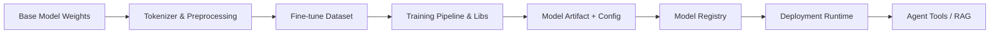

# Model supply-chain risks

> **Learning Path:** Security Architecture
> **Section:** 6.3.10 — AI security

## 1. Problem

உங்க team ஒரு LLM-based agent build பண்ணுது. Base model-ஐ Hugging Face-ல இருந்து pull பண்ணீங்க. Fine-tune-க்கு ஒரு open-source dataset, ஒரு training library, ஒரு tokenizer, ஒரு evaluation script use பண்ணீங்க. Model-ஐ container-ல package பண்ணி Kubernetes-ல deploy பண்ணீங்க.

இங்கே என்ன பிரச்சனை? Software supply chain-ல போல, AI supply chain-லும் ஒரு weak link போதும். Weights மாற்றப்பட்டிருக்கலாம், dataset-ல backdoor poisoning இருக்கலாம், training pipeline-ல ஒரு malicious dependency நுழைந்திருக்கலாம், tokenizer ஊடுருவி prompt injection-க்கு வழி வைத்திருக்கலாம்.

Production-ல model எதையாவது திடீரென்று bias-ஆக, leak-ஆக, அல்லது specific trigger-ல வேற output கொடுக்க ஆரம்பித்தால், அது bug அல்ல. அது supply chain compromise ஆக இருக்கலாம்.

## 2. Mental Model

Model supply chain = **Data → Code → Weights → Runtime → Tools** என்ற chain.

Traditional software-ல source code → build artifact → deploy.

AI-ல இதோடு non-deterministic elements சேரும்: training data, fine-tune data, prompts, embeddings, vector database content, agent tools.

ஒவ்வொரு stage-லும் provenance இல்லை என்றால், நீங்கள் என்ன run பண்ணுகிறீர்கள் என்பது உங்களுக்கு உண்மையில் தெரியாது.

## 3. How It Works

Chain-ஐ பாருங்கள்:

Risk points:

* **Base model:** Who trained it, on what data, any backdoor? Model card இருக்கா?
* **Dataset:** Poisoned samples, watermark triggers, PII leakage.
* **Training libs / dependencies:** Malicious code in training framework, optimizer, or data loader. Typosquatting packages.
* **Weights artifact:** Tampering in transit, unsigned model file.
* **Runtime:** Model server, inference code, prompt templates, system prompts, tools the agent can call.

## 4. Architectural Reasoning

இந்த chain-ல நீங்கள் control செய்ய வேண்டியது:

**Provenance & SBOM.** Model-க்கு Software Bill of Materials மாதிரி Model Bill of Materials. Base model hash, dataset version, training code commit, library versions, tokenizer hash எல்லாம் capture பண்ணுங்கள். Model Registry-ல immutable artifact + signature.

**Verification before trust.** 
* Weights-ஐ checksum / signature verify செய்யுங்கள். Trusted source மட்டுமே allow.
* Dataset-க்கு lineage track, data validation checks, anomaly detection.
* Training pipeline-ஐ reproducible environment-ல run, container image signed.

**Isolation & least privilege.** Model runtime-க்கு தேவையான tool access மட்டும் கொடுங்கள். Agent tools network egress, database access limit பண்ணுங்கள்.

**Runtime monitoring.** Output drift, unexpected tool calls, prompt injection patterns, canary inputs for backdoor detection.

When useful? நீங்கள் third-party model, open weights, அல்லது community dataset use பண்ணும்போது. Internal closed model கூட fine-tune data supply chain risk உண்டு.

Alternatives: fully in-house train vs curated open weights. Trade-off cost vs trust.

## 5. Trade-offs

* **Speed vs Verification.** Fast iterate பண்ண ஆசை. Signature, reproducible build, audit trail எல்லாம் latency add பண்ணும். Architect கேட்க வேண்டியது: எந்த stage-ல verification critical?
* **Open source agility vs provenance.** Open models cheap and fast. ஆனால் supply chain opaque. Vendor model expensive but provenance clear.
* **Reproducibility vs cost.** Training run-ஐ முழுவதும் reproduce பண்ணுவது storage, compute கூடும். Model artifact மட்டும் lock செய்வது மலிவு ஆனால் incomplete.
* **Security vs operability.** Runtime monitoring, sandboxing agent tools செய்தால் ops complexity அதிகம். மிஸ் பண்ணினால் silent compromise.

Failure mode: signed model deploy பண்ணீங்கள், ஆனால் fine-tune dataset update பண்ணும்போது data validation skip பண்ணீங்கள். Poisoned data production-ல backdoor activate ஆகும். Signature இருந்தும் attack வெற்றி.

## 6. Practical Example

Enterprise RAG agent for internal support.

Base model: public LLM from reputable source, checksum verified.
Fine-tune: internal Q&A data. Dataset stored in versioned data lake with hash.
Training pipeline: locked container image, signed, built from internal CI.
Model artifact pushed to internal Model Registry with SBOM: base model hash, dataset commit, training code git SHA, lib versions.
Deployment: model served behind API gateway. Agent tools limited to vector database read only, no write. Tool calls logged.
Runtime: canary prompts run every hour to detect output drift / trigger behavior.

இங்கே supply chain break ஆனால் கூட, எந்த component மாறியது என்பது traceable.

## 7. Reasoning Challenge

உங்களிடம் 20 engineers உள்ளனர். Product team வாரத்திற்கு ஒரு முறை fine-tuned model release வேண்டும் என்கிறார்கள். Security team full reproducible training + signed artifacts கேட்கிறது. Ops team cost-ஐ குறைக்க விரும்புகிறது.

நீங்கள் என்ன compromise செய்வீர்கள்? எந்த stage-ல verification mandatory, எந்த stage-ல risk acceptance? ஏன்?

## 8. Key Takeaways

* Model supply chain என்பது weights மட்டுமல்ல, data, code, tokenizer, tools எல்லாம் சேர்ந்தது.
* Provenance
