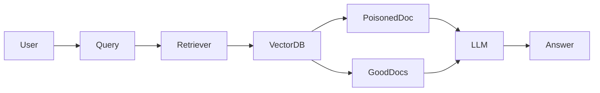

# RAG poisoning

> **Learning Path:** Security Architecture
> **Section:** 6.3.8 — AI security

## 1. Problem

நீங்கள் ஒரு enterprise RAG system பண்ணியிருக்கீங்க. Internal wiki, Confluence, policy docs, support tickets எல்லாத்தையும் vector database-ல ingest பண்ணி, user கேள்விக்கு பொருத்தமான chunks எடுத்து LLM-க்கு கொடுக்கறீங்க.

பிரச்சனை என்ன? LLM retrieval கொடுத்த context-ஐ நம்பி answer generate பண்ணும். Retrieval corpus தான் ground truth ஆக மாறிடும்.

இப்போ ஒருத்தர் உங்கள் ingestion source-ல ஒரு document-ஐ மாற்றலாம் / upload பண்ணலாம். Fake refund policy, wrong API pricing, malicious instructions. அந்த doc embed ஆகி vector DB-ல போயிடும்.

User "எங்கள் refund window என்ன?" என்று கேட்டால், poisoned chunk top-ல வந்து, LLM அதை உண்மையாக சொல்லும். இது hallucination இல்லை, retrieval-ல இருந்து வந்த தவறான உண்மை.

What goes wrong if we don't have this? Trust boundary தெரியாமல் போகும். LLM-ஐ சரியாக train பண்ணியிருந்தாலும், RAG-ல source corrupted ஆனால் output corrupted ஆகும்.

## 2. Mental Model

RAG = Retrieve + Generate.

Generate பகுதி LLM-ன் capability. Retrieve பகுதி உங்கள் architecture.

Poisoning என்பது retrieve பகுதியை தாக்குவது. Attacker உங்கள் knowledge base-ன் source of truth-ஐ மாற்றி, embedding space-ல query-க்கு பொருத்தமாக தோன்றும் content-ஐ வைக்கிறார்.

LLM-க்கு "இது தவறு" என்று தெரியாது. Context trusted ஆக இருக்கிறது என்று assume பண்ணும்.

அதனால் RAG poisoning என்பது data integrity problem, model safety problem அல்ல.

## 3. How It Works

Typical flow:

User Query -> Embed -> Vector DB search -> Top K chunks -> LLM with context -> Answer

Poisoning attack points:

* **Ingestion time**: Attacker உங்கள் crawl target-ல, shared drive-ல, public repo-ல malicious doc-ஐ வைக்கிறார். உங்கள் pipeline அதை புதிய source ஆக ingest பண்ணும்.
* **Chunk craft**: Attacker query-ல வரக்கூடிய keywords-ஐ அடர்த்தியாக வைத்து embedding similarity-ஐ உயர்த்துவார். Ex: "refund policy 90 days" என்று பலமுறை repeat.
* **Retrieval hijack**: Poisoned chunk natural docs-ஐ விட higher similarity score பெற்று top K-ல வரும். LLM அதை படித்து answer-ல incorporate பண்ணும்.

Mermaid flow:

Attacker control செய்வது Retriever-க்கு போகும் data. Generate பகுதி நல்லாதான் வேலை செய்யும்.

## 4. Architectural Reasoning

இது எப்போ painful ஆகும்?

* Corpus partially untrusted: public web crawl, user uploaded docs, third party knowledge base.
* High impact answers: financial advice, policy, medical, internal security procedures.
* Replay / persistence வேண்டும்: poisoned doc long time இருந்தால் பல users affected.

Options:

* **Closed corpus**: Only trusted source, strict access control. Poisoning surface குறையும், ஆனால் freshness குறையும்.
* **Provenance + validation layer**: Every document-க்கு source, author, signature, approval workflow. Ingestion-க்கு முன் verification.
* **Retrieval filtering**: Retrieval results-ஐ secondary check பண்ணி, source reputation, anomaly detection போடுவது.
* **Defensive generation**: LLM-க்கு retrieval results-ஐ "may be outdated" என்று prompt பண்ணி, citations கட்டாயம் கொடுக்க வைப்பது.

Architect ஏன் இதை choose பண்ணுவார்? Cost of wrong answer > cost of verification. Compliance/brand risk இருக்கும் system-ல இது must.

## 5. Trade-offs

* **Freshness vs Verification latency**: Real-time ingestion வேண்டுமா, அல்லது human approval வேண்டுமா? Approval போட்டால் poisoning குறையும், ஆனால் knowledge stale ஆகும்.
* **Open corpus vs Closed corpus**: பெரிய public data பயன
