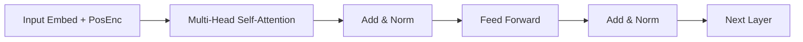

# Transformer high-level architecture

> **Learning Path:** AI / LLM Foundations
> **Section:** 10.1.6 — Understand

## Problem

உங்களுக்கு ஒரு large-scale language model build பண்ண வேண்டி இருக்கு. RNN / LSTM use பண்ணும்போது என்ன painful ஆகுது?

Sequential processing தான் main bottleneck. ஒரு token பார்க்க, முந்தைய hidden state வேணும். Training-லும் inference-லும் இதை parallelize பண்ண முடியாது. GPU ரொம்ப powerful ஆ இருந்தும், நீங்கள் ஒரு வரியை ஒரு step-க்கு ஒரு step-ஆ process பண்ணிக்கிட்டு இருக்கீங்க.

அடுத்தது long dependency. "It was the best of times..." என்று start பண்ணி 500 words கழித்து ஒரு pronoun வரும். LSTM-ல gradient vanish ஆகும். நிறைய layers வைத்தால் training unstable ஆகும்.

அப்புறம் representation mixing. RNN ஒரு vector-ல் எல்லா context-ஐயும் squeeze பண்ணும். முக்கியமான மற்றும் சாதாரணமான information எல்லாம் ஒன்றாக மக்கிப்போகும்.

இந்த pain தான் Transformer-ஐ உருவாக்கியது. **Parallel training + long range dependency + direct access** வேண்டும்.

## Mental Model

Transformer-ன் core idea simple: **Attention is all you need**.

ஒவ்வொரு token-க்கும் முழு sequence-ல எந்த token முக்கியம்னு தானே decide பண்ணிக்கோ. Query, Key, Value என்று ஒரு mechanism வைத்து, ஒவ்வொரு token தனக்கு தேவையான context-ஐயே pick பண்ணிக்கும்.

Analogy: ஒரு meeting-ல ஒரு person பேசும்போது, அவர் முழு room-ல யார் என்ன சொன்னார்ன்னு ஞாபகம் வைத்திருக்க மாட்டார். ஆனால் relevant points மட்டும் attend பண்ணுவார். Self-attention அப்படி.

RNN ஒரு tape recorder போல sequential-ஆ கேட்கும். Transformer ஒரு table-ல எல்லா notes-ஐயும் spread பண்ணி, யார் என்ன சொன்னார்ன்னு instant-ஆ cross reference பண்ணும்.

## How It Works

High-level architecture ரொம்ப modular.

Input tokens → Token Embedding + Positional Encoding → Stack of identical Transformer blocks → Output.

ஒரு Transformer block என்பது இரண்டு main operations:

1. **Multi-head Self-Attention**
   Token-ஐ Query, Key, Value-ஆ project பண்ணி, attention scores calculate பண்ணி weighted sum எடுக்கும். Multi-head என்றால் different representation subspaces-ல் attend பண்ணும்.
   Output = Attention(Q,K,V) + Residual → LayerNorm

2. **Feed-Forward Network**
   Token-wise MLP. Attention-ல கிடைத்த context-ஐ non-linearly transform பண்ணும்.
   Output = FFN + Residual → LayerNorm

Encoder-Decoder model-ல Decoder-ல masked self-attention இருக்கும், future token-ஐ பார்க்க கூடாது. அப்புறம் cross-attention வைத்து encoder output-ஐ பார்க்கும்.

Simple encoder block:

Positional encoding முக்கியம். Attention order-ஐ அறியாது. Sinusoidal or learned positional encoding வைத்து order inject பண்ணுவோம்.

## Architectural Reasoning

எப்போது Transformer useful?

* Parallelizable training வேண்டும். Large corpus, large cluster-ல throughput வேண்டும்.
* Long-range dependency முக்கியம். 2k, 8k, 32k context வேண்டும்.
* Representation quality over raw latency.

Alternatives: RNN/LSTM, CNN. அவை small data, real-time streaming, மற்றும் limited compute scenario-ல இன்னும் use ஆகும். CNN local patterns-க்கு நல்லது, ஆனால் long range கஷ்டம்.

Architect choose பண்ணும்போது கேட்க வேண்டியது: 
Sequence length எவ்வளவு? Training budget என்ன? Inference latency constraint என்ன?

Transformer தேர்வு = **train time parallelism மற்றும் modeling power-க்கு கொடுத்த trade-off**.

## Trade-offs

**Quadratic complexity.** Self-attention O(n²). n = 32k tokens என்றால் attention matrix 1B entries. Memory and compute பெரும். Inference-ல latency spike ஆகும்.

**Positional info artificial.** RNN naturally order அறியும். Transformer-க்க
