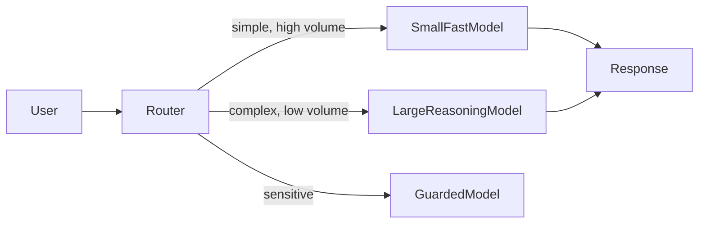

# PARTIAL — Quality

> Reason: Ollama reached num_predict
> num_predict: 32768

## 1. Problem

நீங்கள் ஒரு LLM feature build பண்ண ஆரம்பிச்சீங்க. Prototype-ல ஒரே ஒரு big model போட்டால் போதும், output நல்லா இருக்கு.

Production-க்கு வந்ததும் வலி தெரியுது. Traffic 100x ஆகுது. Cost per request ஏறி business team கேள்வி கேட்குது. p95 latency 2.5 sec ஆகுது, user drop off ஆகுது. அதே model-ல் simple intent classification கூட பண்ணும்போது overkill.

இன்னொரு பக்கம், financial doc summary போன்ற critical task-ல் small model hallucinate பண்ணுது, quality fail ஆகுது.

இங்கே பிரச்சனை என்ன? **ஒரே model எல்லா task-க்கும் சரியாகாது.** Quality-ஐ பற்றி பேசும்போது model selection என்பது benchmark score மட்டும் இல்லை. அது system constraint-களோடு align பண்ணும் ஒரு decision.

## 2. Mental Model

Model selection என்பது ஒரு single best model தேர்ந்தெடுப்பது அல்ல. அது ஒரு **trade-off surface**.

X-axis: capability / reasoning quality
Y-axis: cost per token
Z-axis: latency

ஒரு model இந்த மூன்றையும் optimize பண்ண முடியாது. நீங்கள் தேர்ந்தெடுப்பது **task requirement + operational constraint**-ன் intersection.

> Quality = task-specific correctness, consistency, safety, latency, cost.

ஒரு chatbot-க்கு user experience quality என்பது fast, cheap, good enough answer. ஒரு code generation tool-க்கு quality என்பது accuracy முக்கியம், latency கொஞ்சம் relax.

## 3. How It Works

Architect-கள் model-ஐ தேர்ந்தெடுக்கும்போது முதலில் task-ஐ define பண்ணுவாங்க.

* Input type, context length, reasoning depth
* Acceptable error modes
* SLO: latency p95, cost per 1k requests
* Safety / compliance needs

பிறகு candidate models-ஐ evaluate பண்ணுவாங்க, ஆனால் public benchmark-ல் இல்லை. உங்கள் own golden dataset-ல்.

ஒரு simple router pattern பொதுவாக வரும்:

Router என்பது rule-based or classifier ஆக இருக்கலாம். Production-ல் இது quality vs cost-ஐ control பண்ணும் lever.

## 4. Architectural Reasoning

Model selection useful ஆகும் போது:

* Traffic heterogeneous ஆக இருக்கும். 80% queries trivial, 20% hard.
* Cost a first-class constraint. Token cost linear with usage.
* Latency SLO strict. Large model cold start + long generation.
* Risk profile வேறுபடும். Public FAQ vs internal PII.

Options:

1. **One big model for all** - simple to operate, consistent quality, but cost and latency waste.
2. **Tiered routing** - small model for first pass, fallback to large on low confidence. Cost down, latency down, complexity up.
3. **Task-specific fine-tuned small models** - best quality/cost for narrow task, but maintenance overhead.
4. **Hybrid RAG + model** - quality problem-ஐ retrieval quality-ல் shift பண்ணி, smaller model-ஐ பயன்படுத்த முடியும்.

Decision ஏன்? Because every model choice creates new operational problem. Big model தேர்ந்தால் cost monitoring, rate limiting, prompt caching முக்கியம் ஆகும். Small model தேர்ந்தால் guardrails, hallucination handling முக்கியம் ஆகும்.

## 5. Trade-offs

**
