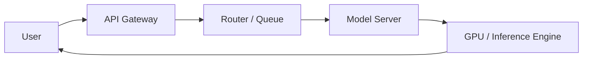

# PARTIAL — Latency

> Reason: Ollama reached num_predict
> num_predict: 32768

## 1. Problem

ஒரு chatbot-ல user ஒரு கேள்வி கேட்ட உடனே response வரணும், இல்லைனா user wait பண்ண மாட்டாரு. 

நீங்கள் ஒரு LLM-ஐ select பண்ணும்போது, அது quality மட்டும் இல்ல, **latency**-ம் முக்கியம். 

ஒரு 70B model-ல் சரியான answer கிடைக்கலாம், ஆனா Time To First Token 3-4 seconds ஆகும். அதே prompt-க்கு 7B model 600ms-ல first token தரும். User-க்கு feel வேறு. 

என்ன problem? Model பெரிதாகும்போது inference slow ஆகும். Traffic அதிகமாகும்போது queue-ல wait பண்ணும். Network round-trip, serialization, prefill/decode எல்லாம் சேர்ந்து latency pile up ஆகும்.

என்ன வரும்? Drop-off, retries, cost spike.

## 2. Mental Model

Latency என்பது **user கேள்வி கேட்ட நேரத்தில் இருந்து first useful token கிடைக்கும் நேரம் வரை** உள்ள காலம்.

இதை மூன்று பகுதியா பார்க்கலாம்:
* **TTFT - Time To First Token**: request வந்ததில் இருந்து முதல் token வரும் வரை
* **TPOT - Time Per Output Token**: தொடர்ந்து token generate ஆகும் வேகம்
* **Total latency**: TTFT + generation time

Average latency பார்க்காதீங்க. p95, p99 பாருங்க. ஏனெனில் ஒரு slow request தான் user experience-ஐ கெடுக்கும்.

## 3. How It Works

ஒரு LLM inference request flow பார்ப்போம்:

இங்கே latency வரும் இடங்கள்:
1. **Queue wait**: concurrent requests இருந்தா model busy இருக்கும்
2. **Prefill**: prompt tokens-ஐ ஒரே batch-ல process பண்ணுவது. Prompt length அதிகமானால் இது heavy
3. **Decode**: ஒரு token generate ஆக ஒரு token time எடுக்கும். Autoregressive என்பதால் serial
4. **Network & serialization**: API gateway, load balancer, token stream

Model selection இந்த எல்லா இடத்தையும் பாதிக்கும். பெரிய model = more parameters = more compute per token = higher latency.

## 4. Architectural Reasoning

Model selection பண்ணும்போது நீங்கள் கேட்க வேண்டிய கேள்வி: **இந்த use case-க்கு எவ்வளவு latency acceptable?**

* Chat UI, real-time agent: TTFT < 800ms வேணும். Small model, quantization, or distilled model தேர்வு.
* Async summarization, batch jobs: latency matter இல்ல. Large model use பண்ணலாம்.
* RAG pipeline: retrieval + LLM. Retrieval latency + LLM latency = total. இங்கே model-ஐ fast-ஆக வைத்தால் overall pipeline fast ஆகும்.

Options உள்ளன:
* Bigger model vs smaller model
* Full precision vs quantized INT4/INT8
* Local GPU vs hosted managed service
* Single model vs router with fallback: fast model first, slow model for hard prompts

ஒரு architect ஏன் small model choose பண்ணுவார்? Latency constraint-ஐ meet பண்ண. Throughput increase பண்ண. Cost per request குறையும்.

## 5. Trade-offs

**Latency vs Quality**: பெரிய model தரமானது. சிறிய model வேகமானது. Use case define பண்ணும்.

**Latency vs Cost**: Low latency-க்கு more GPU replicas, smaller batch size வேணும். Cost per token அதிகம்.

**Latency vs Throughput**: Batching செய்தால் throughput அதிகம், ஆனால் per-request latency அதிகரிக்கும். Real-time-க்கு dynamic batching தான் பயன்படுத்துவார்கள்.

**Consistency**: Latency spiky ஆகும். Cold start, GC pause, GPU contention. p99-ஐ design பண்ணனும்.

Failure mode: Model overload ஆனால் queue pile up ஆகும். Timeout ஆகும். Client retry பண்ணும். அது cascade failure கொண்டு வரும். Circuit breaker வேணும்.

## 6. Practical Example

Enterprise customer support chatbot. 

Peak time-ல 2000 concurrent users. SLA: TTFT < 1s.

70B model-ல TTFT 2.5s வருது. p95 4s.

நீங்கள் என்ன பண்ணீங்க?
* Routing rule: simple FAQs-க்கு 7B distilled model. Complex troubleshooting-க்கு 70B.
* Cache common prompts, RAG results.
* Streaming response: first token வந்த உடனே UI-ல show பண்ண start.

Result: average latency 700ms,
