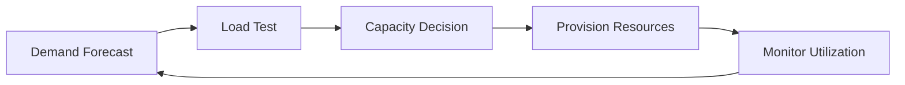

# Capacity planning

> **Learning Path:** Reliability Engineering & Cost Fundamentals
> **Section:** 7.1.10 — Non-functional requirements

# Capacity planning

## 1. Problem

உங்க service இப்போ 1000 requests per second handle பண்ணுது. Normal day-ல fine. 
Black Friday வருது, marketing campaign ஒன்னு release பண்ணீங்க. Traffic 5x ஆகுது.

என்ன ஆகும்?
Latency spike ஆகும், 5xx errors வரும், database connections exhaust ஆகும், autoscaling slow ஆகும், cost கட்டுக்கடங்காம போகும்.

இதுல முக்கியமானது: crash ஆகுறதுக்கு முன்னாடியே பிரச்சனை தெரியணும். 
Capacity planning-ன் கேள்வி என்னன்னா, **எப்போது, எவ்வளவு, எந்த resource-ஐ provision பண்ணனும்** என்பதை முன்கூட்டியே தீர்மானிப்பது.

## 2. Mental Model

Capacity planning என்பது hardware வாங்குறது இல்ல. இது demand-க்கும் supply-க்கும் இடையில ஒரு safety margin வச்சு மேனேஜ் பண்ணுறது.

ஒரு highway-ல lane capacity இருக்கு. Traffic அதுக்குள்ள இருக்கும் வரை smooth. Peak hour-ல அதுக்கு மேல போனா jam.

System-லும் அதே logic. CPU, memory, network I/O, database connections, thread pool, disk IOPS, even human ops team-க்கு capacity இருக்கு.

Mental model: **Forecast demand → Measure current capacity → Find headroom → Decide action before saturation**.

## 3. How It Works

Practical-ல capacity planning ஒரு loop.

1. **Demand capture**: Historical traffic, business forecast, seasonality. Example: daily active users, peak hours, campaign calendar.
2. **Current utilization baseline**: CPU, memory, latency p95/p99, throughput, queue length, error rate. இதை Prometheus, CloudWatch மாதிரி metrics-ல track பண்ணணும்.
3. **Load testing**: Production-like load-ல system-ஐ push பண்ணி, எங்க bottleneck வருதுன்னு கண்டுபிடிக்கணும். Service-ஐ isolate பண்ணி test பண்ணுறது முக்கியம்.
4. **Headroom decision**: Usually 20-30% headroom வைக்கிறாங்க. 100% utilization target பண்ணினா latency degrade ஆகும்.
5. **Provision & validate**: Scale up/down, autoscaling policy tune பண்ணு, அப்புறம் monitor பண்ணு.

## 4. Architectural Reasoning

Capacity planning எப்போ useful?

* Traffic predictable pattern இருக்கும் போது: diurnal peak, monthly billing cycle
* Latency sensitive service: payment, search, real-time recommendation
* Cost sensitive workload: batch processing, AI inference where GPU cost high
* Shared dependency: database, message queue, cache cluster

Alternatives இருக்கு:
* Over-provision எப்பவும் safe: cost அதிகம், waste.
* Reactive autoscaling மட்டும்: scale up time 2-5 min இருக்கும், cold start latency வரும், sudden spike-ல crash ஆகும்.
* Just-in-time scaling: spot instances, serverless. Good for bursty, bad for latency SLO.

Architect decision என்ன? 
Demand pattern-ஐ புரிஞ்சிக்கிட்டு, **proactive baseline capacity + reactive autoscaling buffer** combo வச்சுக்கணும். Critical path service-க்கு headroom கண்டிப்பா வேணும். Batch/low priority workload-க்கு reactive போதும்.

## 5. Trade-offs

**Cost vs Availability**: Headroom வச்சா cost அதிகம். குறைச்சா outage risk அதிகம். இது core trade-off.

**Latency vs Throughput**: CPU 70% க்கு மேல போனா context switch, queueing increase ஆகி p99 latency spike ஆகும். Throughput max ஆகும் முன்னாடியே throttle பண்ணணும்.

**Precision vs Simplicity**: Detailed per-service capacity model accurate ஆக இருக்கும் ஆனா operational overhead அதிகம். Coarse model simple ஆனா surprise வரும்.

Failure modes: 
Forecast தப்பா போனா under-provision. Load test production data மாதிரி இல்லாம இருந்தா false confidence. Autoscaling metric தப்பா தேர்வு பண்ணினா scale up late ஆகும். Database connection pool increase பண்ணினாலும் DB CPU bottleneck வரும் - siloed scaling தோல்வி.

## 6. Practical Example

ஒரு RAG service: LLM inference + vector database.

Peak hour-ல 200 queries/min. Each query: embedding 50ms, vector search 80ms, LLM call 2 sec.

Capacity planning பண்ணும்போது:
* LLM endpoint-க்கு concurrency limit உண்டு. 10 concurrent requests மட்டும் handle பண்ணும். அதுக்கு மேல queue ஆகும்.
* Vector DB read replica CPU 60% இருக்கு peak-ல.
* Embedding service autoscale ஆகுது ஆனா cold start 30 sec.

Decision: Baseline-ல 2 LLM instances provision பண்ணு + autoscaling trigger at 70% concurrency. Vector DB-க்கு read replica add பண்ணு. Embedding-க்கு pre-warm instances வச்சு cold start avoid பண்ணு.

இதனால cost increase ஆகும், ஆனா p95 latency 3 sec-க்குள்ள இருக்கும். இல்லன்னா timeout, retry storm வரும்.

## 7. Reasoning Challenge

உங்களுக்கு 20 consumers ஒரு Kafka topic-ஐ consume பண்ணுது. Producer rate stable ஆனா consumer processing speed வேறுபடுது. Peak hour-ல lag 10 min ஆகுது.

நீங்கள் autoscaling consumers-ஐ scale up பண்ணலாம், அல்லது consumer per partition assignment மாற்றலாம்,
