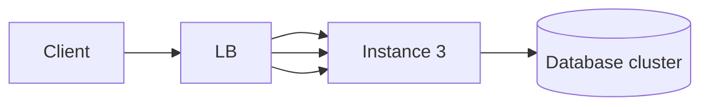

# Availability

> **Learning Path:** Reliability Engineering & Cost Fundamentals
> **Section:** 7.1.2 — Non-functional requirements

## 1. Problem

ஒரு service கிட்ட request போகுது, ஆனால் response வரல. User refresh பண்ணுறார், app stuck ஆகுது. Customer support-க்கு call வருது.

Availability-ன்னா என்ன? Service requested ஆனதும், எதிர்பார்த்த மாதிரி respond பண்ணும் திறன். Data சரியா இருக்கானு இல்ல, service up-ஆ இருக்கானு.

ஒரு single server-ல API run பண்ணினா போதும் என்று தோனும். Server crash ஆனா, OS patch வந்தா, deployment போனா, network blip வந்தா - எல்லாமே downtime. ஒரு failure = முழு system down.

இந்த பயங்கரம் தான் Availability-ஐ பிறப்பித்தது.

## 2. Mental Model

Availability = **பயனர் கேட்டதும் service எவ்வளவு நேரம் பதில் சொல்லும்**.

அதை எண்ணாக சொல்லுவோம்: uptime percentage.

99% = 3.65 days downtime per year
99.9% = 8.76 hours per year
99.99% = 52 minutes per year
99.999% = 5 minutes per year

ஒரு 9 கூடினாலும் cost exponential-ஆ வளரும். ஏன்னா நீ failure-ஐ tolerate பண்ணும் system-ஐ build பண்ணணும்.

இதை SLO/SLA-வாக எழுதுவோம். உதாரணமாக: `99.95% availability per month for checkout API`.

## 3. How It Works

Availability வருவது redundancy-ல இருந்து, fail fast & heal fast-ல இருந்து.

**Redundancy**: Same service-ஐ பல instances-ல ஓட வைக்கிறோம். Load balancer முன்னால் வைத்து traffic-ஐ distribute பண்ணுவோம்.

**Health check & auto failover**: Instance unhealthy ஆனா LB அதை remove பண்ணும். Kubernetes-ல readiness/liveness probe, auto restart.

**Graceful degradation**: Core flow மட்டும் வேலை செய்யும். Non-critical features-ஐ முடக்கி availability காப்பாற்றுவோம்.

**Deployment safety**: Rolling update, blue-green, canary. Deploy போது கூட service down ஆக கூடாது.

Simple flow:

ஒரு instance die ஆனாலும் request வேற instance-க்கு போகும்.

## 4. Architectural Reasoning

Availability தேவை எப்போ peak ஆகும்?

* User-facing critical path: login, checkout, payment
* Revenue directly tied: ஒரு நிமிஷம் down = பணம் loss
* 24x7 systems: banking, telecom, health

எந்த constraint-ஐ address பண்ணுது? **Single point of failure-ஐ remove பண்ணுது.**

Alternatives:
* **Active-Passive**: Standby replica உள்ளது, fail ஆனால் promote பண்ணு. குறைந்த cost, slow failover.
* **Active-Active**: எல்லா node-உம் serve பண்ணும். Complex but fast failover.
* **Multi-region**: Region down ஆனாலும் service தொடரும். Cost & data consistency கடினம்.

Architect முடிவு எப்படி? Traffic pattern, RTO/RPO target, budget, team ops capacity பார்த்து.

## 5. Trade-offs

1. **Availability vs Cost**: Redundancy, multi-AZ, multi-region எல்லாம் பணம். 99.9% maintain பண்ண 99.99% maintain பண்ண 10x செலவாகலாம்.

2. **Availability vs Consistency**: CAP theorem. Network partition-ல availability வைக்கணும் என்றால், சில நேரம் stale data தர வேண்டியிருக்கும். Payment service-க்கு consistency முக்கியம், feed service-க்கு availability முக்கியம்.

3. **Complexity vs Operability**: More replicas, more health checks, more failover logic = more failure modes. Auto failover தவறாக trigger ஆனால் split-brain வரும்.

Failure mode: Over-reliance on load balancer. LB itself single point of failure ஆகலாம். அதனால் LB-க்கும் redundancy வேண்டும்.

## 6. Practical Example

Bank mobile app login service.

Peak time-ல 10k RPS. Single VM crash ஆனால் 10k users login பண்ண முடியாது.

Design: 3 AZ-ல 3 pods each, behind regional LB. Read replicas for user profile DB. Session store Redis cluster with replication.

Deployment rolling-ஆ செய்யப்படும். Health check fail ஆன pod auto replace.

Result: One AZ down ஆனாலும் service தொடரும். Database primary fail ஆனால் automatic promotion.

இங்கே availability-க்காக செலுத்திய விலை: 3x compute, cross-AZ data transfer, operational monitoring.

## 7. Reasoning Challenge

உங்களிடம் payment confirmation service உள்ளது. Daily traffic 2k RPS, peak-ல 5k RPS. Budget tight. Team small.

Option A: Single region active-active with 3 replicas, auto failover.
Option B: Single region active-passive with 1 replica standby, manual failover 10 min.

உங்கள் SLO 99.9% per month. Cost முக்கியம். எதை தேர்வு செய்வீர்கள்? ஏன்? என்ன failure scenario இன்னும் மிஞ்சும்?

## 8. Key Takeaways

* Availability-ன்னா uptime percentage, அது redundancy மற்றும் fast healing-ல இருந்து வரும்.
* ஒவ்வொரு 9-க்கும் cost exponential-ஆ ஏறும். SLO-வை business impact-ஆல் decide பண்ண
