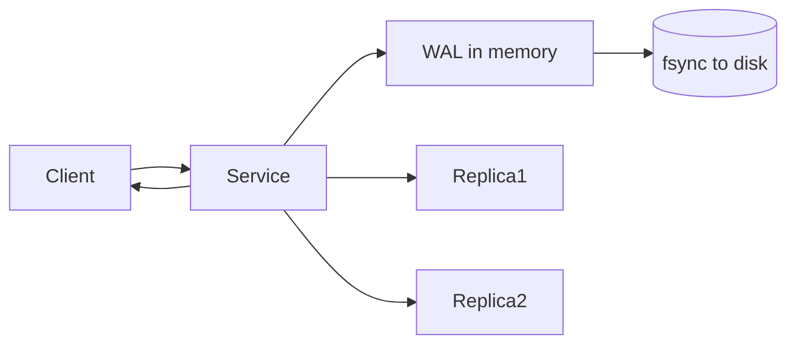

# Durability

> **Learning Path:** Reliability Engineering & Cost Fundamentals
> **Section:** 7.1.4 — Non-functional requirements

## 1. Problem

உங்கள் service-க்கு ஒரு write வருகிறது. `INSERT order` பண்ணினீர்கள், client-க்கு `201 Created` திருப்பி அனுப்பினீர்கள். 2 வினாடிக்குப் பிறகு node crash ஆகிறது.

அந்த order உண்மையில் disk-ல் இருக்கிறதா? இல்லை memory-ல் மட்டும் இருந்துவிட்டு போய்விட்டதா?

இதுதான் durability பிரச்சனை. Availability என்பது service up ஆக இருப்பது. Durability என்பது **once you said write is done, it stays done** even after crash, power loss, disk failure.

ஒரு payment ledger-ல் இது வேலை செய்யாவிட்டால், money debited but record gone. அது business risk.

## 2. Mental Model

Durability = persistence guarantee.

> Client-க்கு acknowledged ஆன எந்த write-ம், reasonable failures-க்குப் பிறகும் மீண்டும் recover ஆக வேண்டும்.

Availability க்கு நீங்கள் read/write செய்யலாம். Durability க்கு நீங்கள் data ஐ நம்பலாம்.

எளிய analogy: notebook-ல் எழுதி page-ஐ close செய்தீர்கள். மின்சாரம் போனாலும் அந்த எழுத்து தங்கும். Memory மட்டும் என்பது whiteboard-ல் எழுதுவது போல.

## 3. How It Works

Durability க்கு system ஒன்று செய்ய வேண்டும்: data ஐ non-volatile medium-க்கு stable ஆக்க வேண்டும்.

அடிப்படை வழிமுறைகள்:

* **WAL + fsync**: Write-Ahead Log-ல் entry எழுதி, OS buffer flush ஆக disk-க்கு force செய்வது. `fsync` தான் உண்மையான durability.
* **Replication**: ஒரு node fail ஆனாலும் கூட data வேறு node-ல் இருக்க வேண்டும். Majority acknowledgment வாங்குவது.
* **Snapshots & backups**: Long-term durability க்கு object storage-க்கு checkpoint எடுப்பது.

Flow ஒரு typical durable write:

Acknowledgement எப்போது கொடுக்கலாம்? WAL memory-ல் இருக்கும்போதே கொடுத்தால் fast ஆனால் risky. Disk fsync ஆன பிறகு கொடுத்தால் slow ஆனால் durable.

## 4. Architectural Reasoning

Durability எப்போது கவனிக்க வேண்டும்?

* Financial transactions, user data, audit logs போன்ற **irreplaceable writes**
* Compliance தேவை உள்ள systems
* Event sourcing / message queue க்கு, replay செய்ய event ஐ தொலைக்க முடியாது

Alternatives:

* **In-memory only with fast recovery** - Redis with AOF disabled. Latency குறைவு, durability இல்லை.
* **Async replication** - write accept செய்து background-ல் replicate. Low latency, risk of data loss on failure.
* **Sync replication + fsync** - strong durability, higher latency & cost.

Architect decision என்பது: எந்த failure-க்கு எதிராக எவ்வளவு guarantee வேண்டும் என்பது. Power loss? Disk failure? Region failure?

## 5. Trade-offs

**Durability vs Latency**
fsync, sync replication செய்தால் write latency 5-50ms ஆகும். Memory acknowledge என்றால் <1ms. High throughput systems-ல் இது painful.

**Durability vs Cost**
More replicas, more disks, frequent snapshots = more storage cost. fsync every write = more IOPS.

**Durability vs Availability**
Strong durability க்கு quorum தேவை. Majority node-கள் up இருக்க வேண்டும். Partition ஆனால் writes block ஆகலாம். Availability க்காக durability தளர்த்தினால் split-brain data loss risk.

**Failure modes**
* Acknowledged before fsync → crash = lost write
* Async replica lag → primary loss = recent writes gone
* Silent disk corruption → checksum இல்லாவிட்டால் bad data durable ஆகிவிடும்

## 6. Practical Example

ஒரு e-commerce order service.

Peak sale-ல் 10k orders/sec வருகிறது. Order table PostgreSQL-ல்.

Option A: `synchronous_commit = off`. Write memory-க்கு போகிறது, client-க்கு fast response. Node crash ஆனால் last few seconds orders போய்விடும்.

Option B: `synchronous_commit = on` + `synchronous_commit = remote_apply` to standby. Every write fsync + replica apply ஆன பிறகே ack. Latency 20ms ஆகிறது, but crash ஆனாலும் order தங்கும்.

அதோடு WAL archiving to S3 every 5 min, point-in-time recovery க்கு.

Business ஏற்றுக்கொள்ளும் latency-க்குள் durability level தேர்வு செய்யப்பட்டது.

## 7. Reasoning Challenge

உங்கள் payment service ல் 3 node Postgres cluster உள்ளது. p99 write latency தற்போது 8ms. Product team 15ms வரை ஏற்றுக்கொள்ளும்.

ஒரு region fail ஆனால் data loss ஆகக்கூடாது என்பது requirement. ஆனால் cost குறைக்க வேண்டும்.

நீங்கள் synchronous replication-ஐ single AZ-ல் மட்டும் வைக்கலாமா? அல்லது cross-AZ sync செய்தால் latency எப்படி மாறும்? Durability guarantee என்ன மாறும்? நீங்கள் என்ன trade-off choose பண்ணுவீர்கள், ஏன்?

## 8. Key Take
