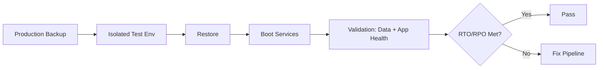

# Restore testing

> **Learning Path:** Reliability Engineering & Cost Fundamentals
> **Section:** 7.2.4 — Disaster recovery & high availability

## 1. Problem

உங்க system-ல daily backup automate ஆகுது. Backup job success ஆகுது, monitoring-ல green. ஆனா ஒரு நாள் production database corrupt ஆயிடுச்சு, அல்லது region down ஆயிடுச்சு. Restore பண்ணனும்னு பார்த்தா:

* backup file corrupt ஆ இருக்கு
* restore script வேலை செய்யல
* data version mismatch, application start ஆகல
* restore எடுக்க 8 மணி நேரம் ஆகுது, RTO 1 hour தான்

Backup எடுக்கிறது easy. Restore work ஆகுதான்னு தெரியாமல் இருப்பது தான் பிரச்சனை. 

Restore testing இல்லாம backup என்பது insurance policy வாங்கினது போல, claim பண்ணும்போது policy invalidன்னு தெரியும்.

## 2. Mental Model

Backup என்பது data copy. Recovery என்பது service-ஐ மீண்டும் usable ஆக்குவது.

நாம் சோதிக்க வேண்டியது: **Can we rebuild the system from backup within RTO and with acceptable data loss RPO?**

Restore test என்பது fire drill. Real disaster வராமல், controlled environment-ல disaster-ஐ simulate பண்ணி, restore செய்து validate பண்ணுவது.

## 3. How It Works

Restore test என்பது 3 step loop.

**1. Select backup:** Production-க்கு தொடர்பில்லாத isolated test environment-ல, குறிப்பிட்ட point-in-time backup-ஐ எடு.

**2. Restore & Boot:** Backup-ஐ restore பண்ணி, database, storage, config எல்லாம் துவக்கு. Application service-களை start பண்ணு.

**3. Validate:** Data integrity check, row count, checksum. Application smoke test, API health check, business critical query ஓடுதான்னு பார். RTO/RPO meet ஆகுதான்னு measure பண்ணு.

இது manual ஆகவும் இருக்கலாம், அல்லது automated pipeline ஆகவும் இருக்கலாம். CI/CD போல, restore test-ஐயும் automate பண்ணினால் தான் frequent ஆக run பண்ண முடியும்.

Mermaid flow:

## 4. Architectural Reasoning

இது ஏன் தேவை?

* **Confidence:** Backup tool version மாறியிருக்கும், storage class மாறியிருக்கும், encryption key rotate ஆகியிருக்கும். Restore script outdated ஆகி இருக்கலாம்.
* **RTO/RPO Proof:** Paper-ல எழுதிய RTO 30 min என்பது உண்மையா என்பதை test தான் prove பண்ணும்.
* **Compliance:** SOC2, ISO 27001 போன்ற audits-ல restore test evidence கேட்பார்கள்.

எப்போது useful?
Backup frequency அதிகமாகும் போது, data size பெரிதாகும் போது, multi-region DR setup இருக்கும் போது, மற்றும் critical service downtime cost அதிகமாகும் போது.

Alternatives:
* **No test:** செலவு குறைவு, ஆனால் blind trust.
* **Production restore:** உண்மையான validation, ஆனால் risk அதிகம்.
* **Checksum only:** file exists என்று மட்டும் பார்க்கிறது, actual recoverability தெரியாது.

## 5. Trade-offs

* **Cost vs Confidence:** Full restore test என்பது compute, storage, network cost. Large DB-க்கு hours ஆகும். அதனால் அடிக்கடி full test செய்ய முடியாது. Incremental or partial restore test பண்ணலாம்.
* **Frequency vs Freshness:** Daily backup எடுக்கிறோம். அதை weekly test பண்ணினால், backup corruption 6 நாள் வரை கண்டுபிடிக்காமல் இருக்கும்.
* **Isolation vs Realism:** Test env production clone இல்லை என்றால், performance difference வரும். Too isolated ஆக இருந்தால் restore time underestimate ஆகும்.
* **Automation complexity:** Automated test easy to run, ஆனால் validation logic-ஐ எழுதுவது கஷ்டம். False positive வரும்.

Failure modes: Test env-ல restore success ஆனால் production-ல fail ஆகலாம், ஏனெனில் network latency, IAM permissions, secrets difference.

## 6. Practical Example

ஒரு fintech company-ல PostgreSQL primary இருக்கு, WAL backup S3-க்கு போகுது. RPO 15 min, RTO 1 hour.

அவர்கள் வாரம் ஒரு முறை automated restore test pipeline ஓட வைத்தார்கள்.

Terraform-ல isolated VPC create பண்ணி, S3 backup-ஐ restore பண்ணி new Postgres instance raise பண்ணுவார்கள். Restore முடிந்ததும் `pg_dump` checksum, critical tables row count compare, app health endpoint hit பண்ணுவார்கள். RTO measure பண்ணுவார்கள்.

ஒரு முறை test-ல restore ஆனது ஆனால் app start ஆகவில்லை. காரண
