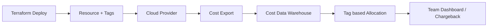

# Cost allocation & tagging

> **Learning Path:** Reliability Engineering & Cost Fundamentals
> **Section:** 7.3.4 — Cloud cost / FinOps

## 1. Problem

உங்க company AWS / Azure / GCP-ல 200+ services ஓடுது. 15 teams, 3 environments, 50+ microservices. ஒரு மாசம் bill வந்தா $180k. 

சோதனை வேளையில் CFO கேட்கிறார்: "இந்த $180k-ல எந்த team எவ்வளவு செலவு பண்றது? எந்த service தான் cost ஏறுது? dev vs prod எவ்வளவு?"

உங்களிடம் பதில் இல்லை. Cloud bill-ல resource name மட்டும் இருக்கு, owner இல்லை. ஒரு EC2 instance யார் create பண்ணா? அந்த instance எந்த product-க்கு? அது prod-வா staging-வா? தெரியல.

இதனால என்ன ஆகும்?
* Cost overrun-ஐ யார் கண்டுக்கறது என்றே தெரியாது
* One team-ன் experiment முழு org-க்கும் bill-ஐ ஏத்திடுது
* Waste-ஐ கண்டுபிடிக்க முடியாது. Idle resources, unattached volumes, over-provisioned databases எல்லாம் நீண்ட நாள் ஓடும்
* Showback / chargeback பண்ண முடியாது. Budget enforce பண்ண முடியாது

Cost allocation & tagging வந்தது இந்த pain-க்காக தான்.

## 2. Mental Model

Tag என்பது resource-க்கு ஒட்டப்பட்ட metadata label.

`Environment=prod`, `Team=payments`, `Product=checkout`, `CostCenter=CC-102` போல.

Cost allocation என்பது இந்த tags-ஐ use பண்ணி cloud billing data-வை group பண்ணி, யார் என்ன செலவு பண்றாங்கன்னு பார்க்கறது.

முக்கிய யோசனை: **Resource create ஆகும் போதே ownership & purpose-ஐ capture பண்ணு, பிறகு bill வந்த போது அதை query பண்ணு.**

இது accounting-க்கு மட்டும் இல்லை. Automation, policy enforcement, lifecycle management எல்லாத்துக்கும் tag தேவை.

## 3. How It Works

1. **Tagging Standard**: Org-wide tag key set define பண்ணு. mandatory tags: `Team`, `Environment`, `Product`, `CostCenter`. Optional: `OwnerEmail`, `Lifecycle`, `TicketID`.

2. **Enforcement Point**: IaC / Terraform / CloudFormation-ல tag apply பண்ணு. Service creation pipeline-ல tag missing என்றால் deny பண்ணு. AWS SCP, Azure Policy, GCP Organization Policy use பண்ணி enforce பண்ணலாம்.

3. **Cost Export**: Cloud bill daily export ஆகி S3 / BigQuery / Snowflake-க்கு போகும். ஒவ்வொரு cost record-க்கும் resource tags join ஆகும்.

4. **Allocation**: Cost Explorer / FinOps tool-ல tags filter பண்ணி view create பண்ணலாம். Team-wise, service-wise, environment-wise spend பார்க்கலாம்.

ஒரு flow:

## 4. Architectural Reasoning

இது எப்போ useful?
* Multi-team platform, shared cloud account
* Cost overrun & waste கண்ட்ரோல் வேண்டும்
* Finance-க்கு showback/chargeback வேண்டும்
* Reliability & FinOps கலந்த decision வேண்டும்

Constraints:
* Tag consistency > tag quantity. 20 tags எல்லாரும் வேற வேற name-ல போட்டால் useless
* Tag at creation time தான் முக்கியம். Post-hoc tagging கடினம், incomplete ஆகும்
* Team size பெருசானால் tag governance தேவை

Alternatives:
* Account per team: Clean isolation, ஆனால் operational overhead, shared services கடினம்
* Manual spreadsheet tracking: Scale ஆகாது, inaccurate
* No tagging: Bill ஆகும், யார் என்று தெரியாது

ஏன் tags?
Because it gives you **granularity without account sprawl**. ஒரே account-ல பல teams-ஐ track பண்ண முடியும், automation-ஐ retain பண்ண முடியும்.

## 5. Trade-offs

* **Granularity vs Overhead**: அதிக tags = better allocation, ஆனால் developer friction. 3-5 mandatory tags மட்டும் வை, மீதி optional.
* **Consistency vs Flexibility**: Strict naming convention வேண்டும். `team`, `Team`, `TEAM` மூன்றும் வேற வேற bucket ஆகும். Tag taxonomy maintain பண்ண வேண்டும்.
* **Automation cost**: Tag enforcement, validation, cleanup pipeline வேண்டும். இது upfront investment.
* **Failure mode**: Tag miss ஆன resource-கள் `Untagged` bucket-ல போகும். அதை மாதம் ஒரு முறை audit பண்ணாவிட்டால் cost leak தொடரும்.

## 6. Practical Example

ஒரு bank-ல `payments` service இருக்கு. Prod ECS cluster, 12 tasks, RDS Postgres, S3 for logs.

Tags:
`Team=payments`, `Product=checkout`, `Environment=prod`, `CostCenter=CC-102`

இதே service-ன் dev environment-க்கு `Environment=dev`.

இப்போ Cost Explorer-ல filter பண்ணினால்:
* Payments team-ன் prod spend: $42k / month
* Payments team-ன் dev spend: $6k / month
* Dev-ல idle RDS instance 2 weeks ஓடியது, அதனால $900 waste

FinOps team alert அனுப்பி dev resource auto-terminate policy trigger பண்ணுது.

இல்லாமல் இருந்தால் இந்த waste யாருக்கும் தெரியாது.

## 7. Reasoning Challenge

உங்களிடம் 20 consumers இருக்கு. எல்லாருக்கும் same event தேவை. Consumer processing speed வேறுபடுகிறது. Producer-ஐ block பண்ணக்கூடாது. Replay-மும் வேண்டும்.

இந்த scenario cost allocation-க்கு ஏன் relevant?

உங்க org-ல ஒரு shared event bus / Kafka cluster இருக்கு. 8 teams அதை use பண்றாங்க. Cluster cost $30k / month. யாருக்கு எவ்வளவு allocate பண்ணுவீர்கள்? Tagging alone போதுமா? அல்லது metrics-based allocation வேண்டுமா? எந்த trade-off இங்கே வரும்?

## 8. Key Takeaways

* Cost allocation-க்கு tags தான் foundation. Tag இல்லாமல் cost visibility இல்லை.
* Tag at creation, enforce via IaC & policy. Retroactive tagging unreliable.
* 3-5 mandatory tags ப
