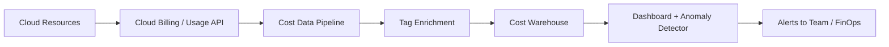

# Cost monitoring

> **Learning Path:** Reliability Engineering & Cost Fundamentals
> **Section:** 7.3.5 — Cloud cost / FinOps

# Cost Monitoring — bill வந்த பிறகு திருந்துவது cost optimization இல்லை

## 1. Problem

Production-ல ஒரு service-ஐ scale பண்ணும்போது engineer-கள் latency, error rate, throughput பார்ப்பார்கள். Cost-ஐ பார்க்க மாட்டார்கள். அது ஒரு invisible resource மாதிரி இருக்கும்.

ஒரு realistic situation: Flash sale-க்காக auto-scaling திறந்து வைத்தீர்கள். Traffic peak முடிந்தும் scale down ஆகவில்லை. அல்லது ஒரு data team nightly batch-ஐ `on-demand` GPU-களில் ஓட விடுகிறார்கள். Development environment-ல யாரோ ஒரு large `vector database` instance-ஐ மறந்து விட்டார்கள்.

மாத இறுதியில் bill வரும்போது மட்டும் தெரியும். அப்போது damage ஆகி விட்டது. Cost-ஐ பின்னோக்கி பார்த்தால் மட்டும் போதாது. Reliability engineer-க்கு cost-ம் ஒரு failure mode தான். Uncontrolled spend = reliability risk.

> What goes wrong if we don't have this? Budget overshoot, surprise shutdown, team blame game, மற்றும் production capacity-க்கு தேவையான investment-க்கு கூட budget இல்லாமல் போவது.

## 2. Mental Model

Cost monitoring என்பது bill tracking அல்ல. Cost-ஐ ஒரு system metric மாதிரி treat பண்ணுவது.

Latency-க்கு p95 உண்டு. Cost-க்கு per-request cost, per-service cost, per-team cost உண்டு.

Mental model simple: **Resource usage -> Metered -> Tagged -> Aggregated -> Observable**.

ஒவ்வொரு cloud resource-ம் usage generate பண்ணும். அதை tag செய்து, யார் உருவாக்கினார்கள், எந்த service-க்கு, எந்த environment-க்கு என்று கூடு போட்டு, real-time ஆக பார்க்க வேண்டும். Cost ஒரு SLO மாதிரி.

## 3. How It Works

Core loop 4 step.

**Metering**: Cloud provider `usage` data தருகிறார்கள். CPU hours, storage GB-month, request count, GPU hours. இது raw.

**Tagging / Attribution**: Resource create ஆகும்போது `team`, `service`, `env`, `project` tags mandatory ஆக்க வேண்டும். Kubernetes namespace, AWS resource tags, GCP labels. இல்லாவிட்டால் cost ஒரு black hole-ல் போகும். Orphan cost என்பது real problem.

**Aggregation**: Usage data-ஐ cost unit-க்கு convert பண்ணி, time series-ல் aggregate செய்ய வேண்டும். Daily, hourly. Service level, team level.

**Alerting & Feedback**: Cost anomaly, budget burn rate, per-request cost spike. இது engineer-க்கு Slack/Alertmanager-ல் போக வேண்டும். Bill வருவதற்கு முன் action.

Architecture-ல் பார்த்தால்:

Implementation-ல் இது பெரும்பாலும் CloudWatch / Stackdriver cost export + BigQuery / Snowflake + internal dashboard.

## 4. Architectural Reasoning

Cost monitoring useful ஆகும் போது:

* Multi-team shared account உள்ளது. Who pays? இதை பிரிக்க வேண்டும்.
* Auto-scaling, serverless, GPU workloads உள்ளது. Cost non-linear ஆக மாறும்.
* Product decision-ல் cost trade-off இருக்கிறது. e.g., cache vs DB read, on-demand vs reserved.

Alternatives: 
* Manual spreadsheet. Scale ஆகாது, stale.
* Bill review மட்டும். Reactive.
* Per-team separate accounts. Operational overhead அதிகம், shared services கடினம்.

Architect choose பண்ணும்போது பார்க்க வேண்டியது: granularity vs noise. Too fine-grained alerts fatigue தரும். Too coarse, spike miss ஆகும்.

## 5. Trade-offs

* **Granularity vs Signal**: Per minute cost பார்த்தால் noise அதிகம். Per day smooth ஆகும். Anomaly detection window தேர்வு முக்கியம்.
* **Accuracy vs Latency**: Real-time cost exact ஆகாது. Cloud billing lag உண்டு. Estimate vs actual. Decision-க்கு estimate போதும், finance-க்கு actual தேவை.
* **Automation vs Governance**: Auto-tagging policy enforce பண்ணலாம். ஆனால் developer friction வரும். Tagging enforcement via IaC pipeline better.
* **Cost of monitoring itself**: Data pipeline, warehouse cost. Over-monitoring செலவு செய்யும்.

Failure modes: Missing tags -> cost unallocated. Tag drift -> wrong team charge. No burn-rate alert -> budget 80% burn ஆன பிறகு தான் தெரியும்.

## 6. Practical Example

Enterprise RAG service. LLM inference `GPU` instances, vector database, object storage.

Flash sale அல்லது marketing campaign-ல் traffic 5x ஆக
