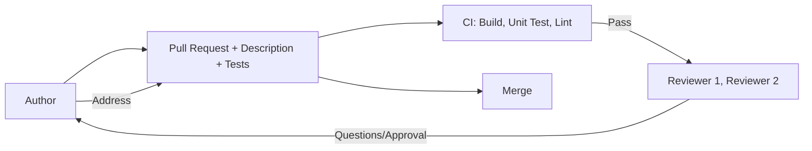

# Code review practices

> **Learning Path:** Technical Leadership & Delivery
> **Section:** 8.1.1 — Code & delivery practices

## 1. Problem

உங்கள் team-ல 8 engineers இருக்காங்க. ஒவ்வொருவரும் தனித்தனியா service-களை own பண்ணுறாங்க. ஒரு developer தனியா code எழுதி, தனியா test பண்ணி, direct-ஆ main-க்கு merge பண்ணிட்டார்.

Production-ல போனதும்:

* ஒரு null pointer வந்து 500 errors ஆரம்பிச்சுது
* ஒரு DB query N+1 ஆகி latency spike ஆனது
* ஒரு API contract மாறியதால் downstream service break ஆனது

இதே மாதிரி இன்னொரு engineer அதே பகுதியை touch பண்ணும்போது, "இதை யார் எழுதினாங்க, ஏன் இப்படி செஞ்சாங்க?" என்று தெரியாமல் மாட்டிக்கொள்கிறார்.

**Problem என்ன?** Code quality மட்டும் இல்லை. Knowledge silo, hidden assumptions, production risk எல்லாம் ஒன்றாக வருகிறது. Review இல்லாமல் delivery வேகமாக தெரியும், ஆனால் cost பின்னால் வந்து அடிக்கும்.

## 2. Mental Model

Code review என்பது bug-hunting competition இல்லை.

அது **shared understanding + risk reduction** ஆகும்.

ஒரு pull request என்பது:

* Author: "இதை ஏன் இப்படி செஞ்சேன், இந்த constraint என்ன" என்று விளக்கும் இடம்
* Reviewer: "இதை நான் production-ல run பண்ணும்போது என்ன break ஆகும்?" என்று கேட்கும் இடம்

Review என்பது gate, அல்ல. Conversation ஆகும்.

## 3. How It Works

Effective code review சில விஷயங்களை depend பண்ணும்:

* **Small diffs**: 200-400 lines-க்கு மேல் இருந்தால் reviewer fatigue வரும். Context switch கடினம்.
* **Context in PR description**: ஏன் இந்த change வேண்டும், என்ன problem solve பண்ணுது, எப்படி test பண்ணீங்க, rollback plan என்ன.
* **Automated checks first**: CI-ல unit test, lint, build fail ஆனால் human review-க்கு போகாது.
* **Reviewer selection**: Author-க்கு close இல்லாத, ஆனால் domain-ஐ புரிந்தவரை தேர்ந்தெடு. Same team, different service owner.
* **Two-way discussion**: Comment என்பது "change this" அல்ல. "இங்கே timeout 30s வச்சிருக்கீங்க, upstream SLA 5s தான். Retry logic இல்லாமல் என்ன ஆகும்?" என்ற reasoning.

Flow:

## 4. Architectural Reasoning

Code review எப்போது கட்டாயம்?

* **System boundary மாறும்போது**: API contract, DB schema, message format மாற்றம். இங்கே impact தெரியாமல் merge பண்ணினால் downstream break ஆகும்.
* **High blast radius**: Payment, auth, data pipeline போன்ற critical path.
* **Team scale > 3**: Bus factor குறைய, knowledge spread ஆக.
* **On-call load குறைக்க**: Reviewer தான் முதல் production operator.

Alternatives என்ன?

* No review: வேகம் அதிகம், defect cost அதிகம்.
* Self review only: Author bias. Blind spots தெரியாது.
* LGTM culture: Reviewer rubber stamp பண்ணுவார். Value இல்லை.

Architect ஆக நீங்கள் decide பண்ணுவது: review depth vs delivery latency trade-off.

## 5. Trade-offs

* **Speed vs Quality**: Review காத்திருப்பு lead time ஆகும். ஆனால் production incident cost அதை விட பெரியது. Fix forward cost = 10x.
* **Reviewer bottleneck**: Senior engineers எல்லா PR-யும் பார்த்தால் throughput முடங்கும். Solution: rotate reviewers, define ownership areas, use checklists.
* **False safety**: Review இருக்கிறது என்பதால் tests இல்லாமல் போகிறது. Review test-ஐ replace பண்ணாது. Review + automated test = safety net.
* **Social friction**: Author ego hurt ஆகும், reviewer nitpick பண்ணுவார். Culture set பண்ண வேண்டும்: review the code, not the person.

Failure mode: Large PR, reviewer tired, approve பண்ணிட்டார். அதன் பிறகு incident வந்தால் blame game ஆரம்பம்.

## 6. Practical Example

Enterprise payment service-ல refund flow மாற்றம்
