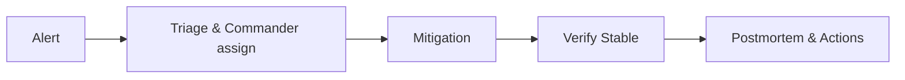

# Incident response leadership

> **Learning Path:** Technical Leadership & Delivery
> **Section:** 8.2.1 — Incident & operational leadership

## 1. Problem

நீங்கள் on-call-ல இருக்கீங்க. 2 AM-க்கு PagerDuty alert வருது: payment service error rate 15% ஆக உயர்ந்திருக்கு. Slack-ல ஆட்கள் ஜம்ப் பண்ண ஆரம்பிச்சிட்டாங்க. ஒருத்தர் database-ஐ பார்க்கிறார், இன்னொருத்தர் API logs-ஐ பார்க்கிறார், மூன்றாவது engineer rollback பண்ண ஆரம்பிச்சிட்டார். யார் என்ன பண்ணிக்கிட்டு இருக்காங்கன்னு யாருக்கும் தெரியல. Communication சிதறுது, decisions மெதுவா நடக்குது.

இதே situation-ல இல்லாமல் இருந்தா என்ன ஆகும்? Same engineers, same tools, ஆனால் வேகமா முடிவு எடுத்து, customer impact குறைவா இருக்கும்.

Incident response leadership என்பது சும்மா ஒரு process இல்ல. இது **chaos-ஐ coordination-ஆ மாற்றுறது**. Technical problem-ஐ technical people தீர்ப்பாங்க, ஆனால் யார் என்ன செய்யணும், என்ன prioritize பண்ணணும், எப்போ communicate பண்ணணும் என்பதை decide பண்ண ஒரு leader தேவை.

## 2. Mental Model

நல்ல incident response என்பது ஒரு **fire drill அல்ல, fire brigade**.

நீங்கள் தீயை அணைக்கிறீங்க, அதே நேரத்தில்:

* **Incident Commander**: Overall coordination, priority setting, communication
* **Technical leads**: Mitigation, root cause isolation
* **Communicator**: Status updates to stakeholders, customer

முக்கிய mental model: **Stabilize first, understand later.** First response goal production-ஐ safe state-க்கு கொண்டு வருவது. Root cause-க்கு பிறகு போகலாம்.

## 3. How It Works

நடைமுறையில் incident response 4 layers-ல நடக்கும்.

**Detect & Triage:** Alerting, dashboard, SLO burn rate. False positive-ஐ நீக்கி real incident-ஐ confirm பண்ணணும். ஒரு engineer incident commander-ஆ announce பண்ணுவார்.

**Mitigation:** Service-ஐ degrade பண்ணுறது, feature flag off பண்ணுறது, traffic shift பண்ணுறது, rollback. இங்கே speed முக்கியம். Deep investigation அல்ல.

**Resolution & Verification:** Mitigation work ஆச்சா? Error rate normal-க்கு வந்ததா? Customer impact confirm ஆச்சா?

**Postmortem:** Blameless postmortem. What happened, why detection slow, what to prevent. Action items with owners.

Simple flow:

## 4. Architectural Reasoning

ஏன் ஒரு dedicated leader தேவை?

Constraints: Time pressure, partial information, multiple systems, on-call fatigue, business impact.

Options:

* **Hero mode:** Senior engineer எல்லாவற்றையும் செய்வார். Scale ஆகாது, burnout வரும்.
* **Ad-hoc:** எவர் available அவர் lead ஆவார். Inconsistent decisions.
* **Defined IC role:** Incident commander rotates, clear runbook, clear escalation.

Architect தேர்வு செய்யும்போது பார்க்க வேண்டியது: Team size, service criticality, on-call rotation maturity.

நீங்கள் RTO / RPO, SLO breach ஆகியவற்றை கணக்கில் வைத்து process-ஐ design பண்ணுவீங்க. உதாரணமாக payment service-க்கு 15 min RTO, அதனால் auto rollback + human approval flow வேண்டும்.

## 5. Trade-offs

**Speed vs Accuracy:** Fast mitigation saves revenue, ஆனால் wrong rollback புது problem உருவாக்கும். இதற்கு runbook + clear rollback criteria தேவை.

**Transparency vs Noise:** Stakeholders-க்கு அடிக்கடி update தேவை. ஆனால் too much detail confusion உருவாக்கும். Communicator role இதை filter பண்ணும்.

**Blameless vs Accountability:** Blameless postmortem culture learning-ஐ encourage பண்ணும். ஆனால் repeated mistakes-க்கு ownership இல்லாமல் போக கூடாது. Action items with owners தேவை.

**Automation vs Human judgment:** Auto rollback சிறந்தது, ஆனால் data loss scenario-ல human in loop தேவை. Decision boundary-ஐ தெளிவாக வைக்க வேண்டும்.

Failure mode: Commander தொழில்நுட்ப விவரத்தில் மூழ்கி coordination-ஐ மறந்துவிடுவது. Leader-ன் job decision making, not debugging.

## 6. Practical Example

E-commerce sale நேரத்தில் checkout service latency 4s-க்கு spike ஆகுது. Error rate 5%.

Incident commander announce ஆகிறார். ஒரு engineer dashboard-ல database connection pool exhaustion-ஐ பார்க்கிறார். இன்னொருவர் recent deploy-ஐ சோதிக்கிறார். Communicator #incident Slack channel-ல 5 min-க்கு ஒரு update தருகிறார்.

Commander decide: First traffic 50% cut via feature flag for new promo flow, then rollback last deploy if no improvement in 10 min.

Stabilize ஆகிறது. பிறகு postmortem: connection pool size promotion traffic-ஐ handle பண்ணல, deploy review-ல load test miss ஆனது. Action items: pool autoscaling, load test gate in CI.

## 7. Reasoning Challenge

உங்களிடம் 3 critical services: payments, inventory, recommendations. 11 PM-ல payments down, inventory degraded, recommendations slow. ஒரே on-call team. Limited engineers awake.

நீங்கள் incident commander
